# Tài liệu Phân tích Nghiệp vụ (BA) — Hệ thống Quản Lý Sinh Viên

> **StudentManager** · Đồ án môn học · Business Analysis Document (BRD + đặc tả yêu cầu ở mức nghiệp vụ)

## Thông tin tài liệu

| Mục | Nội dung |
|---|---|
| Tên dự án | Quản Lý Sinh Viên (StudentManager) |
| Loại tài liệu | Business Analysis Document — gộp Business Requirements (BRD) và đặc tả yêu cầu chức năng / phi chức năng ở mức nghiệp vụ |
| Mã tài liệu | SM-BA-001 |
| Phiên bản | 1.0 — bản nháp để duyệt |
| Ngày lập | 04/10/2026 |
| Repository | `github.com/HoaiNam765/StudentManager` |
| Nhóm thực hiện | [Họ tên — MSSV — Lớp] *(cần điền)* |
| Giảng viên hướng dẫn | [Họ tên] *(cần điền)* |
| Trạng thái | Chờ xác nhận các vấn đề mở ở [mục 12](#12-vấn-đề-mở-và-câu-hỏi-cần-xác-nhận) |

### Lịch sử phiên bản

| Phiên bản | Ngày | Nội dung thay đổi |
|---|---|---|
| 1.0 | 04/10/2026 | Bản đầu tiên: bối cảnh, phạm vi, quy trình nghiệp vụ, 16 module theo yêu cầu + 7 module đề xuất bổ sung, mô hình dữ liệu khái niệm, yêu cầu phi chức năng, kế hoạch triển khai và nghiệm thu. |

## Tóm tắt điều hành

- **Bài toán:** xây dựng hệ thống web **StudentManager** quản lý trọn vòng đời học vụ của sinh viên đại học chính quy theo học chế tín chỉ — từ nhập học, lớp, đăng ký học phần, thời khóa biểu, điểm danh, thi, điểm, học phí, giấy tờ, thông báo cho đến xét tốt nghiệp.
- **Phạm vi:** **23 module** = 16 module theo yêu cầu ban đầu + **7 module đề xuất bổ sung** sau khi rà soát khoảng trống: `ACY` (Năm học – Học kỳ), `CUR` (Chương trình đào tạo), `ROM` (Phòng học), `GRA` (Học vụ & Tốt nghiệp), `REQ` (Đơn từ sinh viên), `SCH` (Học bổng – Rèn luyện – Kỷ luật), `EVA` (Khảo sát chất lượng). Lý do chi tiết ở [mục 5.4](#54-phân-tích-khoảng-trống-và-đề-xuất-bổ-sung).
- **Quy mô đặc tả:** 317 yêu cầu chức năng, 193 quy tắc nghiệp vụ, 44 yêu cầu phi chức năng, 27 sơ đồ, 41 báo cáo chuẩn, 38 sự kiện thông báo. Mọi yêu cầu đều có mã định danh để truy vết từ yêu cầu → thiết kế → mã nguồn → kiểm thử.
- **Lộ trình:** 4 giai đoạn P1 → P4 ([mục 5.6](#56-ưu-tiên-và-lộ-trình-phát-hành)). P1 là bản MVP "học vụ cốt lõi" (danh mục, sinh viên, lớp, đăng ký học phần, thời khóa biểu cơ bản, điểm); các module còn lại bổ sung dần.
- **Quy chế học vụ:** các ngưỡng mặc định (thang điểm, xếp loại, khối lượng học tập, cảnh báo học vụ…) tham chiếu **Thông tư 56/2026/TT-BGDĐT**; tất cả đều là **tham số cấu hình** theo khóa, cần đối chiếu văn bản gốc và quy chế của trường ([Phụ lục C](#phụ-lục-c--bảng-quy-đổi-điểm-và-xếp-loại-mặc-định)).
- **Việc cần xác nhận:** 22 câu hỏi mở ở [mục 12](#12-vấn-đề-mở-và-câu-hỏi-cần-xác-nhận); mỗi câu đã có phương án mặc định nên không chặn tiến độ.

## Mục lục

<!-- TOC:START -->
- [Thông tin tài liệu](#thông-tin-tài-liệu)
  - [Lịch sử phiên bản](#lịch-sử-phiên-bản)
- [Tóm tắt điều hành](#tóm-tắt-điều-hành)
- [1. Giới thiệu](#1-giới-thiệu)
  - [1.1 Mục đích tài liệu](#11-mục-đích-tài-liệu)
  - [1.2 Phạm vi tài liệu và cách đọc](#12-phạm-vi-tài-liệu-và-cách-đọc)
  - [1.3 Quy ước trình bày](#13-quy-ước-trình-bày)
  - [1.4 Thuật ngữ và viết tắt](#14-thuật-ngữ-và-viết-tắt)
  - [1.5 Tài liệu tham chiếu](#15-tài-liệu-tham-chiếu)
- [2. Tổng quan dự án](#2-tổng-quan-dự-án)
  - [2.1 Bối cảnh và phát biểu bài toán](#21-bối-cảnh-và-phát-biểu-bài-toán)
  - [2.2 Mục tiêu nghiệp vụ và chỉ số thành công](#22-mục-tiêu-nghiệp-vụ-và-chỉ-số-thành-công)
  - [2.3 Phạm vi dự án](#23-phạm-vi-dự-án)
  - [2.4 Giả định, ràng buộc và phụ thuộc](#24-giả-định-ràng-buộc-và-phụ-thuộc)
  - [2.5 Rủi ro](#25-rủi-ro)
  - [2.6 Các bên liên quan](#26-các-bên-liên-quan)
- [3. Phân tích hiện trạng và quy trình nghiệp vụ](#3-phân-tích-hiện-trạng-và-quy-trình-nghiệp-vụ)
  - [3.1 Hiện trạng (As-Is) và điểm đau](#31-hiện-trạng-as-is-và-điểm-đau)
  - [3.2 Vòng đời sinh viên (To-Be)](#32-vòng-đời-sinh-viên-to-be)
  - [3.3 Các quy trình nghiệp vụ chính](#33-các-quy-trình-nghiệp-vụ-chính)
- [4. Tác nhân và phân quyền](#4-tác-nhân-và-phân-quyền)
  - [4.1 Danh sách tác nhân (vai trò)](#41-danh-sách-tác-nhân-vai-trò)
  - [4.2 Ma trận phân quyền mặc định](#42-ma-trận-phân-quyền-mặc-định)
  - [4.3 Phạm vi dữ liệu (data scope)](#43-phạm-vi-dữ-liệu-data-scope)
- [5. Kiến trúc nghiệp vụ và danh mục module](#5-kiến-trúc-nghiệp-vụ-và-danh-mục-module)
  - [5.1 Bối cảnh hệ thống](#51-bối-cảnh-hệ-thống)
  - [5.2 Bản đồ module](#52-bản-đồ-module)
  - [5.3 Danh mục module và ranh giới phạm vi](#53-danh-mục-module-và-ranh-giới-phạm-vi)
  - [5.4 Phân tích khoảng trống và đề xuất bổ sung](#54-phân-tích-khoảng-trống-và-đề-xuất-bổ-sung)
  - [5.5 Ma trận phụ thuộc](#55-ma-trận-phụ-thuộc)
  - [5.6 Ưu tiên và lộ trình phát hành](#56-ưu-tiên-và-lộ-trình-phát-hành)
- [6. Đặc tả chi tiết theo module](#6-đặc-tả-chi-tiết-theo-module)
  - [6.0 Quy ước chung của đặc tả module](#60-quy-ước-chung-của-đặc-tả-module)
  - [6.1 AUTH — Authentication & Authorization](#61-auth--authentication--authorization)
  - [6.2 STU — Student Management](#62-stu--student-management)
  - [6.3 CLS — Class Management](#63-cls--class-management)
  - [6.4 FAC — Faculty / Department Management](#64-fac--faculty--department-management)
  - [6.5 SUB — Subject / Course Management](#65-sub--subject--course-management)
  - [6.6 ENR — Enrollment Management](#66-enr--enrollment-management)
  - [6.7 TTB — Class Schedule / Timetable](#67-ttb--class-schedule--timetable)
  - [6.8 ATT — Attendance Management](#68-att--attendance-management)
  - [6.9 GRD — Grade Management](#69-grd--grade-management)
  - [6.10 FEE — Tuition / Fee Management](#610-fee--tuition--fee-management)
  - [6.11 DOC — Student Documents](#611-doc--student-documents)
  - [6.12 NOT — Notification Management](#612-not--notification-management)
  - [6.13 EXM — Exam Management](#613-exm--exam-management)
  - [6.14 TCH — Teacher / Lecturer Management](#614-tch--teacher--lecturer-management)
  - [6.15 RPT — Dashboard & Reports](#615-rpt--dashboard--reports)
  - [6.16 SYS — System Administration](#616-sys--system-administration)
  - [6.17 ACY — Academic Year & Semester (đề xuất bổ sung — nhóm A)](#617-acy--academic-year--semester-đề-xuất-bổ-sung--nhóm-a)
  - [6.18 CUR — Curriculum / Training Program (đề xuất bổ sung — nhóm A)](#618-cur--curriculum--training-program-đề-xuất-bổ-sung--nhóm-a)
  - [6.19 ROM — Classroom & Facility (đề xuất bổ sung — nhóm A)](#619-rom--classroom--facility-đề-xuất-bổ-sung--nhóm-a)
  - [6.20 GRA — Graduation & Academic Standing (đề xuất bổ sung — nhóm B)](#620-gra--graduation--academic-standing-đề-xuất-bổ-sung--nhóm-b)
  - [6.21 REQ — Student Requests & Petitions (đề xuất bổ sung — nhóm B)](#621-req--student-requests--petitions-đề-xuất-bổ-sung--nhóm-b)
  - [6.22 SCH — Scholarship, Rewards, Discipline & Conduct (đề xuất bổ sung — nhóm C)](#622-sch--scholarship-rewards-discipline--conduct-đề-xuất-bổ-sung--nhóm-c)
  - [6.23 EVA — Course & Lecturer Evaluation (đề xuất bổ sung — nhóm C)](#623-eva--course--lecturer-evaluation-đề-xuất-bổ-sung--nhóm-c)
- [7. Mô hình dữ liệu khái niệm](#7-mô-hình-dữ-liệu-khái-niệm)
  - [7.1 ERD học vụ](#71-erd-học-vụ)
  - [7.2 ERD tài chính, dịch vụ và hệ thống](#72-erd-tài-chính-dịch-vụ-và-hệ-thống)
  - [7.3 Quy ước dữ liệu chung](#73-quy-ước-dữ-liệu-chung)
  - [7.4 Danh mục trạng thái](#74-danh-mục-trạng-thái)
- [8. Yêu cầu giao diện và trải nghiệm người dùng](#8-yêu-cầu-giao-diện-và-trải-nghiệm-người-dùng)
  - [8.1 Các phân hệ giao diện](#81-các-phân-hệ-giao-diện)
  - [8.2 Danh sách màn hình chính](#82-danh-sách-màn-hình-chính)
  - [8.3 Nguyên tắc trải nghiệm người dùng](#83-nguyên-tắc-trải-nghiệm-người-dùng)
- [9. Yêu cầu phi chức năng](#9-yêu-cầu-phi-chức-năng)
  - [9.1 Hiệu năng (PERF)](#91-hiệu-năng-perf)
  - [9.2 Bảo mật (SEC)](#92-bảo-mật-sec)
  - [9.3 Độ tin cậy (REL)](#93-độ-tin-cậy-rel)
  - [9.4 Khả dụng và trải nghiệm (USA)](#94-khả-dụng-và-trải-nghiệm-usa)
  - [9.5 Tương thích (CMP)](#95-tương-thích-cmp)
  - [9.6 Bảo trì (MNT)](#96-bảo-trì-mnt)
  - [9.7 Dữ liệu và tuân thủ (DAT)](#97-dữ-liệu-và-tuân-thủ-dat)
  - [9.8 Bản địa hóa, quy mô và giám sát (LOC · SCA · OBS)](#98-bản-địa-hóa-quy-mô-và-giám-sát-loc--sca--obs)
- [10. Ma trận truy vết](#10-ma-trận-truy-vết)
  - [10.1 Mục tiêu nghiệp vụ → module → yêu cầu → kiểm chứng](#101-mục-tiêu-nghiệp-vụ--module--yêu-cầu--kiểm-chứng)
  - [10.2 Thống kê yêu cầu theo module và độ phủ yêu cầu ban đầu](#102-thống-kê-yêu-cầu-theo-module-và-độ-phủ-yêu-cầu-ban-đầu)
- [11. Kế hoạch triển khai, kiểm thử và nghiệm thu](#11-kế-hoạch-triển-khai-kiểm-thử-và-nghiệm-thu)
  - [11.1 Từ tài liệu BA đến nghiệm thu](#111-từ-tài-liệu-ba-đến-nghiệm-thu)
  - [11.2 Chiến lược kiểm thử và nghiệm thu](#112-chiến-lược-kiểm-thử-và-nghiệm-thu)
  - [11.3 Định nghĩa hoàn thành (Definition of Done)](#113-định-nghĩa-hoàn-thành-definition-of-done)
  - [11.4 Quản lý thay đổi yêu cầu](#114-quản-lý-thay-đổi-yêu-cầu)
- [12. Vấn đề mở và câu hỏi cần xác nhận](#12-vấn-đề-mở-và-câu-hỏi-cần-xác-nhận)
- [Phụ lục A — Danh mục sự kiện thông báo](#phụ-lục-a--danh-mục-sự-kiện-thông-báo)
- [Phụ lục B — Danh mục báo cáo](#phụ-lục-b--danh-mục-báo-cáo)
- [Phụ lục C — Bảng quy đổi điểm và xếp loại mặc định](#phụ-lục-c--bảng-quy-đổi-điểm-và-xếp-loại-mặc-định)
  - [C.1 Quy đổi điểm học phần](#c1-quy-đổi-điểm-học-phần)
  - [C.2 Xếp loại học lực và xếp hạng tốt nghiệp](#c2-xếp-loại-học-lực-và-xếp-hạng-tốt-nghiệp)
  - [C.3 Tham số học vụ mặc định](#c3-tham-số-học-vụ-mặc-định)
  - [C.4 Xếp loại điểm rèn luyện (module SCH)](#c4-xếp-loại-điểm-rèn-luyện-module-sch)
- [Phụ lục D — Gợi ý công nghệ (không ràng buộc)](#phụ-lục-d--gợi-ý-công-nghệ-không-ràng-buộc)
- [Phụ lục E — Nguồn tra cứu và mức độ xác minh](#phụ-lục-e--nguồn-tra-cứu-và-mức-độ-xác-minh)
<!-- TOC:END -->

## 1. Giới thiệu

### 1.1 Mục đích tài liệu

Tài liệu này là nguồn tham chiếu thống nhất về **nghiệp vụ** của hệ thống Quản Lý Sinh Viên (StudentManager). Tài liệu trả lời các câu hỏi: hệ thống phục vụ ai, giải quyết vấn đề gì, gồm những module nào, mỗi module phải làm được gì, tuân theo quy tắc nghiệp vụ nào và như thế nào thì được coi là hoàn thành.

Tài liệu là đầu vào cho các bước tiếp theo của đồ án: đặc tả use case chi tiết (SRS), thiết kế cơ sở dữ liệu, thiết kế giao diện, lập trình, kiểm thử và nghiệm thu.

### 1.2 Phạm vi tài liệu và cách đọc

- Tài liệu dừng ở mức **WHAT** (hệ thống cần làm gì), không quy định **HOW** (cài đặt thế nào). Gợi ý công nghệ chỉ nằm ở [Phụ lục D](#phụ-lục-d--gợi-ý-công-nghệ-không-ràng-buộc) và không ràng buộc.
- Mọi yêu cầu có mã định danh ổn định; khi thay đổi yêu cầu, giữ nguyên mã và ghi vào lịch sử phiên bản.
- Các con số ngưỡng (điểm, tín chỉ, số lần…) là **giá trị mặc định có thể cấu hình**, không phải hằng số cứng trong chương trình.

| Người đọc | Nên đọc trước |
|---|---|
| Giảng viên hướng dẫn / hội đồng chấm | Mục 2, 5, 10, 11 |
| Quản lý dự án / người làm BA | Toàn bộ tài liệu, đặc biệt mục 2–5 và 12 |
| Lập trình viên | Mục 6, 7, 9 và Phụ lục A–C |
| Kiểm thử | Tiêu chí nghiệm thu trong mục 6, mục 9 và mục 11.2 |
| Thiết kế giao diện (UI/UX) | Mục 3, 4, 8 |

### 1.3 Quy ước trình bày

**Mã định danh**

| Loại | Mẫu mã | Ví dụ |
|---|---|---|
| Module | 3 chữ cái in hoa | `ENR` |
| Yêu cầu chức năng | `FR-<MODULE>-<NNN>` | `FR-ENR-003` |
| Quy tắc nghiệp vụ | `BR-<MODULE>-<NN>` | `BR-GRD-04` |
| Yêu cầu phi chức năng | `NFR-<NHÓM>-<NN>` | `NFR-SEC-02` |
| Mục tiêu nghiệp vụ | `O-NN` | `O-02` |
| Giả định / Ràng buộc / Phụ thuộc | `A-NN` / `C-NN` / `D-NN` | `A-03` |
| Rủi ro | `R-NN` | `R-02` |
| Câu hỏi mở | `Q-NN` | `Q-05` |
| Sự kiện thông báo | `EV-<MODULE>-<NN>` | `EV-GRD-01` |
| Báo cáo | `RP-<MODULE>-<NN>` | `RP-FEE-02` |
| Kịch bản nghiệm thu | `UAT-NN` | `UAT-04` |

**Mức ưu tiên (MoSCoW)**

| Ký hiệu | Mức | Ý nghĩa |
|---|---|---|
| M | Must | Bắt buộc; thiếu thì module không dùng được |
| S | Should | Quan trọng, nên có trong cùng giai đoạn nếu còn thời gian |
| C | Could | Có thì tốt, để dành cho giai đoạn mở rộng |
| W | Won't | Chưa làm ở phiên bản này; ghi nhận để tham khảo |

**Giai đoạn phát hành**: P1 (MVP — học vụ cốt lõi), P2 (vận hành), P3 (hoàn thiện), P4 (mở rộng) — xem [mục 5.6](#56-ưu-tiên-và-lộ-trình-phát-hành). **Công sức ước lượng tương đối**: S (nhỏ), M (vừa), L (lớn).

**Tác nhân**: dùng mã vai trò (`ADMIN`, `ACAD`, `EXAM`, `CTSV`, `FIN`, `DEAN`, `LEC`, `ADV`, `STU`) — xem [mục 4.1](#41-danh-sách-tác-nhân-vai-trò).

### 1.4 Thuật ngữ và viết tắt

| Thuật ngữ | Viết tắt | Giải thích |
|---|---|---|
| Sinh viên | SV | Người học đang theo học chương trình đại học |
| Giảng viên | GV | Người giảng dạy |
| Cố vấn học tập | CVHT | Giảng viên được phân công phụ trách lớp hành chính để tư vấn học vụ (còn gọi giáo viên chủ nhiệm) |
| Mã số sinh viên | MSSV | Mã định danh duy nhất của sinh viên |
| Học chế tín chỉ | — | Phương thức đào tạo đo khối lượng học tập bằng tín chỉ; SV tự đăng ký học phần theo kế hoạch cá nhân |
| Tín chỉ | TC | Đơn vị đo khối lượng học tập |
| Học phần | HP | Đơn vị nội dung giảng dạy có mã, số tín chỉ và cơ cấu điểm (tài liệu dùng lẫn với "môn học"; Subject / Course) |
| Lớp học phần | LHP | Nhóm SV học cùng một học phần, cùng GV, cùng lịch trong một học kỳ (Course Section) |
| Lớp hành chính | Lớp HC | Lớp sinh hoạt cố định theo khóa – ngành, có CVHT (Administrative / Homeroom class) |
| Khóa | — | Đợt tuyển sinh theo năm nhập học, ví dụ K2026 (Cohort / Intake) |
| Chương trình đào tạo | CTĐT | Khung gồm các học phần, tín chỉ và điều kiện tốt nghiệp của một ngành theo khóa (Curriculum) |
| Học phần tiên quyết | — | Học phần phải đạt trước khi được đăng ký học phần khác |
| Học phần song hành | — | Học phần phải đăng ký học cùng hoặc trước học phần khác |
| Học kỳ | HK | Giai đoạn học tập: HK1, HK2 và tùy chọn học kỳ hè |
| Điểm trung bình học kỳ / tích lũy | GPA / CGPA | Trung bình có trọng số tín chỉ trên thang điểm 4 |
| Cảnh báo học vụ | — | Cảnh báo sinh viên có kết quả học tập dưới ngưỡng quy định |
| Số báo danh | SBD | Mã dự thi của sinh viên trong một kỳ thi |
| Căn cước công dân | CCCD | Giấy tờ định danh cá nhân |
| Quy trình phê duyệt | Workflow | Chuỗi bước duyệt nhiều cấp của một yêu cầu |
| Kiểm soát truy cập theo vai trò | RBAC | Role-Based Access Control |
| Phạm vi dữ liệu | Data scope | Giới hạn dữ liệu mà một vai trò được nhìn thấy (toàn trường, theo khoa, theo lớp, của riêng mình) |
| Nhật ký kiểm toán | Audit log | Bản ghi bất biến về ai đã làm gì, khi nào, trên đối tượng nào |
| Xóa mềm | Soft delete | Đánh dấu ngừng sử dụng thay vì xóa vật lý |
| Dữ liệu cá nhân | PII | Thông tin cho phép nhận diện một người |
| BRD / SRS | — | Business Requirements Document / Software Requirements Specification |
| FR / NFR / BR | — | Yêu cầu chức năng / phi chức năng / quy tắc nghiệp vụ |
| MVP | — | Sản phẩm khả dụng tối thiểu |
| UAT | — | Kiểm thử chấp nhận bởi người dùng |
| SLA | — | Cam kết mức độ dịch vụ (thời gian xử lý) |
| KPI | — | Chỉ số đo lường hiệu quả |
| 2FA / OTP / SSO | — | Xác thực hai lớp / mật khẩu dùng một lần / đăng nhập một lần |
| RPO / RTO | — | Mức mất dữ liệu tối đa chấp nhận được / thời gian khôi phục tối đa |
| ERD | — | Sơ đồ quan hệ thực thể |
| Idempotent | — | Xử lý lặp lại nhiều lần vẫn cho cùng một kết quả (dùng cho callback thanh toán) |

### 1.5 Tài liệu tham chiếu

| # | Tài liệu | Ghi chú sử dụng |
|---|---|---|
| 1 | Thông tư 56/2026/TT-BGDĐT (07/07/2026) — Quy chế đào tạo trình độ đại học | Nguồn tham chiếu cho các ngưỡng học vụ mặc định; theo các nguồn tổng hợp, áp dụng cho khóa tuyển sinh từ 2026 (năm học 2026–2027) và thay thế Thông tư 08/2021/TT-BGDĐT. **Cần đối chiếu văn bản gốc** và quy chế riêng của trường trước khi chốt |
| 2 | Thông tư 08/2021/TT-BGDĐT (18/03/2021) — Quy chế đào tạo trình độ đại học (đã được thay thế) | Có thể vẫn áp dụng cho các khóa tuyển sinh trước 2026 tùy lộ trình chuyển tiếp của trường — hệ thống cho phép cấu hình quy chế theo khóa |
| 3 | Luật Bảo vệ dữ liệu cá nhân số 91/2025/QH15 (hiệu lực 01/01/2026) và Nghị định 356/2025/NĐ-CP hướng dẫn | Cơ sở cho yêu cầu bảo vệ dữ liệu cá nhân; thay thế Nghị định 13/2023/NĐ-CP |
| 4 | Thông tư 16/2015/TT-BGDĐT — Quy chế đánh giá kết quả rèn luyện của người học hệ chính quy | Tham chiếu cho module `SCH`; cần kiểm tra văn bản thay thế (nếu có) tại thời điểm triển khai |
| 5 | Sắp xếp đơn vị hành chính, chính quyền địa phương hai cấp từ 01/07/2025 (34 đơn vị cấp tỉnh) | Cơ sở cho danh mục địa chỉ trong `SYS` |
| 6 | ISO/IEC/IEEE 29148:2018 — Requirements engineering | Khung viết và đánh giá chất lượng yêu cầu |
| 7 | BABOK Guide v3 (IIBA) | Kỹ thuật phân tích nghiệp vụ |
| 8 | OWASP Top 10 và OWASP ASVS | Cơ sở cho yêu cầu bảo mật |
| 9 | WCAG 2.1 (W3C) | Cơ sở cho yêu cầu khả năng tiếp cận |

## 2. Tổng quan dự án

### 2.1 Bối cảnh và phát biểu bài toán

Quản lý sinh viên là nghiệp vụ lõi của mọi cơ sở giáo dục đại học: từ khi sinh viên nhập học đến khi tốt nghiệp, nhà trường phải quản lý hồ sơ, lớp, học phần, đăng ký học phần, thời khóa biểu, chuyên cần, thi, điểm, học phí, giấy tờ và thông báo. Ở nhiều đơn vị, các nghiệp vụ này vẫn nằm rải rác trong file Excel, giấy tờ và nhóm chat; dữ liệu bị trùng lặp, lệch nhau, khó truy vết và tốn nhiều công sức tổng hợp báo cáo.

**Phát biểu bài toán:** xây dựng một hệ thống web tập trung, phân quyền chặt chẽ, tự động hóa các quy tắc học vụ (kiểm tra điều kiện đăng ký, tính điểm, học phí, cảnh báo học vụ, xét tốt nghiệp) để Phòng ban, Khoa, Giảng viên và Sinh viên cùng làm việc trên **một nguồn dữ liệu duy nhất**, có nhật ký kiểm toán và báo cáo theo thời gian thực.

### 2.2 Mục tiêu nghiệp vụ và chỉ số thành công

Các chỉ tiêu dưới đây là **đề xuất** để đo ở giai đoạn nghiệm thu; chưa có số liệu hiện trạng thực tế nên chưa đặt đường cơ sở (baseline).

| ID | Mục tiêu nghiệp vụ | Chỉ số đo (KPI) | Chỉ tiêu đề xuất | Module chính |
|---|---|---|---|---|
| O-01 | Tập trung hóa dữ liệu, một nguồn sự thật duy nhất | Tỷ lệ nghiệp vụ lõi thao tác trên hệ thống; số file Excel chạy song song cho dữ liệu gốc | 100% nghiệp vụ lõi; 0 file song song | STU, FAC, CLS, SUB, SYS |
| O-02 | Tự động hóa quy tắc học vụ | Độ lệch kết quả so với bộ ca kiểm thử chuẩn (đăng ký, GPA, học phí); thời gian một lượt đăng ký học phần | 0 sai lệch; mỗi lượt đăng ký không quá 5 phút | ENR, GRD, FEE, GRA |
| O-03 | Vận hành tổ chức giảng dạy trơn tru | Số xung đột phòng / giảng viên / sinh viên sau khi công bố thời khóa biểu và lịch thi | 0 xung đột | TTB, ROM, EXM, CLS |
| O-04 | Minh bạch và tự phục vụ | Tỷ lệ tra cứu thực hiện trực tuyến; độ trễ thông báo sau sự kiện | Từ 90% tra cứu trực tuyến; thông báo trong 5 phút | NOT, RPT, DOC |
| O-05 | Kiểm soát tài chính chính xác | Sai lệch công nợ sau đối soát; tỷ lệ giao dịch có chứng từ | 0 sai lệch; 100% có biên lai | FEE |
| O-06 | Bảo mật và tuân thủ bảo vệ dữ liệu cá nhân | Số lỗ hổng mức cao khi kiểm thử cơ bản theo OWASP; tỷ lệ thao tác ghi dữ liệu nhạy cảm có nhật ký | 0 lỗ hổng mức cao; 100% có nhật ký | AUTH, SYS, DOC |
| O-07 | Hỗ trợ ra quyết định bằng báo cáo thời gian thực | Thời gian truy xuất báo cáo chuẩn; độ phủ danh mục báo cáo | Dưới 10 giây (đến 10.000 dòng); đủ báo cáo ưu tiên M/S | RPT |
| O-08 | Rút ngắn xử lý đơn từ và giấy tờ | Thời gian xử lý giấy xác nhận; tỷ lệ đơn đúng SLA | Không quá 2 ngày làm việc; từ 80% đúng SLA | REQ, DOC |
| O-09 | Hoàn thành đồ án đúng hạn với bản chạy được | Demo trọn vòng đời một học kỳ trên dữ liệu mẫu | Demo end-to-end ở cuối P1 | Toàn bộ P1 |

### 2.3 Phạm vi dự án

**Trong phạm vi**

- Ứng dụng web responsive với 3 phân hệ giao diện: Cổng Sinh viên, Cổng Giảng viên, Cổng Quản trị / Văn phòng ([mục 8](#8-yêu-cầu-giao-diện-và-trải-nghiệm-người-dùng)).
- 23 module nêu ở [mục 5.3](#53-danh-mục-module-và-ranh-giới-phạm-vi).
- Một cơ sở đào tạo (single-tenant), đại học hệ chính quy, học chế tín chỉ.
- Ngôn ngữ giao diện: Tiếng Việt (chính), tiếng Anh (phụ).
- Nhập dữ liệu thủ công và import Excel; xuất Excel / PDF.
- Tích hợp: email SMTP; tùy chọn cổng thanh toán (sandbox), đăng nhập SSO.

**Ngoài phạm vi (ghi nhận để tham khảo, có thể làm ở giai đoạn sau)**

| Hạng mục | Lý do loại khỏi phạm vi | Hướng xử lý |
|---|---|---|
| Tuyển sinh, xét tuyển | Là nghiệp vụ trước khi có sinh viên | Hệ thống chỉ nhận sinh viên đã trúng tuyển ở trạng thái "Chờ nhập học" |
| Nhân sự – tiền lương giảng viên | Thuộc hệ thống HR | Chỉ quản lý hồ sơ giảng dạy và khối lượng giảng dạy |
| Ký túc xá, thư viện | Hệ thống riêng | Có thể tích hợp sau qua API |
| LMS (bài giảng, bài tập, thi trực tuyến) | Quy mô lớn, hệ thống riêng | Chỉ lưu liên kết lớp học trực tuyến |
| Kế toán tổng hợp, hóa đơn điện tử, chữ ký số | Cần tích hợp nhà cung cấp có pháp nhân | Xuất dữ liệu thu để kế toán xử lý |
| Ứng dụng di động bản địa | Tốn nhiều công sức | Giao diện web responsive; có thể nâng cấp thành PWA |
| Kết nối cơ sở dữ liệu ngành giáo dục, báo cáo thống kê gửi cơ quan quản lý | Cần đặc tả kết nối chính thức | Cung cấp báo cáo xuất file theo mẫu |
| Đào tạo sau đại học, liên kết quốc tế, song ngành | Quy tắc khác biệt đáng kể | Mở rộng sau khi ổn định lõi đại học chính quy |
| Quản lý nghiên cứu khoa học | Ngoài nghiệp vụ quản lý sinh viên | — |

### 2.4 Giả định, ràng buộc và phụ thuộc

**Giả định**

| ID | Giả định | Ảnh hưởng nếu sai |
|---|---|---|
| A-01 | Hệ thống phục vụ **một** cơ sở đào tạo (không đa trường) | Phải thiết kế lại phân tách dữ liệu theo trường |
| A-02 | Đào tạo đại học chính quy theo **học chế tín chỉ**; học kỳ chính HK1, HK2, học kỳ hè tùy chọn | Nếu là niên chế, phải đổi logic đăng ký, tính điểm và học phí |
| A-03 | Quy chế học vụ mặc định tham chiếu **Thông tư 56/2026/TT-BGDĐT**; các khóa cũ cấu hình theo Thông tư 08/2021; mọi ngưỡng là tham số ([Phụ lục C](#phụ-lục-c--bảng-quy-đổi-điểm-và-xếp-loại-mặc-định)) | Cập nhật cấu hình, không sửa mã nguồn |
| A-04 | Người dùng truy cập bằng trình duyệt (máy tính và điện thoại); không có ứng dụng bản địa | Tăng phạm vi nếu cần app |
| A-05 | Dữ liệu ban đầu (khoa, ngành, CTĐT, môn, SV, GV) cung cấp bằng Excel hoặc dữ liệu mẫu tự sinh | Cần công cụ chuyển đổi dữ liệu |
| A-06 | Có dịch vụ email SMTP; SMS / Zalo là tùy chọn | Thông báo chỉ hiển thị trong ứng dụng |
| A-07 | Thanh toán trực tuyến là tùy chọn; bản đầu ghi nhận thủ công và đối soát bằng file sao kê | Thêm tích hợp ở P4 |
| A-08 | Một sinh viên thuộc **một ngành chính** tại một thời điểm | Song ngành cần mở rộng mô hình dữ liệu |
| A-09 | Đồ án chỉ dùng **dữ liệu giả lập**, không dùng dữ liệu cá nhân thật | Phải bổ sung thủ tục bảo vệ dữ liệu cá nhân nghiêm ngặt hơn |
| A-10 | Nhóm dùng Laravel 13 (PHP 8.3) với MySQL trên Laragon — suy ra từ các lab hiện có (cả bốn lab trong thư mục làm việc đều là dự án Laravel) — chờ xác nhận ([Q-19](#12-vấn-đề-mở-và-câu-hỏi-cần-xác-nhận)) | Đổi gợi ý công nghệ ở Phụ lục D, không đổi nghiệp vụ |

**Ràng buộc**

| ID | Ràng buộc |
|---|---|
| C-01 | Thời gian đồ án có hạn: chỉ P1 là cam kết; P2 trở đi là mục tiêu mở rộng tùy thời gian |
| C-02 | Nhóm nhỏ (1–4 sinh viên): ưu tiên tái sử dụng framework và thư viện có sẵn |
| C-03 | Chi phí bằng 0: dùng công cụ mã nguồn mở hoặc bản miễn phí |
| C-04 | Môi trường phát triển: Windows + Laragon; trình diễn trên máy cục bộ hoặc hosting miễn phí |
| C-05 | Tuân thủ quy định bảo vệ dữ liệu cá nhân (Luật 91/2025/QH15): chỉ dùng dữ liệu giả và thiết kế sẵn cơ chế bảo vệ |
| C-06 | Khi tài liệu này khác quy chế của trường, **quy chế của trường được ưu tiên** và được phản ánh qua cấu hình |

**Phụ thuộc**

| ID | Phụ thuộc | Cần có vào lúc |
|---|---|---|
| D-01 | Quy chế đào tạo, thang điểm, khung CTĐT mẫu của trường hoặc của giảng viên hướng dẫn | Trước khi chốt BA v1.0 |
| D-02 | Dịch vụ email SMTP (có thể dùng dịch vụ thử nghiệm như Mailtrap) | P2 |
| D-03 | Cổng thanh toán sandbox (ví dụ VNPay, MoMo) — tùy chọn | P4 |
| D-04 | Danh mục đơn vị hành chính chuẩn (tỉnh / thành phố, xã / phường) dạng file mở | P1 |
| D-05 | Máy chủ / hosting và tên miền để trình diễn trực tuyến (nếu cần) | Cuối P1 |
| D-06 | Bộ dữ liệu mẫu (seed) do nhóm tự tạo | Đầu P1 |

### 2.5 Rủi ro

| ID | Rủi ro | Xác suất | Tác động | Biện pháp giảm thiểu |
|---|---|---|---|---|
| R-01 | Phạm vi quá lớn so với thời gian đồ án (23 module) | Cao | Cao | Xếp ưu tiên MoSCoW và chia P1–P4; chốt MVP trước; mỗi module có bản tối thiểu |
| R-02 | Quy chế khác nhau theo trường / khóa và Thông tư 56/2026 mới ban hành | Cao | Trung bình | Mọi ngưỡng là tham số cấu hình có hiệu lực theo khóa (`FR-SYS-003`); tách quy tắc khỏi mã |
| R-03 | Hiểu sai nghiệp vụ học vụ (tiên quyết, GPA, học lại…) | Trung bình | Cao | Bộ ca kiểm thử nghiệp vụ chuẩn có số liệu; xác nhận với giảng viên hướng dẫn; mỗi quy tắc có ví dụ |
| R-04 | Tranh chấp đồng thời khi đăng ký học phần làm vượt sĩ số | Trung bình | Cao | Giao dịch nguyên tử và ràng buộc ở cơ sở dữ liệu; kiểm thử tải (`NFR-PERF-02`) |
| R-05 | Lộ dữ liệu cá nhân hoặc phân quyền sai (truy cập trái quyền) | Trung bình | Cao | Kiểm quyền ở máy chủ cho mọi truy cập; phạm vi dữ liệu; kiểm thử bảo mật; dùng dữ liệu giả |
| R-06 | Xếp thời khóa biểu / lịch thi tự động quá phức tạp | Cao | Trung bình | P1 chỉ kiểm tra xung đột khi xếp tay; xếp tự động là mức Could |
| R-07 | Tích hợp thanh toán cần tài khoản đối tác | Trung bình | Thấp | Dùng sandbox hoặc giả lập; bản đầu ghi nhận thủ công |
| R-08 | Thiếu dữ liệu để kiểm thử hiệu năng và báo cáo | Trung bình | Trung bình | Sinh dữ liệu mẫu tự động quy mô 10.000 sinh viên |
| R-09 | Yêu cầu thay đổi giữa chừng | Trung bình | Trung bình | Quản lý thay đổi: mọi thay đổi cập nhật tài liệu, giữ mã yêu cầu, tăng phiên bản |
| R-10 | Mất dữ liệu do lỗi sao lưu | Thấp | Cao | Sao lưu tự động và thử khôi phục định kỳ (`FR-SYS-006`) |
| R-11 | Phụ thuộc vào một vài thành viên có kỹ năng then chốt | Trung bình | Trung bình | Tài liệu hóa, xem xét mã chéo giữa các thành viên |

### 2.6 Các bên liên quan

| Bên liên quan | Vai trò trong dự án | Mối quan tâm chính | Ảnh hưởng | Quan tâm |
|---|---|---|---|---|
| Ban Giám hiệu / Lãnh đạo trường | Nhà tài trợ, phê duyệt chính sách | Hiệu quả quản lý, chất lượng đào tạo, báo cáo tổng hợp | Cao | Trung bình |
| Phòng Đào tạo | Chủ sở hữu nghiệp vụ chính | CTĐT, mở lớp, thời khóa biểu, đăng ký, điểm, học vụ | Cao | Cao |
| Phòng Khảo thí | Người dùng chính | Tổ chức thi, bảo mật, điểm thi | Trung bình | Cao |
| Phòng Công tác sinh viên | Người dùng chính | Hồ sơ sinh viên, rèn luyện, học bổng, khen thưởng – kỷ luật | Trung bình | Cao |
| Phòng Tài chính – Kế toán | Người dùng chính | Học phí, công nợ, đối soát | Trung bình | Cao |
| Khoa / Bộ môn | Người dùng và phê duyệt | Phân công giảng dạy, đề cương, kết quả học tập của sinh viên khoa | Trung bình | Cao |
| Giảng viên | Người dùng | Lịch dạy, điểm danh, nhập điểm | Trung bình | Cao |
| Cố vấn học tập | Người dùng | Theo dõi và tư vấn sinh viên lớp phụ trách | Thấp | Trung bình |
| Sinh viên | Nhóm người dùng đông nhất | Đăng ký học phần dễ dùng, tra cứu thời khóa biểu / điểm / học phí | Trung bình | Cao |
| Phụ huynh | Gián tiếp | Theo dõi kết quả học tập và học phí | Thấp | Trung bình |
| Phòng CNTT / quản trị hệ thống | Vận hành | Bảo mật, sao lưu, hiệu năng | Cao | Cao |
| Giảng viên hướng dẫn đồ án / hội đồng | Đánh giá đồ án | Tính đầy đủ, đúng phương pháp BA, chất lượng tài liệu | Cao | Cao |
| Nhóm phát triển | Thực hiện | Phạm vi khả thi, yêu cầu rõ ràng | Cao | Cao |

## 3. Phân tích hiện trạng và quy trình nghiệp vụ

### 3.1 Hiện trạng (As-Is) và điểm đau

Bảng dưới là **mô hình điển hình** của đơn vị quản lý bằng công cụ rời rạc (Excel, giấy tờ, nhóm chat); cần đối chiếu lại với đơn vị đào tạo thực tế khi có điều kiện khảo sát.

| # | Lĩnh vực | Hiện trạng điển hình | Hệ quả | Giải pháp (module) |
|---|---|---|---|---|
| 1 | Hồ sơ sinh viên | Lưu trong Excel / giấy, nhiều phiên bản khác nhau | Dữ liệu lệch nhau, khó tra cứu, khó biết bản nào đúng | STU, DOC |
| 2 | Lớp và chương trình đào tạo | File Word / Excel rời; không ràng buộc tiên quyết | Mở lớp sai, sinh viên học sai trình tự | CLS, CUR, SUB, ACY |
| 3 | Đăng ký học phần | Thủ công hoặc hệ thống cũ chậm; kiểm tra điều kiện bằng mắt | Sai tiên quyết, vượt sĩ số, tắc nghẽn giờ cao điểm | ENR |
| 4 | Thời khóa biểu và phòng học | Xếp tay, phát hiện trùng lịch muộn | Trùng phòng, trùng giảng viên | TTB, ROM |
| 5 | Điểm danh | Sổ giấy, tổng hợp cuối kỳ | Khó tổng hợp, không cảnh báo kịp thời cấm thi | ATT |
| 6 | Nhập và quản lý điểm | Excel gửi qua email; sửa điểm không để lại dấu vết | Sai điểm, tranh chấp, không truy vết | GRD |
| 7 | Học phí | Sổ sách riêng, không đồng bộ với đăng ký học phần | Sai công nợ, thất thoát, đối soát lâu | FEE |
| 8 | Giấy tờ và đơn từ | Xếp hàng nộp đơn, ký tay nhiều cấp | Chậm, thất lạc hồ sơ | DOC, REQ |
| 9 | Thông báo | Nhóm chat, bảng tin giấy | Bỏ sót, thiếu kênh chính thống | NOT |
| 10 | Tổ chức thi | Danh sách thi lập thủ công | Trùng ca thi, trùng phòng, sai điều kiện dự thi | EXM |
| 11 | Báo cáo | Tổng hợp thủ công cuối kỳ | Chậm, số liệu thiếu nhất quán | RPT |
| 12 | Bảo mật và phân quyền | Chia sẻ file, dùng chung mật khẩu | Rò rỉ dữ liệu, không biết ai đã sửa gì | AUTH, SYS |

### 3.2 Vòng đời sinh viên (To-Be)

Hệ thống bám theo vòng đời của sinh viên; **học kỳ** là trục thời gian chung của hầu hết nghiệp vụ.

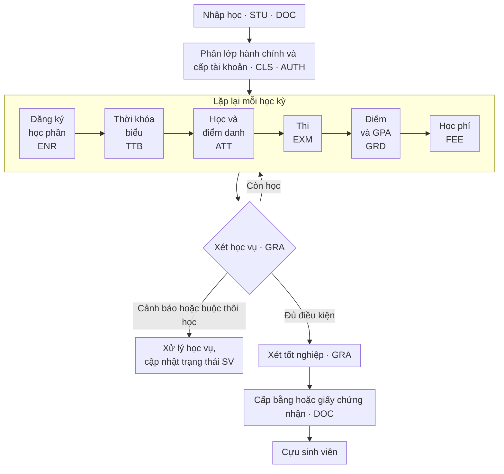
```mermaid
%%{init: {"flowchart": {"rankSpacing": 28, "nodeSpacing": 28, "padding": 8}}}%%
flowchart TB
    A["Nhập học · STU · DOC"] --> B["Phân lớp hành chính và cấp tài khoản · CLS · AUTH"]
    B --> C
    subgraph C["Lặp lại mỗi học kỳ"]
        direction LR
        C1["Đăng ký<br/>học phần<br/>ENR"] --> C2["Thời khóa<br/>biểu<br/>TTB"]
        C2 --> C3["Học và<br/>điểm danh<br/>ATT"]
        C3 --> C4["Thi<br/>EXM"]
        C4 --> C5["Điểm<br/>và GPA<br/>GRD"]
        C5 --> C6["Học phí<br/>FEE"]
    end
    C --> D{"Xét học vụ · GRA"}
    D -->|"Còn học"| C
    D -->|"Cảnh báo hoặc buộc thôi học"| E["Xử lý học vụ,<br/>cập nhật trạng thái SV"]
    D -->|"Đủ điều kiện"| F["Xét tốt nghiệp · GRA"]
    F --> G["Cấp bằng hoặc giấy chứng nhận · DOC"]
    G --> H["Cựu sinh viên"]
```

**Nguyên tắc xuyên suốt**

- Một sinh viên có đúng **một MSSV** và **một hồ sơ** duy nhất trong toàn bộ vòng đời.
- Quy chế học vụ là **tham số cấu hình theo khóa** (không viết cứng trong mã nguồn).
- Mỗi sự kiện nghiệp vụ quan trọng phát sinh **thông báo** (module `NOT`) và **nhật ký kiểm toán** (module `SYS`).
- Mọi dữ liệu sau khi **khóa sổ học kỳ** chỉ được sửa theo quy trình ngoại lệ có phê duyệt.

### 3.3 Các quy trình nghiệp vụ chính

Mỗi quy trình có sơ đồ và các **điểm kiểm soát** — nơi hệ thống bắt buộc kiểm tra điều kiện hoặc ghi vết.

#### 3.3.1 Đăng ký học phần

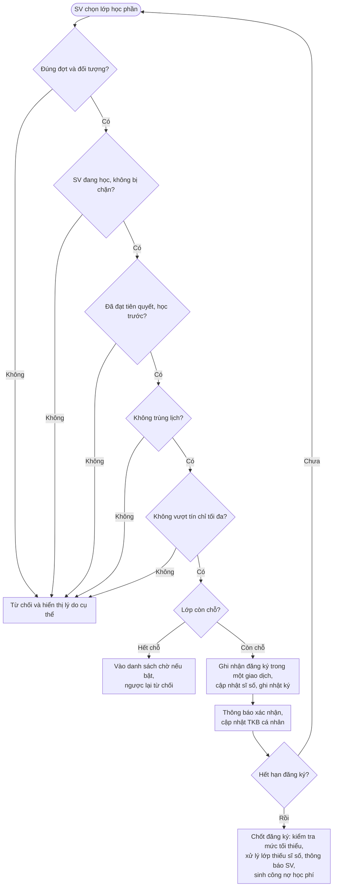
```mermaid
%%{init: {"flowchart": {"rankSpacing": 28, "nodeSpacing": 28, "padding": 8}}}%%
flowchart TD
    S(["SV chọn lớp học phần"]) --> V1{"Đúng đợt và đối tượng?"}
    V1 -- Không --> X["Từ chối và hiển thị lý do cụ thể"]
    V1 -- Có --> V2{"SV đang học, không bị chặn?"}
    V2 -- Không --> X
    V2 -- Có --> V3{"Đã đạt tiên quyết, học trước?"}
    V3 -- Không --> X
    V3 -- Có --> V4{"Không trùng lịch?"}
    V4 -- Không --> X
    V4 -- Có --> V5{"Không vượt tín chỉ tối đa?"}
    V5 -- Không --> X
    V5 -- Có --> V6{"Lớp còn chỗ?"}
    V6 -- Hết chỗ --> W["Vào danh sách chờ nếu bật,<br/>ngược lại từ chối"]
    V6 -- Còn chỗ --> OK["Ghi nhận đăng ký trong một giao dịch,<br/>cập nhật sĩ số, ghi nhật ký"]
    OK --> N["Thông báo xác nhận,<br/>cập nhật TKB cá nhân"]
    N --> E{"Hết hạn đăng ký?"}
    E -- Chưa --> S
    E -- Rồi --> F["Chốt đăng ký: kiểm tra mức tối thiểu,<br/>xử lý lớp thiếu sĩ số, thông báo SV,<br/>sinh công nợ học phí"]
```

**Điểm kiểm soát:** `BR-ENR-01` (đối tượng), `BR-ENR-03` (tiên quyết), `BR-ENR-04` (trùng lịch), `BR-ENR-02` (khung tín chỉ), `BR-ENR-05` (sĩ số — kiểm tra và ghi nhận phải nguyên tử), `BR-ENR-08` (đồng bộ công nợ).

#### 3.3.2 Nhập, duyệt và công bố điểm

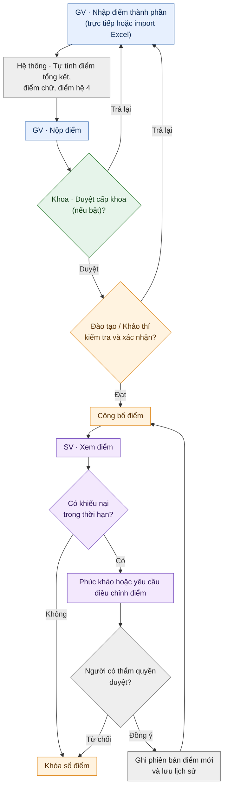
```mermaid
%%{init: {"flowchart": {"rankSpacing": 28, "nodeSpacing": 28, "padding": 8}}}%%
flowchart TB
    G1["GV · Nhập điểm thành phần<br/>(trực tiếp hoặc import Excel)"] --> G2["Hệ thống · Tự tính điểm tổng kết,<br/>điểm chữ, điểm hệ 4"]
    G2 --> G3["GV · Nộp điểm"]
    G3 --> K1{"Khoa · Duyệt cấp khoa<br/>(nếu bật)?"}
    K1 -- Trả lại --> G1
    K1 -- Duyệt --> D1{"Đào tạo / Khảo thí<br/>kiểm tra và xác nhận?"}
    D1 -- Trả lại --> G1
    D1 -- Đạt --> D2["Công bố điểm"]
    D2 --> S1["SV · Xem điểm"]
    S1 --> S2{"Có khiếu nại<br/>trong thời hạn?"}
    S2 -- Không --> D3["Khóa sổ điểm"]
    S2 -- Có --> P["Phúc khảo hoặc yêu cầu điều chỉnh điểm"]
    P --> Q{"Người có thẩm quyền<br/>duyệt?"}
    Q -- Đồng ý --> R["Ghi phiên bản điểm mới<br/>và lưu lịch sử"]
    R --> D2
    Q -- Từ chối --> D3

    classDef gv fill:#e7f0fe,stroke:#3b6fb6,color:#0b2a55
    classDef khoa fill:#e6f4ea,stroke:#2e7d32,color:#0d3b12
    classDef dt fill:#fff3e0,stroke:#e08a1e,color:#5a3200
    classDef sv fill:#f3e8fd,stroke:#7e57c2,color:#2d1457
    classDef sys fill:#eeeeee,stroke:#757575,color:#212121
    class G1,G3 gv
    class K1 khoa
    class D1,D2,D3 dt
    class S1,S2,P sv
    class G2,Q,R sys
```

**Điểm kiểm soát:** `BR-GRD-05` (chỉ giảng viên được phân công mới nhập), `BR-GRD-06` (điểm đã công bố không sửa trực tiếp, mọi điều chỉnh tạo phiên bản mới), `BR-GRD-08` (sinh viên chỉ thấy điểm đã công bố), `BR-GRD-09` (thời hạn phúc khảo).

#### 3.3.3 Thu học phí

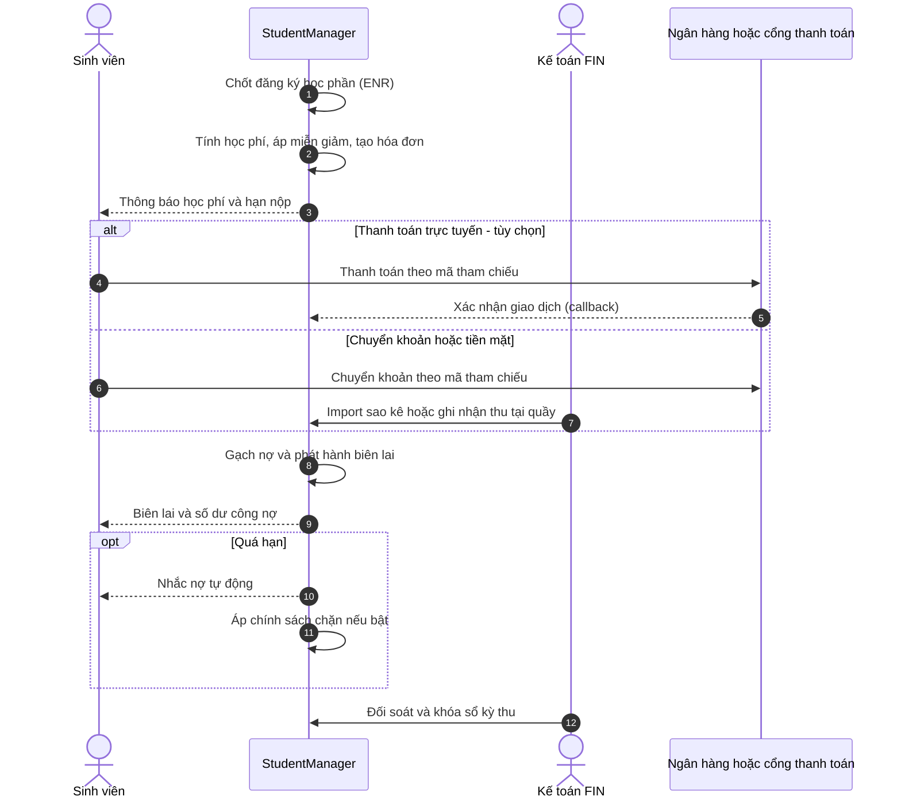
```mermaid
sequenceDiagram
    autonumber
    actor SV as Sinh viên
    participant HT as StudentManager
    actor KT as Kế toán FIN
    participant NH as Ngân hàng hoặc cổng thanh toán
    HT->>HT: Chốt đăng ký học phần (ENR)
    HT->>HT: Tính học phí, áp miễn giảm, tạo hóa đơn
    HT-->>SV: Thông báo học phí và hạn nộp
    alt Thanh toán trực tuyến - tùy chọn
        SV->>NH: Thanh toán theo mã tham chiếu
        NH-->>HT: Xác nhận giao dịch (callback)
    else Chuyển khoản hoặc tiền mặt
        SV->>NH: Chuyển khoản theo mã tham chiếu
        KT->>HT: Import sao kê hoặc ghi nhận thu tại quầy
    end
    HT->>HT: Gạch nợ và phát hành biên lai
    HT-->>SV: Biên lai và số dư công nợ
    opt Quá hạn
        HT-->>SV: Nhắc nợ tự động
        HT->>HT: Áp chính sách chặn nếu bật
    end
    KT->>HT: Đối soát và khóa sổ kỳ thu
```

**Điểm kiểm soát:** `BR-FEE-01` (công thức học phí), `BR-FEE-03` (giao dịch bất biến, sai sót xử lý bằng bút toán điều chỉnh), `BR-FEE-04` (phân bổ thanh toán), `BR-FEE-07` (người tạo khác người duyệt khi hoàn tiền), `BR-FEE-09` (mã tham chiếu duy nhất để đối soát).

#### 3.3.4 Tổ chức kỳ thi

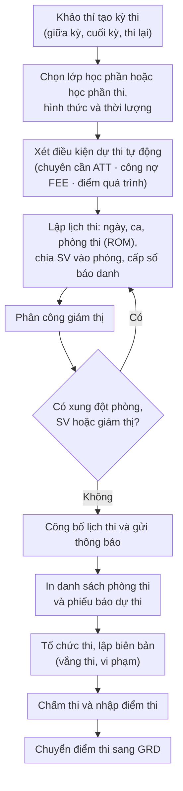
```mermaid
%%{init: {"flowchart": {"rankSpacing": 28, "nodeSpacing": 28, "padding": 8}}}%%
flowchart TD
    A["Khảo thí tạo kỳ thi<br/>(giữa kỳ, cuối kỳ, thi lại)"] --> B["Chọn lớp học phần hoặc học phần thi,<br/>hình thức và thời lượng"]
    B --> C["Xét điều kiện dự thi tự động<br/>(chuyên cần ATT · công nợ FEE · điểm quá trình)"]
    C --> D["Lập lịch thi: ngày, ca, phòng thi (ROM),<br/>chia SV vào phòng, cấp số báo danh"]
    D --> E["Phân công giám thị"]
    E --> F{"Có xung đột phòng,<br/>SV hoặc giám thị?"}
    F -- Có --> D
    F -- Không --> G["Công bố lịch thi và gửi thông báo"]
    G --> H["In danh sách phòng thi<br/>và phiếu báo dự thi"]
    H --> I["Tổ chức thi, lập biên bản<br/>(vắng thi, vi phạm)"]
    I --> J["Chấm thi và nhập điểm thi"]
    J --> K["Chuyển điểm thi sang GRD"]
```

**Điểm kiểm soát:** `BR-EXM-01` (chỉ xếp lịch cho môn đã đăng ký và đủ điều kiện), `BR-EXM-02` (không trùng ca / phòng, đủ sức chứa), `BR-EXM-03` (quy tắc giám thị), `BR-EXM-04` (thay đổi lịch sau công bố).

#### 3.3.5 Xử lý đơn từ

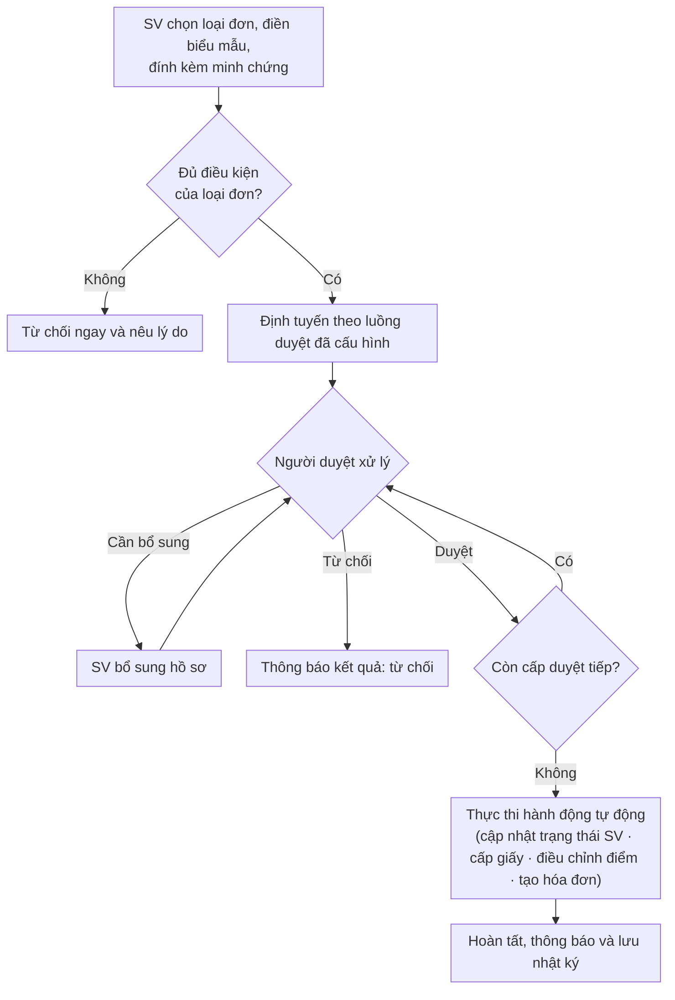
```mermaid
%%{init: {"flowchart": {"rankSpacing": 28, "nodeSpacing": 28, "padding": 8}}}%%
flowchart TD
    A["SV chọn loại đơn, điền biểu mẫu,<br/>đính kèm minh chứng"] --> B{"Đủ điều kiện<br/>của loại đơn?"}
    B -- Không --> R1["Từ chối ngay và nêu lý do"]
    B -- Có --> C["Định tuyến theo luồng duyệt đã cấu hình"]
    C --> D{"Người duyệt xử lý"}
    D -- "Cần bổ sung" --> E["SV bổ sung hồ sơ"]
    E --> D
    D -- "Từ chối" --> R2["Thông báo kết quả: từ chối"]
    D -- "Duyệt" --> F{"Còn cấp duyệt tiếp?"}
    F -- Có --> D
    F -- Không --> G["Thực thi hành động tự động<br/>(cập nhật trạng thái SV · cấp giấy · điều chỉnh điểm · tạo hóa đơn)"]
    G --> H["Hoàn tất, thông báo và lưu nhật ký"]
```

**Điểm kiểm soát:** `BR-REQ-01` (điều kiện theo loại đơn), `BR-REQ-03` (đơn đã duyệt không sửa), `BR-REQ-04` (SLA và leo thang).

#### 3.3.6 Xét tốt nghiệp

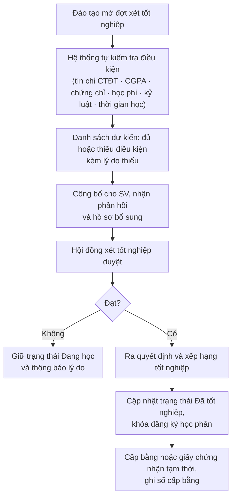
```mermaid
%%{init: {"flowchart": {"rankSpacing": 28, "nodeSpacing": 28, "padding": 8}}}%%
flowchart TD
    A["Đào tạo mở đợt xét tốt nghiệp"] --> B["Hệ thống tự kiểm tra điều kiện<br/>(tín chỉ CTĐT · CGPA · chứng chỉ · học phí · kỷ luật · thời gian học)"]
    B --> C["Danh sách dự kiến: đủ hoặc thiếu điều kiện<br/>kèm lý do thiếu"]
    C --> D["Công bố cho SV, nhận phản hồi<br/>và hồ sơ bổ sung"]
    D --> E["Hội đồng xét tốt nghiệp duyệt"]
    E --> F{"Đạt?"}
    F -- Không --> G["Giữ trạng thái Đang học<br/>và thông báo lý do"]
    F -- Có --> H["Ra quyết định và xếp hạng tốt nghiệp"]
    H --> I["Cập nhật trạng thái Đã tốt nghiệp,<br/>khóa đăng ký học phần"]
    I --> J["Cấp bằng hoặc giấy chứng nhận tạm thời,<br/>ghi sổ cấp bằng"]
```

**Điểm kiểm soát:** `BR-GRA-04` (điều kiện tốt nghiệp), `BR-GRA-05` (xếp hạng và giảm hạng), `BR-GRA-06` (quyết định có số và ngày hiệu lực).

## 4. Tác nhân và phân quyền

### 4.1 Danh sách tác nhân (vai trò)

| Mã | Vai trò | Đơn vị | Nhiệm vụ chính | Module chủ đạo |
|---|---|---|---|---|
| `ADMIN` | Quản trị hệ thống | Phòng CNTT | Tài khoản, phân quyền, cấu hình, sao lưu, giám sát | AUTH, SYS |
| `ACAD` | Cán bộ Đào tạo | Phòng Đào tạo | Quản lý CTĐT, học phần, mở lớp, thời khóa biểu, đăng ký, điểm, học vụ, tốt nghiệp | ACY, CUR, CLS, TTB, ENR, GRD, GRA |
| `EXAM` | Cán bộ Khảo thí | Phòng Khảo thí | Kỳ thi, lịch thi, phòng thi, giám thị, điểm thi | EXM |
| `CTSV` | Cán bộ Công tác sinh viên | Phòng CTSV | Hồ sơ sinh viên, rèn luyện, học bổng, khen thưởng – kỷ luật | STU, DOC, SCH |
| `FIN` | Cán bộ Tài chính – Kế toán | Phòng TC–KT | Học phí, miễn giảm, thu – hoàn tiền, công nợ, đối soát | FEE |
| `DEAN` | Lãnh đạo Khoa / Bộ môn | Khoa, Bộ môn | Phân công giảng dạy, duyệt điểm và đề cương cấp khoa, theo dõi sinh viên của khoa | FAC, SUB, CUR, TCH, GRD |
| `LEC` | Giảng viên | Khoa, Bộ môn | Xem lịch dạy, điểm danh, nhập điểm, coi thi, thông báo cho lớp | TTB, ATT, GRD, EXM |
| `ADV` | Cố vấn học tập | Khoa | Theo dõi và tư vấn sinh viên lớp hành chính, xác nhận đơn, nhận cảnh báo học vụ | CLS, STU, REQ, GRA |
| `STU` | Sinh viên | — | Hồ sơ cá nhân, đăng ký học phần, thời khóa biểu, điểm, học phí, đơn từ, thông báo | ENR, GRD, FEE, REQ |
| `GUA` | Phụ huynh *(tùy chọn, mức C)* | — | Xem kết quả và học phí của con khi sinh viên hoặc nhà trường cho phép (chỉ đọc) | RPT, NOT |

> `ADV` là **vai trò gán thêm** cho một giảng viên (cùng một tài khoản có thể vừa là `LEC` vừa là `ADV`), không phải một loại tài khoản riêng. Một người dùng có thể giữ nhiều vai trò; quyền là hợp (union) của các vai trò.

### 4.2 Ma trận phân quyền mặc định

Chú giải: `C` tạo · `R` xem · `U` sửa · `D` xóa mềm · `A` phê duyệt / xác nhận / khóa · `X` xuất dữ liệu · `—` không có quyền · dấu `*` ở cuối ô nghĩa là **toàn bộ quyền trong ô chỉ áp dụng trong phạm vi dữ liệu của người dùng** ([mục 4.3](#43-phạm-vi-dữ-liệu-data-scope)).

| Module | ADMIN | ACAD | EXAM | CTSV | FIN | DEAN | LEC | ADV | STU |
|---|---|---|---|---|---|---|---|---|---|
| AUTH | `CRUDA` | `U*` | `U*` | `U*` | `U*` | `U*` | `U*` | `U*` | `U*` |
| STU | `R` | `CRUAX` | `R` | `CRUAX` | `R` | `RX*` | `R*` | `RU*` | `RU*` |
| CLS | `R` | `CRUDAX` | `R` | `RU` | `R` | `RA*` | `R*` | `R*` | `R*` |
| FAC | `CRUD` | `CRUD` | `R` | `R` | `R` | `RU*` | `R` | `R` | `R` |
| SUB | `R` | `CRUDAX` | `R` | `R` | `R` | `CRUA*` | `RU*` | `R` | `R` |
| ENR | `R` | `CRUDAX` | `R` | `R` | `R` | `R*` | `R*` | `R*` | `CRD*` |
| TTB | `R` | `CRUDAX` | `R` | `R` | `—` | `CR*` | `CR*` | `R*` | `R*` |
| ATT | `R` | `RAX` | `R` | `R` | `—` | `RX*` | `CRU*` | `R*` | `R*` |
| GRD | `R` | `RUAX` | `RAX` | `R` | `—` | `RA*` | `CRU*` | `R*` | `R*` |
| FEE | `R` | `R` | `—` | `RA` | `CRUDAX` | `R*` | `—` | `R*` | `R*` |
| DOC | `R` | `CRUAX` | `R` | `CRUAX` | `R*` | `R*` | `—` | `R*` | `CR*` |
| NOT | `CRUDX` | `CRX` | `CR` | `CR` | `CR` | `CR*` | `CR*` | `CR*` | `RU*` |
| EXM | `R` | `RX` | `CRUDAX` | `R` | `—` | `RA*` | `RU*` | `R*` | `R*` |
| TCH | `R` | `CRUX` | `R` | `R` | `R` | `CRUAX*` | `RU*` | `RU*` | `R` |
| RPT | `RX` | `RX` | `RX` | `RX` | `RX` | `RX*` | `R*` | `R*` | `R*` |
| SYS | `CRUDX` | `RU` | `—` | `—` | `—` | `—` | `—` | `—` | `—` |
| ACY | `R` | `CRUDA` | `R` | `R` | `R` | `R` | `R` | `R` | `R` |
| CUR | `R` | `CRUDAX` | `R` | `R` | `R` | `CRUA*` | `R` | `R` | `R*` |
| ROM | `CRUD` | `CRUDX` | `R` | `R` | `—` | `R` | `R` | `R` | `R` |
| GRA | `R` | `CRUDAX` | `RX` | `RA` | `R` | `RA*` | `—` | `R*` | `CR*` |
| REQ | `R` | `CRUA` | `RA` | `RA` | `RA` | `RA*` | `RA*` | `RA*` | `CR*` |
| SCH | `R` | `R` | `R` | `CRUDAX` | `R` | `RA*` | `R*` | `RA*` | `CR*` |
| EVA | `R` | `CRUAX` | `R` | `R` | `—` | `R*` | `R*` | `—` | `CR*` |

**Ghi chú**

1. `ADMIN` **không** nhập hoặc sửa dữ liệu giao dịch nghiệp vụ (đăng ký, điểm, học phí, thi) để đảm bảo phân tách nhiệm vụ; can thiệp kỹ thuật phải qua cơ chế ngoại lệ có nhật ký (`FR-SYS-004`, `BR-SYS-03`).
2. Ở hàng `AUTH`, `U*` nghĩa là mỗi người tự quản lý tài khoản của chính mình (đổi mật khẩu, xem và thu hồi phiên đăng nhập).
3. Chữ `C` ở một số ô là **đề xuất** khi quyền quyết định thuộc vai trò khác — ví dụ `LEC` ở `TTB` đề xuất dạy bù hoặc báo nghỉ, chờ `ACAD` duyệt.
4. Ma trận là cấu hình **mặc định**; có thể điều chỉnh bằng giao diện ở module `AUTH` (`FR-AUTH-011`, `FR-AUTH-012`).

### 4.3 Phạm vi dữ liệu (data scope)

| Phạm vi | Mô tả | Áp dụng cho |
|---|---|---|
| `ALL` | Toàn trường | `ADMIN`, `ACAD`, `EXAM`, `CTSV`, `FIN` |
| `FACULTY` | Dữ liệu thuộc khoa / bộ môn mà người dùng quản lý | `DEAN` |
| `SECTION` | Các lớp học phần được phân công giảng dạy hoặc coi thi | `LEC` |
| `ADVISEE` | Các lớp hành chính được phân công cố vấn | `ADV` |
| `OWN` | Dữ liệu của chính người dùng | `STU`, và hồ sơ cá nhân của `LEC`, `ADV` |

> Phạm vi dữ liệu phải được kiểm tra **ở tầng máy chủ** cho mọi truy cập (kể cả khi người dùng gõ trực tiếp đường dẫn hoặc gọi API); ẩn nút trên giao diện không được coi là đủ (`BR-AUTH-04`, `NFR-SEC-05`).

## 5. Kiến trúc nghiệp vụ và danh mục module

### 5.1 Bối cảnh hệ thống

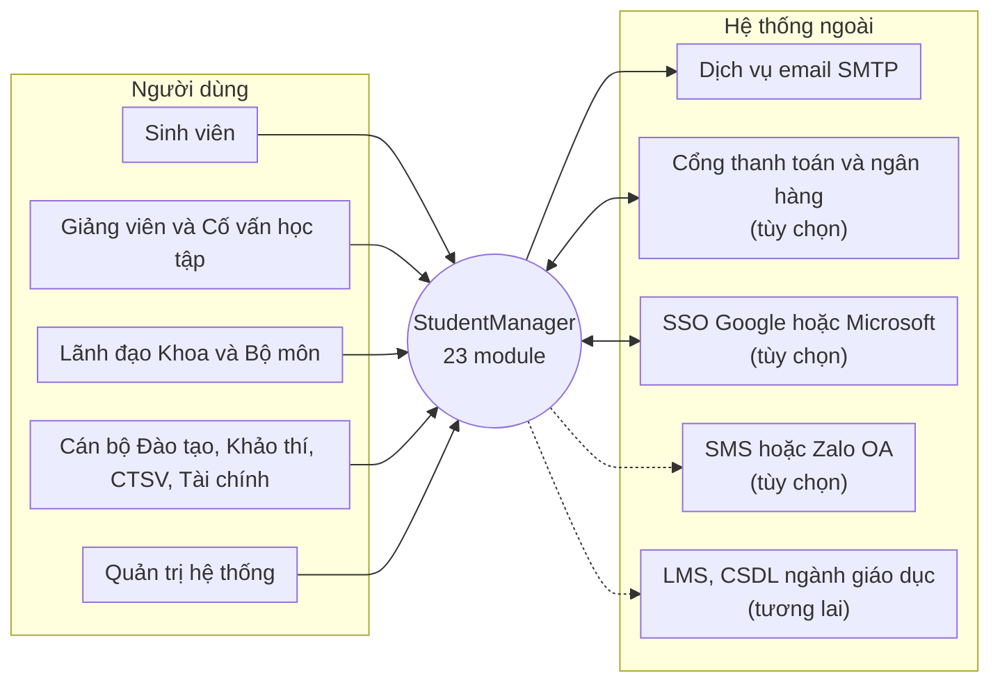
```mermaid
%%{init: {"flowchart": {"rankSpacing": 28, "nodeSpacing": 28, "padding": 8}}}%%
flowchart LR
    subgraph Users["Người dùng"]
        U1["Sinh viên"]
        U2["Giảng viên và Cố vấn học tập"]
        U3["Lãnh đạo Khoa và Bộ môn"]
        U4["Cán bộ Đào tạo, Khảo thí, CTSV, Tài chính"]
        U5["Quản trị hệ thống"]
    end
    SM(("StudentManager<br/>23 module"))
    subgraph Ext["Hệ thống ngoài"]
        E1["Dịch vụ email SMTP"]
        E2["Cổng thanh toán và ngân hàng<br/>(tùy chọn)"]
        E3["SSO Google hoặc Microsoft<br/>(tùy chọn)"]
        E4["SMS hoặc Zalo OA<br/>(tùy chọn)"]
        E5["LMS, CSDL ngành giáo dục<br/>(tương lai)"]
    end
    U1 --> SM
    U2 --> SM
    U3 --> SM
    U4 --> SM
    U5 --> SM
    SM --> E1
    SM <--> E2
    SM <--> E3
    SM -.-> E4
    SM -.-> E5
```

| Hệ thống ngoài | Mục đích | Hướng dữ liệu | Giai đoạn | Phương thức gợi ý |
|---|---|---|---|---|
| Dịch vụ email SMTP | Gửi thông báo (đặt lại mật khẩu, học phí, điểm…) | StudentManager → ngoài | P2 (P1 dùng thông báo trong ứng dụng hoặc hộp thư thử nghiệm) | SMTP |
| Cổng thanh toán, ngân hàng | Thanh toán trực tuyến, nhận xác nhận giao dịch, đối soát sao kê | Hai chiều | P4 (bản đầu: import sao kê dạng file) | API / webhook; file CSV |
| SSO Google / Microsoft | Đăng nhập bằng email trường | Hai chiều | P4 | OAuth2 / OpenID Connect |
| SMS, Zalo OA | Nhắc việc khẩn | StudentManager → ngoài | P4 | API nhà cung cấp |
| LMS, CSDL ngành giáo dục | Đồng bộ lớp và điểm; báo cáo thống kê | Hai chiều | Ngoài phạm vi | API / file chuẩn |

### 5.2 Bản đồ module

Màu xanh là module theo yêu cầu ban đầu; **viền cam nét đứt** là module đề xuất bổ sung.

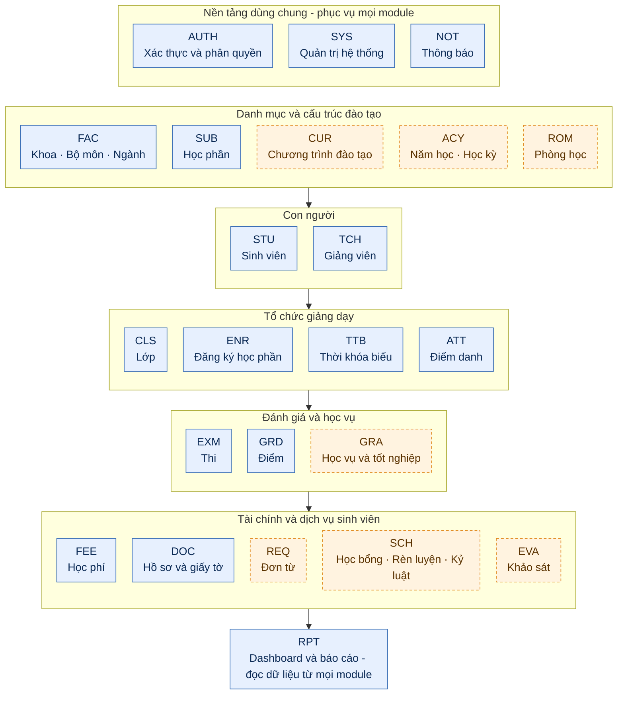
```mermaid
%%{init: {"flowchart": {"rankSpacing": 30, "nodeSpacing": 24, "padding": 8}}}%%
flowchart TB
    subgraph PLAT["Nền tảng dùng chung - phục vụ mọi module"]
        direction TB
        AUTH["AUTH<br/>Xác thực và phân quyền"]
        SYS["SYS<br/>Quản trị hệ thống"]
        NOT["NOT<br/>Thông báo"]
    end
    subgraph MASTER["Danh mục và cấu trúc đào tạo"]
        direction TB
        FAC["FAC<br/>Khoa · Bộ môn · Ngành"]
        SUB["SUB<br/>Học phần"]
        CUR["CUR<br/>Chương trình đào tạo"]
        ACY["ACY<br/>Năm học · Học kỳ"]
        ROM["ROM<br/>Phòng học"]
    end
    subgraph PEOPLE["Con người"]
        direction TB
        STU["STU<br/>Sinh viên"]
        TCH["TCH<br/>Giảng viên"]
    end
    subgraph TEACH["Tổ chức giảng dạy"]
        direction TB
        CLS["CLS<br/>Lớp"]
        ENR["ENR<br/>Đăng ký học phần"]
        TTB["TTB<br/>Thời khóa biểu"]
        ATT["ATT<br/>Điểm danh"]
    end
    subgraph ASSESS["Đánh giá và học vụ"]
        direction TB
        EXM["EXM<br/>Thi"]
        GRD["GRD<br/>Điểm"]
        GRA["GRA<br/>Học vụ và tốt nghiệp"]
    end
    subgraph SERVICE["Tài chính và dịch vụ sinh viên"]
        direction TB
        FEE["FEE<br/>Học phí"]
        DOC["DOC<br/>Hồ sơ và giấy tờ"]
        REQ["REQ<br/>Đơn từ"]
        SCH["SCH<br/>Học bổng · Rèn luyện · Kỷ luật"]
        EVA["EVA<br/>Khảo sát"]
    end
    RPT["RPT<br/>Dashboard và báo cáo - đọc dữ liệu từ mọi module"]

    PLAT ~~~ MASTER
    MASTER --> PEOPLE
    PEOPLE --> TEACH
    TEACH --> ASSESS
    ASSESS --> SERVICE
    SERVICE --> RPT

    classDef req fill:#e7f0fe,stroke:#3b6fb6,color:#0b2a55
    classDef add fill:#fff3e0,stroke:#e08a1e,stroke-dasharray:4 3,color:#5a3200
    class AUTH,SYS,NOT,FAC,SUB,STU,TCH,CLS,ENR,TTB,ATT,EXM,GRD,FEE,DOC,RPT req
    class ACY,ROM,CUR,GRA,REQ,SCH,EVA add
```

> Các nhóm xếp từ trên xuống theo thứ tự dữ liệu chảy chính: danh mục → con người → tổ chức giảng dạy → đánh giá → tài chính và dịch vụ → báo cáo. `AUTH`, `SYS` và `NOT` phục vụ mọi module; `RPT` đọc dữ liệu từ tất cả module. Mối phụ thuộc chi tiết theo từng module (kể cả việc `FEE` chặn `ENR` khi sinh viên nợ học phí) nằm ở [mục 5.5](#55-ma-trận-phụ-thuộc).

### 5.3 Danh mục module và ranh giới phạm vi

| # | Mã | Module | Nguồn | Phạm vi chính | Ưu tiên | Giai đoạn | Công sức |
|---|---|---|---|---|---|---|---|
| 1 | AUTH | Authentication & Authorization | Yêu cầu | Đăng nhập, mật khẩu, phiên, vai trò – quyền, phạm vi dữ liệu | M | P1 | M |
| 2 | STU | Student Management | Yêu cầu | Hồ sơ sinh viên, MSSV, trạng thái vòng đời, import / export, lịch sử thay đổi | M | P1 | L |
| 3 | CLS | Class Management | Yêu cầu | Khóa, lớp hành chính, lớp học phần, phân công giảng viên, cố vấn học tập | M | P1 | M |
| 4 | FAC | Faculty / Department Management | Yêu cầu | Khoa, bộ môn, ngành, chuyên ngành, hệ đào tạo | M | P1 | S |
| 5 | SUB | Subject / Course Management | Yêu cầu | Danh mục học phần, tín chỉ, tiên quyết, cơ cấu điểm, đề cương | M | P1 | M |
| 6 | ENR | Enrollment Management | Yêu cầu | Đợt đăng ký, kiểm tra điều kiện, rút và đổi lớp, chốt đăng ký | M | P1 | L |
| 7 | TTB | Class Schedule / Timetable | Yêu cầu | Tiết học, xếp lịch, phát hiện xung đột, TKB cá nhân, dạy bù | M | P1 → P2 | L |
| 8 | ATT | Attendance Management | Yêu cầu | Điểm danh theo buổi, cảnh báo vắng, cấm thi, báo cáo chuyên cần | S | P2 | M |
| 9 | GRD | Grade Management | Yêu cầu | Nhập điểm, tính GPA, duyệt và công bố, phúc khảo, bảng điểm | M | P1 | L |
| 10 | FEE | Tuition / Fee Management | Yêu cầu | Biểu phí, hóa đơn, thanh toán, miễn giảm, công nợ, hoàn tiền | S | P2 | L |
| 11 | DOC | Student Documents | Yêu cầu | Hồ sơ nhập học, giấy tờ cấp cho sinh viên, mẫu văn bản, xác thực bằng QR | S | P2 | M |
| 12 | NOT | Notification Management | Yêu cầu | Thông báo trong ứng dụng, email, mẫu, sự kiện tự động, thông báo thủ công | S | P1 → P2 | M |
| 13 | EXM | Exam Management | Yêu cầu | Kỳ thi, điều kiện dự thi, lịch – phòng – giám thị, vi phạm, nhập điểm thi | S | P2 | L |
| 14 | TCH | Teacher / Lecturer Management | Yêu cầu | Hồ sơ giảng viên, phân công giảng dạy, khối lượng, cố vấn học tập, cổng giảng viên | M | P1 | M |
| 15 | RPT | Dashboard & Reports | Yêu cầu | Dashboard theo vai trò, báo cáo chuẩn, xuất file, báo cáo định kỳ | M | P1 → P3 | M |
| 16 | SYS | System Administration | Yêu cầu | Cấu hình, danh mục dùng chung, quy chế, nhật ký, sao lưu, import, khóa sổ | M | P1 → P3 | M |
| 17 | ACY | Academic Year & Semester | **Đề xuất** | Năm học, học kỳ, lịch học vụ, ngày nghỉ | M | P1 | S |
| 18 | CUR | Curriculum / Training Program | **Đề xuất** | CTĐT theo ngành – khóa, khối kiến thức, điều kiện tốt nghiệp, tiến độ học tập | M | P1 | M |
| 19 | ROM | Classroom & Facility | **Đề xuất** | Tòa nhà, phòng, sức chứa, loại phòng, lịch sử dụng | M | P1 | S |
| 20 | GRA | Graduation & Academic Standing | **Đề xuất** | Xếp loại học lực, cảnh báo học vụ, xét tốt nghiệp, cấp bằng | S | P3 | M |
| 21 | REQ | Student Requests & Petitions | **Đề xuất** | Đơn từ trực tuyến, luồng duyệt cấu hình được, SLA, hành động tự động | S | P3 | M |
| 22 | SCH | Scholarship, Rewards, Discipline & Conduct | **Đề xuất** | Học bổng, điểm rèn luyện, khen thưởng, kỷ luật | C | P4 | M |
| 23 | EVA | Course & Lecturer Evaluation | **Đề xuất** | Khảo sát chất lượng giảng dạy ẩn danh | C | P4 | S |

**Làm rõ ranh giới phạm vi** (để tránh hiểu nhầm khi thiết kế):

| Chủ đề | Quy ước |
|---|---|
| Từ "lớp" | `CLS` quản lý **hai loại lớp**: *lớp hành chính* (gắn khóa – ngành, có CVHT, tồn tại suốt khóa học) và *lớp học phần* (mở theo học kỳ cho một học phần, có giảng viên, lịch, sĩ số). Hai loại có vòng đời khác nhau |
| Khóa (cohort) | Thuộc `CLS`; `CUR` và quy chế học vụ trong `SYS` gắn theo khóa |
| Cơ cấu tổ chức | `FAC` gồm Khoa → Bộ môn, Ngành → Chuyên ngành, Hệ đào tạo. Mỗi ngành thuộc đúng một khoa quản lý |
| Học phần và chương trình đào tạo | `SUB` là danh mục học phần dùng chung; `CUR` quy định học phần nào thuộc ngành – khóa nào, ở học kỳ nào, bắt buộc hay tự chọn và điều kiện tốt nghiệp |
| Giảng viên và cố vấn học tập | `TCH` quản lý hồ sơ giảng viên và vai trò CVHT; việc gán CVHT cho lớp hành chính thực hiện ở `CLS` |
| Hồ sơ và giấy tờ | `DOC` gồm (1) hồ sơ sinh viên nộp lên (CCCD, học bạ…) và (2) văn bản cấp cho sinh viên sinh từ mẫu (giấy xác nhận, bảng điểm có mã QR). Luồng xin cấp giấy dùng chung với `REQ` |
| Thi và điểm | `EXM` tổ chức kỳ thi (lịch, phòng, giám thị, vi phạm); điểm thi chuyển sang `GRD`; xếp loại học lực, cảnh báo học vụ và tốt nghiệp thuộc `GRA` |
| Thông báo | `NOT` là hạ tầng dùng chung; module khác chỉ phát sự kiện ([Phụ lục A](#phụ-lục-a--danh-mục-sự-kiện-thông-báo)) |
| Báo cáo | `RPT` là tầng dashboard và báo cáo tổng hợp; báo cáo chuyên biệt của từng module liệt kê ở [Phụ lục B](#phụ-lục-b--danh-mục-báo-cáo) |

### 5.4 Phân tích khoảng trống và đề xuất bổ sung

Rà soát 16 module ban đầu theo vòng đời sinh viên ([mục 3.2](#32-vòng-đời-sinh-viên-to-be)), phát hiện các khoảng trống sau. Đề xuất chia 3 nhóm theo mức cần thiết.

| Mã | Module đề xuất | Khoảng trống phát hiện | Hệ quả nếu thiếu | Nhóm |
|---|---|---|---|---|
| ACY | Academic Year & Semester | Đăng ký, thời khóa biểu, thi, điểm, học phí đều xoay quanh "học kỳ" nhưng chưa có nơi quản lý năm học, học kỳ và các mốc thời gian | Không mở được đợt đăng ký, không chốt hay khóa sổ kỳ, báo cáo theo kỳ sai | **A — Nền tảng, bắt buộc** |
| CUR | Curriculum / Training Program | `SUB` chỉ là danh mục học phần; chưa có cấu trúc chương trình (học phần nào, kỳ nào, bao nhiêu tín chỉ, điều kiện ra trường) | `ENR` không biết học phần nào được phép đăng ký; không xét được tốt nghiệp; không có tiến độ học tập | **A — Nền tảng, bắt buộc** |
| ROM | Classroom & Facility | `TTB` và `EXM` cần phòng, sức chứa, loại phòng để phát hiện xung đột | Xếp lịch và phòng thi thủ công, dễ trùng phòng | **A — Nền tảng, bắt buộc** (bản tối thiểu: quản lý danh mục phòng) |
| GRA | Graduation & Academic Standing | `GRD` dừng ở điểm và GPA; thiếu xếp loại học lực, cảnh báo học vụ, buộc thôi học, xét tốt nghiệp, cấp bằng | Vòng đời sinh viên không khép kín; `STU` không biết khi nào tốt nghiệp hoặc bị buộc thôi học | **B — Nên có** |
| REQ | Student Requests & Petitions | Nhiều nghiệp vụ cần sinh viên gửi đơn và được duyệt nhiều cấp (bảo lưu, thôi học, phúc khảo, xin giấy xác nhận, nghỉ có phép…) nhưng chưa có cơ chế chung | Mỗi module tự làm luồng duyệt riêng — trùng lặp, không theo dõi được tiến độ | **B — Nên có** |
| SCH | Scholarship, Rewards, Discipline & Conduct | Công tác sinh viên (học bổng, khen thưởng, kỷ luật, điểm rèn luyện) ảnh hưởng học phí (`FEE`) và xét tốt nghiệp (`GRA`) | Thiếu dữ liệu đầu vào cho miễn giảm và xét tốt nghiệp; phòng CTSV vẫn dùng Excel | **C — Mở rộng, tùy chọn** |
| EVA | Course & Lecturer Evaluation | Khảo sát chất lượng giảng dạy là yêu cầu phổ biến của kiểm định chất lượng | Thiếu kênh phản hồi có hệ thống của sinh viên | **C — Mở rộng, tùy chọn** |

**Năng lực xuyên suốt** — không tách thành module riêng mà gộp vào các module nền tảng:

| Năng lực | Đặc tả tại |
|---|---|
| Nhật ký kiểm toán (audit log) | `SYS` — `FR-SYS-004` |
| Sao lưu và khôi phục | `SYS` — `FR-SYS-006` |
| Import / export hàng loạt | `SYS` — `FR-SYS-007` |
| Đa ngôn ngữ (vi / en) | `SYS` — `FR-SYS-009` |
| Lập lịch tác vụ nền | `SYS` — `FR-SYS-011` |
| Lưu trữ tệp | `SYS` — `FR-SYS-012` và `DOC` |
| Chính sách lưu trữ và ẩn danh hóa dữ liệu | `SYS` — `FR-SYS-018` |
| Tìm kiếm, lọc, sắp xếp, phân trang | Quy ước chung `GC-01` ([mục 6.0](#60-quy-ước-chung-của-đặc-tả-module)) |

**Hạng mục chưa đưa vào phạm vi, có thể xem xét sau**: thực tập – khóa luận tốt nghiệp (hướng dẫn, đề tài, bảo vệ), cổng cựu sinh viên, cổng phụ huynh đầy đủ, và các hạng mục ở bảng "Ngoài phạm vi" của [mục 2.3](#23-phạm-vi-dự-án).

### 5.5 Ma trận phụ thuộc

| Module | Cần có trước (đầu vào) | Cung cấp cho (đầu ra) |
|---|---|---|
| AUTH | SYS (cấu hình, nhật ký), NOT (email đặt lại mật khẩu) | Tất cả module |
| SYS | AUTH | Tất cả module (cấu hình, nhật ký, import, khóa sổ) |
| NOT | AUTH, SYS | Tất cả module (nhận sự kiện) |
| FAC | AUTH | STU, TCH, SUB, CUR, CLS |
| ACY | SYS | CLS, ENR, TTB, EXM, GRD, FEE |
| ROM | SYS | TTB, EXM |
| SUB | FAC | CUR, CLS, ENR, GRD |
| CUR | FAC, SUB, ACY | STU, ENR, GRA |
| TCH | FAC, AUTH | CLS, TTB, ATT, EXM, GRD |
| STU | FAC, CUR, AUTH, CLS (khóa, lớp hành chính) | ENR, FEE, GRD, DOC, GRA, REQ |
| CLS | FAC, ACY, SUB, TCH | STU (lớp hành chính), ENR, TTB, ATT, GRD |
| ENR | STU, CLS, CUR, SUB, ACY, TTB (kiểm tra trùng lịch), FEE (kiểm tra công nợ) | ATT, EXM, GRD, FEE, EVA |
| TTB | CLS, ROM, TCH, ACY | ENR, ATT, EXM |
| ATT | TTB (buổi học), ENR | EXM (điều kiện dự thi), GRD (điểm chuyên cần), NOT |
| EXM | ENR, ATT, FEE, ROM, TCH, ACY | GRD, NOT |
| GRD | ENR, EXM, SUB, ATT | GRA, DOC (bảng điểm), RPT |
| FEE | ENR, STU, ACY, SCH (học bổng) | ENR và EXM (chặn khi nợ), DOC, GRA, RPT |
| DOC | STU, GRD, REQ | REQ, GRA |
| GRA | GRD, CUR, FEE, SCH | STU (cập nhật trạng thái), DOC |
| REQ | AUTH, STU, DOC | STU, GRD, FEE, DOC |
| SCH | STU, GRD | FEE, GRA |
| EVA | ENR, CLS, TCH | RPT, TCH |
| RPT | Tất cả module | — |

> **Phụ thuộc vòng `STU` ↔ `CLS`** được giải quyết bằng thứ tự dựng: khóa và lớp hành chính (`CLS`) → hồ sơ sinh viên (`STU`) → gán sinh viên vào lớp hành chính.

### 5.6 Ưu tiên và lộ trình phát hành

| Giai đoạn | Tên | Mục tiêu | Module (mức độ) | Tiêu chí hoàn thành |
|---|---|---|---|---|
| **P1** | MVP — Học vụ cốt lõi | Chạy được trọn vòng đời một học kỳ: dựng danh mục → quản lý sinh viên, giảng viên, lớp → đăng ký học phần → thời khóa biểu → nhập điểm → sinh viên xem kết quả | AUTH, SYS (cơ bản), FAC, ACY, ROM (danh mục phòng), SUB, CUR (cơ bản), TCH, CLS, STU, ENR, TTB (cơ bản), GRD, NOT (trong ứng dụng), RPT (dashboard cơ bản) | Demo end-to-end; các kịch bản UAT-01 → UAT-08 đạt |
| **P2** | Vận hành | Bổ sung điểm danh, thi, học phí, giấy tờ và thông báo đầy đủ | ATT, EXM, FEE, DOC, NOT (email, mẫu), TTB (dạy bù, lịch nâng cao), ROM (lịch sử dụng) | UAT-09 → UAT-13 đạt |
| **P3** | Hoàn thiện | Khép kín vòng đời: học vụ – tốt nghiệp, đơn từ, báo cáo nâng cao, sao lưu và khóa sổ | GRA, REQ, RPT (đầy đủ), SYS (đầy đủ) | UAT-14 → UAT-17 đạt |
| **P4** | Mở rộng (tùy chọn) | Công tác sinh viên, khảo sát, tích hợp ngoài, tối ưu | SCH, EVA, cổng thanh toán, SSO, xếp lịch tự động, PWA | UAT-18, UAT-19 và các mục tiêu riêng |

**Thứ tự xây dựng đề xuất trong P1**

1. `SYS` cơ bản (cấu hình, nhật ký) và `AUTH` (đăng nhập, vai trò).
2. Danh mục nền: `FAC`, `ACY`, `ROM`.
3. `SUB`, rồi `CUR` (cơ bản).
4. `TCH`, `CLS` (khóa, lớp hành chính), rồi `STU`.
5. `CLS` (lớp học phần) và `TTB` (cơ bản).
6. `ENR` — module khó nhất của P1, cần dữ liệu của tất cả bước trước.
7. `GRD`.
8. `NOT` (trong ứng dụng) và `RPT` (dashboard cơ bản).

## 6. Đặc tả chi tiết theo module

### 6.0 Quy ước chung của đặc tả module

**Cấu trúc mỗi module:** (1) bảng thông tin chung; (2) luồng nghiệp vụ chính; (3) yêu cầu chức năng (FR); (4) quy tắc nghiệp vụ (BR); (5) dữ liệu chính; (6) sơ đồ trạng thái khi cần; (7) tiêu chí nghiệm thu mức nghiệp vụ theo dạng **Cho – Khi – Thì**; (8) lưu ý.

**Quy ước chung áp dụng cho mọi module** (không nhắc lại trong từng module):

| ID | Quy ước |
|---|---|
| GC-01 | Mọi danh sách hỗ trợ tìm kiếm (không phân biệt hoa thường và dấu tiếng Việt), lọc, sắp xếp, phân trang và xuất Excel khi người dùng có quyền `X` |
| GC-02 | Dữ liệu nghiệp vụ dùng xóa mềm; không xóa vật lý bản ghi đã phát sinh dữ liệu liên quan |
| GC-03 | Mọi thao tác tạo, sửa, xóa, duyệt, khóa đều ghi nhật ký kiểm toán: ai, khi nào, đối tượng, giá trị trước và sau (`FR-SYS-004`) |
| GC-04 | Kiểm tra bắt buộc, định dạng và ràng buộc ở cả giao diện lẫn máy chủ; thông báo lỗi bằng tiếng Việt, nêu rõ cách khắc phục |
| GC-05 | Dữ liệu danh mục có trạng thái Hoạt động / Ngừng hoạt động thay cho việc xóa; bản ghi ngừng hoạt động vẫn hiển thị trong dữ liệu lịch sử |
| GC-06 | Dữ liệu có hiệu lực theo thời gian (nhiệm kỳ, khung giá, quy chế) lưu ngày hiệu lực; không ghi đè lịch sử |
| GC-07 | Thao tác hàng loạt (import, gán, duyệt) phải có bước xem trước, xác nhận và báo cáo kết quả từng dòng |
| GC-08 | Quyền và phạm vi dữ liệu được kiểm tra ở máy chủ cho mọi thao tác ([mục 4.3](#43-phạm-vi-dữ-liệu-data-scope)) |
| GC-09 | Ngày giờ theo múi giờ Việt Nam (UTC+7), định dạng ngày dd/MM/yyyy; tiền tệ VND không có phần thập phân |
| GC-10 | Sự kiện nghiệp vụ quan trọng phát sinh thông báo theo [Phụ lục A](#phụ-lục-a--danh-mục-sự-kiện-thông-báo) |
| GC-11 | Mỗi bản ghi có trường chuẩn: mã định danh, người và thời điểm tạo, người và thời điểm sửa gần nhất, trạng thái |
| GC-12 | Các ngưỡng, thời hạn, số lần… nêu trong tài liệu là **giá trị mặc định lấy từ cấu hình** (`FR-SYS-003`), không viết cứng trong chương trình |

### 6.1 AUTH — Authentication & Authorization

| Thuộc tính | Nội dung |
|---|---|
| Tên tiếng Việt | Xác thực và phân quyền |
| Mục tiêu | Xác định đúng người dùng và chỉ cho họ làm những việc thuộc vai trò, trong phạm vi dữ liệu được cấp; là nền tảng bảo mật cho toàn hệ thống |
| Tác nhân | `ADMIN` (quản lý tài khoản, vai trò, quyền); mọi người dùng (đăng nhập, đổi mật khẩu) |
| Ưu tiên · Giai đoạn · Công sức | Must · P1 · M |
| Phụ thuộc | `SYS` (cấu hình, nhật ký), `NOT` (email đặt lại mật khẩu) |

**Luồng nghiệp vụ chính**

1. Tài khoản được tạo bởi `ADMIN` hoặc tự động khi tạo hồ sơ sinh viên / giảng viên, kèm vai trò mặc định và mật khẩu tạm.
2. Người dùng đăng nhập lần đầu và bắt buộc đổi mật khẩu.
3. Mỗi yêu cầu sau đó được kiểm tra theo ba lớp: phiên còn hợp lệ → vai trò có quyền thực hiện hành động → đối tượng nằm trong phạm vi dữ liệu của người dùng.
4. Nhập sai mật khẩu nhiều lần thì khóa tạm; quên mật khẩu thì nhận liên kết đặt lại qua email.
5. `ADMIN` điều chỉnh vai trò và quyền; mọi thay đổi được ghi nhật ký.

**Yêu cầu chức năng**

| ID | Chức năng | Mô tả và ràng buộc | Tác nhân | Ưu tiên |
|---|---|---|---|---|
| FR-AUTH-001 | Đăng nhập | Đăng nhập bằng tên đăng nhập (MSSV với sinh viên; mã cán bộ hoặc email với nhân sự) và mật khẩu; sau đó chuyển tới trang chủ đúng vai trò | Mọi người dùng | M |
| FR-AUTH-002 | Đăng xuất | Đăng xuất và hủy phiên hiện tại ở phía máy chủ | Mọi người dùng | M |
| FR-AUTH-003 | Quên mật khẩu | Gửi liên kết đặt lại có thời hạn tới email đã đăng ký; không tiết lộ tài khoản có tồn tại hay không | Mọi người dùng | M |
| FR-AUTH-004 | Đổi mật khẩu | Yêu cầu nhập mật khẩu hiện tại; bắt buộc đổi ở lần đăng nhập đầu hoặc sau khi được đặt lại | Mọi người dùng | M |
| FR-AUTH-005 | Chính sách mật khẩu | Cấu hình độ dài tối thiểu, độ phức tạp, không trùng N mật khẩu gần nhất, thời hạn hết hạn tùy chọn | `ADMIN` | M |
| FR-AUTH-006 | Khóa tạm tài khoản | Khóa sau N lần sai liên tiếp; tự mở sau thời gian chờ hoặc do `ADMIN` mở; ghi nhật ký và gửi cảnh báo cho chủ tài khoản | Hệ thống, `ADMIN` | M |
| FR-AUTH-007 | Quản lý phiên | Hết hạn phiên khi không hoạt động; xem và thu hồi các phiên đang đăng nhập; tùy chọn "ghi nhớ đăng nhập" có giới hạn thời gian | Mọi người dùng | S |
| FR-AUTH-008 | Quản lý người dùng | Tạo, sửa, khóa, mở khóa, ngừng hoạt động tài khoản; liên kết tài khoản với đúng một hồ sơ sinh viên, giảng viên hoặc nhân viên | `ADMIN` | M |
| FR-AUTH-009 | Tạo tài khoản hàng loạt | Sinh tài khoản cho sinh viên nhập học và giảng viên mới từ danh sách (import hoặc từ `STU`, `TCH`); mật khẩu tạm gửi qua email | `ADMIN`, `ACAD` | S |
| FR-AUTH-010 | Quản lý vai trò | Tạo, sửa, ngừng vai trò; gán nhiều vai trò cho một người dùng; vai trò hệ thống mặc định không bị xóa | `ADMIN` | M |
| FR-AUTH-011 | Quản lý quyền | Định nghĩa quyền theo module – hành động – phạm vi dữ liệu (`ALL`, `FACULTY`, `SECTION`, `ADVISEE`, `OWN`) | `ADMIN` | M |
| FR-AUTH-012 | Ma trận phân quyền | Gán quyền cho vai trò bằng ma trận trực quan, xem trước ảnh hưởng; có hiệu lực ngay | `ADMIN` | M |
| FR-AUTH-013 | Kiểm soát truy cập phía máy chủ | Mọi yêu cầu đều qua kiểm tra vai trò – hành động – phạm vi dữ liệu, mặc định từ chối; giao diện chỉ ẩn hoặc hiện theo quyền | Hệ thống | M |
| FR-AUTH-014 | Xác thực hai lớp (2FA) | OTP qua ứng dụng xác thực hoặc email cho tài khoản đặc quyền (`ADMIN`, `ACAD`, `FIN`); bắt buộc với `ADMIN` khi bật | `ADMIN` | C |
| FR-AUTH-015 | Đăng nhập một lần (SSO) | Đăng nhập bằng tài khoản email của trường (Google, Microsoft) và ánh xạ vào tài khoản có sẵn | Mọi người dùng | C |
| FR-AUTH-016 | Lịch sử đăng nhập | Ghi nhận thành công / thất bại, thời điểm, IP, thiết bị; `ADMIN` xem toàn bộ, người dùng xem của mình; cảnh báo đăng nhập bất thường | `ADMIN`, mọi người dùng | S |
| FR-AUTH-017 | Ủy quyền tạm thời | Người có quyền duyệt (ví dụ trưởng khoa) ủy quyền cho người khác trong khoảng thời gian xác định; ghi nhật ký | `DEAN`, `ACAD` | C |
| FR-AUTH-018 | Truy cập hỗ trợ có kiểm soát | `ADMIN` xem hệ thống dưới danh nghĩa người dùng để hỗ trợ: cần lý do, thời hạn ngắn, nhật ký riêng và **không được thực hiện thao tác ghi** | `ADMIN` | C |

**Quy tắc nghiệp vụ**

| ID | Quy tắc |
|---|---|
| BR-AUTH-01 | Mỗi tài khoản gắn đúng một hồ sơ chính (sinh viên, giảng viên hoặc nhân viên); tên đăng nhập duy nhất toàn hệ thống và không tái sử dụng |
| BR-AUTH-02 | Mật khẩu lưu dạng băm một chiều có muối bằng thuật toán hiện đại (ví dụ bcrypt hoặc Argon2); không bao giờ lưu hay hiển thị mật khẩu gốc |
| BR-AUTH-03 | Mã đặt lại mật khẩu dùng một lần, hiệu lực không quá 30 phút (mặc định); đặt lại xong thì mọi phiên đang mở bị hủy |
| BR-AUTH-04 | Quyền và phạm vi dữ liệu được kiểm tra ở máy chủ cho **mọi** yêu cầu; mặc định từ chối (deny by default); quyền của người dùng là hợp quyền của các vai trò được gán |
| BR-AUTH-05 | Không được xóa, khóa hoặc tự gỡ quyền của `ADMIN` cuối cùng đang hoạt động |
| BR-AUTH-06 | Khóa tạm sau 5 lần sai liên tiếp trong 15 phút, thời gian khóa 15 phút (mặc định, cấu hình được) |
| BR-AUTH-07 | Tài khoản sinh viên chuyển sang Thôi học, Buộc thôi học hoặc Chuyển trường bị vô hiệu hóa sau thời gian cấu hình; sinh viên Đã tốt nghiệp chuyển sang chế độ chỉ đọc (xem bảng điểm, tải giấy tờ) |
| BR-AUTH-08 | Mọi thay đổi vai trò, quyền, trạng thái tài khoản đều ghi nhật ký kiểm toán và thông báo cho người bị ảnh hưởng khi cần |
| BR-AUTH-09 | Thông báo lỗi đăng nhập không cho biết tên đăng nhập có tồn tại hay không |
| BR-AUTH-10 | Mật khẩu tạm do hệ thống hoặc `ADMIN` cấp buộc đổi ngay ở lần đăng nhập đầu và hết hạn sau 7 ngày nếu chưa dùng (mặc định) |

**Dữ liệu chính**

- **User**: tên đăng nhập, email, mật khẩu băm, trạng thái, cờ bắt buộc đổi mật khẩu, lần đăng nhập gần nhất, liên kết hồ sơ.
- **Role**: mã, tên, cờ vai trò hệ thống. **Permission**: module, hành động, phạm vi dữ liệu. **RolePermission**, **UserRole** (có hiệu lực từ – đến).
- **LoginHistory**, **PasswordResetToken**, **UserSession**, **Delegation** (nếu bật ủy quyền).

**Tiêu chí nghiệm thu (mức nghiệp vụ)**

- **Cho** tài khoản đang hoạt động, **khi** nhập đúng thông tin, **thì** đăng nhập thành công và vào đúng trang chủ theo vai trò.
- **Cho** tài khoản đã nhập sai mật khẩu 5 lần liên tiếp, **khi** nhập tiếp (kể cả đúng mật khẩu), **thì** bị từ chối, tài khoản bị khóa tạm 15 phút và sự kiện được ghi nhật ký.
- **Cho** giảng viên A chỉ dạy lớp L1, **khi** A truy cập trực tiếp đường dẫn xem điểm của lớp L2, **thì** hệ thống từ chối truy cập và ghi nhật ký.
- **Cho** liên kết đặt lại mật khẩu đã dùng một lần hoặc quá 30 phút, **khi** dùng lại, **thì** bị từ chối.
- **Cho** hệ thống chỉ còn một `ADMIN` đang hoạt động, **khi** người này tự khóa mình hoặc gỡ vai trò `ADMIN`, **thì** thao tác bị từ chối.

### 6.2 STU — Student Management

| Thuộc tính | Nội dung |
|---|---|
| Tên tiếng Việt | Quản lý sinh viên |
| Mục tiêu | Quản lý hồ sơ sinh viên đầy đủ, chính xác và toàn bộ vòng đời (từ chờ nhập học đến tốt nghiệp hoặc thôi học); là nguồn dữ liệu gốc cho mọi module |
| Tác nhân | `CTSV`, `ACAD` (quản lý hồ sơ); `STU` (xem và cập nhật phần được phép); `ADV`, `LEC`, `DEAN` (xem theo phạm vi) |
| Ưu tiên · Giai đoạn · Công sức | Must · P1 · L |
| Phụ thuộc | `FAC`, `CUR`, `CLS`, `AUTH`, `DOC`, `SYS` |

**Luồng nghiệp vụ chính**

1. `ACAD` hoặc `CTSV` nhập hồ sơ sinh viên trúng tuyển (từng người hoặc import Excel) → trạng thái **Chờ nhập học**.
2. Sinh viên hoàn thiện hồ sơ và nộp giấy tờ (`DOC`) → cán bộ xác nhận nhập học → hệ thống cấp MSSV, email trường, tài khoản; gán ngành, khóa, CTĐT, lớp hành chính → trạng thái **Đang học**.
3. Trong quá trình học: cập nhật hồ sơ, chuyển lớp hoặc ngành, bảo lưu, quay lại học — mọi thay đổi trạng thái đều có quyết định và lịch sử.
4. Kết thúc: **Đã tốt nghiệp**, **Thôi học**, **Buộc thôi học** hoặc **Chuyển trường** → khóa các quyền liên quan ở `ENR` và `AUTH`.

**Yêu cầu chức năng**

| ID | Chức năng | Mô tả và ràng buộc | Tác nhân | Ưu tiên |
|---|---|---|---|---|
| FR-STU-001 | Tạo hồ sơ sinh viên | Nhập hồ sơ từng người: thông tin cá nhân, liên hệ, đối tượng ưu tiên, ngành – khóa; trạng thái ban đầu "Chờ nhập học"; kiểm tra bắt buộc và trùng (CCCD, email) | `CTSV`, `ACAD` | M |
| FR-STU-002 | Xác nhận nhập học và cấp MSSV | Sinh MSSV theo quy tắc cấu hình (khóa + mã ngành + số thứ tự), email trường, tài khoản (`AUTH`); gán CTĐT (`CUR`) và lớp hành chính (`CLS`); chuyển sang "Đang học" | `CTSV`, `ACAD` | M |
| FR-STU-003 | Danh sách và tìm kiếm | Tìm nhanh theo MSSV, họ tên, CCCD; lọc theo khoa, ngành, khóa, lớp, trạng thái; chọn cột hiển thị; phân trang | `CTSV`, `ACAD`, `DEAN` | M |
| FR-STU-004 | Hồ sơ chi tiết | Trang hồ sơ nhiều thẻ: cá nhân, liên hệ, gia đình, học tập, tài chính, giấy tờ, lịch sử trạng thái, lịch sử thay đổi | `CTSV`, `ACAD`, `ADV` | M |
| FR-STU-005 | Cập nhật hồ sơ | Cán bộ sửa hồ sơ; mọi thay đổi lưu giá trị trước – sau, người sửa, thời điểm; trường nhạy cảm phải ghi lý do | `CTSV`, `ACAD` | M |
| FR-STU-006 | Sinh viên tự cập nhật | Sinh viên xem hồ sơ và tự sửa trường được phép (điện thoại, địa chỉ, email cá nhân, ảnh, liên hệ khẩn cấp); sửa họ tên, ngày sinh, CCCD phải gửi yêu cầu kèm minh chứng và chờ duyệt (`REQ`) | `STU` | M |
| FR-STU-007 | Import hàng loạt | Nhập từ Excel / CSV theo mẫu: kiểm tra từng dòng, xem trước, báo cáo lỗi theo dòng – cột, chọn lưu toàn bộ hoặc chỉ dòng hợp lệ | `CTSV`, `ACAD` | M |
| FR-STU-008 | Xuất danh sách | Xuất danh sách theo bộ lọc ra Excel / PDF; dữ liệu nhạy cảm cần quyền riêng và được ghi nhật ký | `CTSV`, `ACAD`, `DEAN` | M |
| FR-STU-009 | Quản lý trạng thái | Chuyển trạng thái theo sơ đồ cho phép: Chờ nhập học, Đang học, Bảo lưu, Thôi học, Buộc thôi học, Chuyển trường, Đã tốt nghiệp | `ACAD`, `CTSV` | M |
| FR-STU-010 | Quyết định chuyển trạng thái | Mỗi lần chuyển trạng thái ghi số quyết định, ngày hiệu lực, lý do, tệp đính kèm; kích hoạt hệ quả tự động (hủy đăng ký chưa chốt, khóa hoặc mở quyền đăng ký học phần, vô hiệu hóa tài khoản, thông báo) | `ACAD` | M |
| FR-STU-011 | Bảo lưu và quay lại học | Ghi nhận thời gian bảo lưu và điều kiện quay lại; tính lại thời gian học tối đa; khi quay lại gán vào lớp hành chính phù hợp | `ACAD` | S |
| FR-STU-012 | Chuyển lớp, chuyển ngành | Chuyển lớp hành chính hoặc ngành / chuyên ngành theo quyết định; gán CTĐT mới và ánh xạ học phần tương đương (`CUR`); giữ lịch sử | `ACAD` | S |
| FR-STU-013 | Người thân và liên hệ khẩn cấp | Quản lý nhiều người liên hệ (cha, mẹ, người giám hộ) với quan hệ, điện thoại, đồng ý nhận thông báo | `CTSV`, `STU` | S |
| FR-STU-014 | Đối tượng ưu tiên và chính sách | Ghi nhận diện chính sách, khu vực, đối tượng ưu tiên kèm minh chứng; là đầu vào cho miễn giảm học phí (`FEE`) | `CTSV` | S |
| FR-STU-015 | Ảnh thẻ | Tải ảnh, kiểm tra định dạng và kích thước, cắt theo tỷ lệ 3x4 | `STU`, `CTSV` | S |
| FR-STU-016 | Tóm tắt học tập | Khối tóm tắt trên hồ sơ: GPA kỳ gần nhất, CGPA, tín chỉ tích lũy và còn thiếu, cảnh báo học vụ, công nợ (lấy từ `GRD`, `CUR`, `FEE`) | `CTSV`, `ACAD`, `ADV` | S |
| FR-STU-017 | Phát hiện hồ sơ trùng | Cảnh báo hồ sơ có khả năng trùng (tên, ngày sinh, CCCD); hỗ trợ hợp nhất có kiểm soát và lưu vết | `CTSV` | C |
| FR-STU-018 | Dữ liệu in thẻ sinh viên | Xuất dữ liệu in thẻ (ảnh, MSSV, ngành, khóa, mã QR hoặc mã vạch) | `CTSV` | C |

**Quy tắc nghiệp vụ**

| ID | Quy tắc |
|---|---|
| BR-STU-01 | MSSV duy nhất, cấp một lần khi xác nhận nhập học; không đổi và không tái sử dụng kể cả khi sinh viên thôi học |
| BR-STU-02 | Số CCCD / CMND (hoặc hộ chiếu với sinh viên nước ngoài) và email trường là duy nhất trong hệ thống |
| BR-STU-03 | Ngày sinh hợp lệ (không ở tương lai, tuổi nhập học trong khoảng cấu hình, mặc định 16–60); số điện thoại và email đúng định dạng |
| BR-STU-04 | Tại một thời điểm, mỗi sinh viên thuộc đúng một ngành chính, một CTĐT và một lớp hành chính |
| BR-STU-05 | Chỉ chuyển trạng thái theo sơ đồ cho phép; trạng thái cuối (Thôi học, Buộc thôi học, Chuyển trường, Đã tốt nghiệp) chỉ khôi phục bằng quyết định đặc biệt do `ACAD` thực hiện, có lý do và nhật ký |
| BR-STU-06 | Thay đổi trường nhạy cảm (họ tên, ngày sinh, CCCD, ngành) cần minh chứng, người duyệt và lưu lịch sử đầy đủ |
| BR-STU-07 | Không xóa hồ sơ đã phát sinh dữ liệu học tập hoặc tài chính, chỉ ngừng hoạt động; hồ sơ nhập sai chưa phát sinh dữ liệu có thể xóa mềm |
| BR-STU-08 | Tổng thời gian học không vượt 2 lần thời gian đào tạo chuẩn của CTĐT (mặc định tham chiếu Thông tư 56/2026/TT-BGDĐT); thời gian tạm dừng vì lý do được quy định (nghĩa vụ quân sự, nhiệm vụ quốc gia, bệnh tật – thai sản – tai nạn) không tính vào thời gian tối đa; điều kiện bảo lưu chi tiết theo quy chế của trường |
| BR-STU-09 | Địa chỉ dùng danh mục đơn vị hành chính hai cấp từ 01/07/2025 (tỉnh / thành phố – xã / phường / đặc khu); dữ liệu cũ ba cấp vẫn tra cứu được |
| BR-STU-10 | Hệ quả khi chuyển trạng thái: Bảo lưu, Thôi học, Buộc thôi học, Chuyển trường → hủy đăng ký học phần chưa chốt của kỳ chưa bắt đầu và chặn đăng ký mới; Đã tốt nghiệp → khóa đăng ký học phần và chuyển tài khoản sang chỉ đọc |
| BR-STU-11 | Dữ liệu cá nhân chỉ thu thập ở mức cần thiết cho quản lý đào tạo; trường nhạy cảm (CCCD, địa chỉ, giấy tờ y tế) hiển thị che một phần và ghi nhật ký mỗi lần xem đầy đủ |

**Dữ liệu chính**

- **Student**: MSSV, họ tên, giới tính, ngày sinh, nơi sinh, dân tộc, tôn giáo, quốc tịch, CCCD (số, ngày cấp, nơi cấp), email trường, email cá nhân, điện thoại, địa chỉ thường trú và tạm trú, ngày nhập học, hệ đào tạo, ngành, chuyên ngành, khóa, CTĐT, lớp hành chính, trạng thái, ảnh.
- **StudentContact**: họ tên, quan hệ, điện thoại, email, là liên hệ khẩn cấp, đồng ý nhận thông báo.
- **StudentStatusHistory**: trạng thái cũ – mới, số quyết định, ngày hiệu lực, lý do, tệp đính kèm, người thực hiện.
- **StudentChangeLog** (giá trị trước – sau), **StudentChangeRequest** (trường, giá trị đề nghị, minh chứng, trạng thái duyệt), **StudentPolicyGroup** (diện chính sách, nối với `FEE`).

**Vòng đời trạng thái sinh viên**

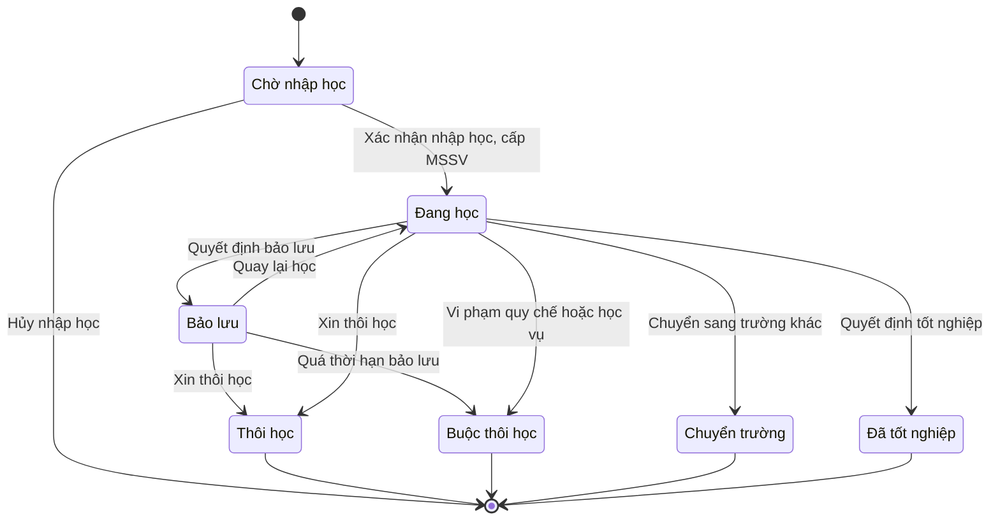
```mermaid
stateDiagram-v2
    state "Chờ nhập học" as ChoNhapHoc
    state "Đang học" as DangHoc
    state "Bảo lưu" as BaoLuu
    state "Thôi học" as ThoiHoc
    state "Buộc thôi học" as BuocThoiHoc
    state "Chuyển trường" as ChuyenTruong
    state "Đã tốt nghiệp" as TotNghiep
    [*] --> ChoNhapHoc
    ChoNhapHoc --> DangHoc : Xác nhận nhập học, cấp MSSV
    ChoNhapHoc --> [*] : Hủy nhập học
    DangHoc --> BaoLuu : Quyết định bảo lưu
    BaoLuu --> DangHoc : Quay lại học
    BaoLuu --> ThoiHoc : Xin thôi học
    BaoLuu --> BuocThoiHoc : Quá thời hạn bảo lưu
    DangHoc --> ThoiHoc : Xin thôi học
    DangHoc --> BuocThoiHoc : Vi phạm quy chế hoặc học vụ
    DangHoc --> ChuyenTruong : Chuyển sang trường khác
    DangHoc --> TotNghiep : Quyết định tốt nghiệp
    ThoiHoc --> [*]
    BuocThoiHoc --> [*]
    ChuyenTruong --> [*]
    TotNghiep --> [*]
```

**Tiêu chí nghiệm thu (mức nghiệp vụ)**

- **Cho** hồ sơ sinh viên mới đủ trường bắt buộc, **khi** cán bộ xác nhận nhập học, **thì** hệ thống sinh MSSV đúng quy tắc, tạo email trường và tài khoản, gán CTĐT và lớp hành chính, đặt trạng thái Đang học.
- **Cho** số CCCD đã tồn tại, **khi** tạo hồ sơ mới với số đó, **thì** bị từ chối và thông báo hồ sơ trùng (nội dung hiển thị theo quyền của người dùng).
- **Cho** file import 100 dòng có 5 dòng lỗi, **khi** import, **thì** hệ thống báo lỗi chính xác theo dòng – cột và chỉ lưu 95 dòng hợp lệ khi người dùng chọn "Lưu dòng hợp lệ".
- **Cho** sinh viên Đang học đã đăng ký học phần của kỳ sau (chưa chốt), **khi** chuyển sang Bảo lưu có số quyết định, **thì** đăng ký chưa chốt bị hủy, sinh viên không đăng ký thêm được, lịch sử trạng thái được ghi và sinh viên nhận thông báo.
- **Cho** sinh viên đăng nhập, **khi** sửa số điện thoại, **thì** lưu ngay; **khi** sửa họ tên, **thì** hệ thống tạo yêu cầu chờ duyệt kèm minh chứng.

**Lưu ý:** trạng thái "Chờ nhập học" nhận dữ liệu thí sinh trúng tuyển qua import; nghiệp vụ tuyển sinh nằm ngoài phạm vi ([mục 2.3](#23-phạm-vi-dự-án)).

### 6.3 CLS — Class Management

| Thuộc tính | Nội dung |
|---|---|
| Tên tiếng Việt | Quản lý lớp (khóa, lớp hành chính, lớp học phần) |
| Mục tiêu | Tổ chức người học thành các lớp: *lớp hành chính* theo khóa – ngành để quản lý và tư vấn; *lớp học phần* theo học kỳ để giảng dạy và đăng ký |
| Tác nhân | `ACAD` (chính); `DEAN` (đề xuất mở lớp, phân công); `CTSV` (ban cán sự); `LEC`, `ADV`, `STU` (xem) |
| Ưu tiên · Giai đoạn · Công sức | Must · P1 · M |
| Phụ thuộc | `FAC`, `ACY`, `SUB`, `CUR`, `TCH`, `STU` (thành viên lớp hành chính) |

**Luồng nghiệp vụ chính**

*Lớp hành chính:* `ACAD` tạo khóa → tạo lớp hành chính theo ngành → gán cố vấn học tập → gán sinh viên vào lớp khi nhập học.

*Lớp học phần:*

1. Trước mỗi học kỳ, `ACAD` (có đề xuất của Khoa) xác định học phần cần mở theo CTĐT và nhu cầu.
2. Tạo lớp học phần, phân công giảng viên, đặt sĩ số tối thiểu – tối đa.
3. `TTB` xếp lịch và phòng; lớp chuyển sang **Mở đăng ký** (`ENR`).
4. Đóng đăng ký: xử lý lớp thiếu sĩ số (hủy hoặc gộp).
5. Hết học kỳ, sau khi công bố điểm thì khóa lớp.

**Yêu cầu chức năng**

| ID | Chức năng | Mô tả và ràng buộc | Tác nhân | Ưu tiên |
|---|---|---|---|---|
| FR-CLS-001 | Quản lý khóa tuyển sinh | CRUD khóa (mã K2026, năm bắt đầu, năm kết thúc dự kiến); gắn quy chế đào tạo áp dụng cho khóa | `ACAD` | M |
| FR-CLS-002 | Quản lý lớp hành chính | CRUD lớp: mã, tên, khóa, ngành / chuyên ngành, hệ, sĩ số tối đa, trạng thái | `ACAD` | M |
| FR-CLS-003 | Gán sinh viên vào lớp hành chính | Gán / gỡ đơn lẻ và hàng loạt; hỗ trợ chia lớp tự động theo ngành và sĩ số khi nhập học (có xem trước); lưu lịch sử | `ACAD` | M |
| FR-CLS-004 | Gán cố vấn học tập | Gán CVHT cho lớp theo giai đoạn (từ – đến), lưu lịch sử; cảnh báo lớp chưa có CVHT | `ACAD`, `DEAN` | M |
| FR-CLS-005 | Ban cán sự lớp | Ghi nhận lớp trưởng, lớp phó, bí thư và nhiệm kỳ | `CTSV`, `ADV` | S |
| FR-CLS-006 | Danh sách lớp | Xem danh sách lớp và sinh viên trong lớp; xuất Excel / PDF | `ACAD`, `ADV`, `DEAN`, `LEC` | M |
| FR-CLS-007 | Thống kê lớp | Sĩ số, tỷ lệ nam / nữ, phân bố trạng thái và xếp loại học lực theo lớp | `ACAD`, `ADV`, `DEAN` | S |
| FR-CLS-008 | Sáp nhập, tách, đóng lớp | Sáp nhập, tách hoặc đóng lớp hành chính; di chuyển sinh viên theo quyết định và lưu lịch sử | `ACAD` | C |
| FR-CLS-009 | Mở lớp học phần | Mở theo học kỳ: chọn học phần (thuộc CTĐT đang áp dụng), loại (lý thuyết / thực hành / kết hợp), hình thức (trực tiếp / trực tuyến / kết hợp), sĩ số tối thiểu – tối đa, ngôn ngữ giảng dạy | `ACAD` | M |
| FR-CLS-010 | Mã lớp học phần | Sinh mã tự động (mã học phần + học kỳ + số thứ tự), duy nhất | Hệ thống | M |
| FR-CLS-011 | Phân công giảng viên | Gán một hoặc nhiều giảng viên (chính, trợ giảng); cảnh báo vượt định mức giờ dạy (`TCH`); phải có ít nhất một giảng viên chính trước khi mở đăng ký | `ACAD`, `DEAN` | M |
| FR-CLS-012 | Vòng đời lớp học phần | Dự kiến → Mở đăng ký → Đóng đăng ký → Đang học → Kết thúc → Đã khóa; cho phép hủy ở các bước đầu | `ACAD` | M |
| FR-CLS-013 | Xử lý lớp thiếu sĩ số | Khi đóng đăng ký, liệt kê lớp dưới mức tối thiểu; đề xuất hủy hoặc gộp; khi hủy thì thông báo sinh viên và hướng dẫn đăng ký lớp thay thế | `ACAD` | M |
| FR-CLS-014 | Danh sách sinh viên lớp học phần | Lấy từ `ENR`; xuất danh sách dùng cho điểm danh, nhập điểm, danh sách thi | `ACAD`, `LEC` | M |
| FR-CLS-015 | Sao chép lớp từ học kỳ trước | Nhân bản cấu hình lớp (học phần, giảng viên, sĩ số, lịch) sang học kỳ mới để chỉnh sửa | `ACAD` | S |
| FR-CLS-016 | Đề xuất mở lớp từ nhu cầu | Gợi ý học phần và số lớp cần mở dựa trên CTĐT, số sinh viên đến kỳ học và đăng ký sơ bộ | `ACAD`, `DEAN` | C |
| FR-CLS-017 | Chia nhóm thực hành | Chia lớp học phần thành nhóm thực hành với giảng viên, lịch, phòng riêng | `ACAD` | C |
| FR-CLS-018 | Khóa lớp học phần | Sau khi công bố điểm, khóa lớp: không sửa điểm danh và điểm; mở khóa chỉ qua quy trình ngoại lệ (`SYS`) | `ACAD` | M |

**Quy tắc nghiệp vụ**

| ID | Quy tắc |
|---|---|
| BR-CLS-01 | Mã lớp (hành chính, học phần) duy nhất; lớp hành chính thuộc đúng một khóa và một ngành |
| BR-CLS-02 | Sĩ số tối đa của lớp học phần không vượt sức chứa phòng được xếp (nếu có) và không vượt mức cấu hình |
| BR-CLS-03 | Chỉ mở lớp cho học phần đang hoạt động và thuộc ít nhất một CTĐT đang áp dụng trong học kỳ đó |
| BR-CLS-04 | Lớp học phần phải có ít nhất một giảng viên chính trước khi chuyển sang trạng thái Mở đăng ký |
| BR-CLS-05 | Lớp có số đăng ký dưới mức tối thiểu khi đóng đăng ký phải được `ACAD` xử lý (hủy hoặc gộp) trước khi chốt |
| BR-CLS-06 | Không xóa lớp đã có sinh viên đăng ký hoặc dữ liệu liên quan; chỉ hủy hoặc đóng, kèm lý do |
| BR-CLS-07 | Cố vấn học tập là giảng viên đang hoạt động; một lớp hành chính chỉ có một CVHT hiệu lực tại một thời điểm |
| BR-CLS-08 | Sinh viên chỉ có đúng một lớp hành chính hiệu lực; chuyển lớp lưu lịch sử với ngày hiệu lực |
| BR-CLS-09 | Khi hủy lớp học phần đã có đăng ký, hệ thống tự hủy các đăng ký liên quan, điều chỉnh công nợ (`FEE`) và gửi thông báo |

**Dữ liệu chính**

- **Cohort**: mã, năm bắt đầu, năm kết thúc dự kiến, quy chế áp dụng. **AdminClass**: mã, tên, khóa, ngành, chuyên ngành, sĩ số tối đa, trạng thái. **AdminClassMember**: sinh viên, lớp, từ ngày – đến ngày. **ClassOfficer**, **AdvisorAssignment**.
- **CourseSection**: mã, học phần (phiên bản), học kỳ, loại, hình thức, sĩ số tối thiểu – tối đa, trạng thái. **SectionInstructor**: giảng viên, vai trò. **SectionGroup**: nhóm thực hành.

**Vòng đời lớp học phần**

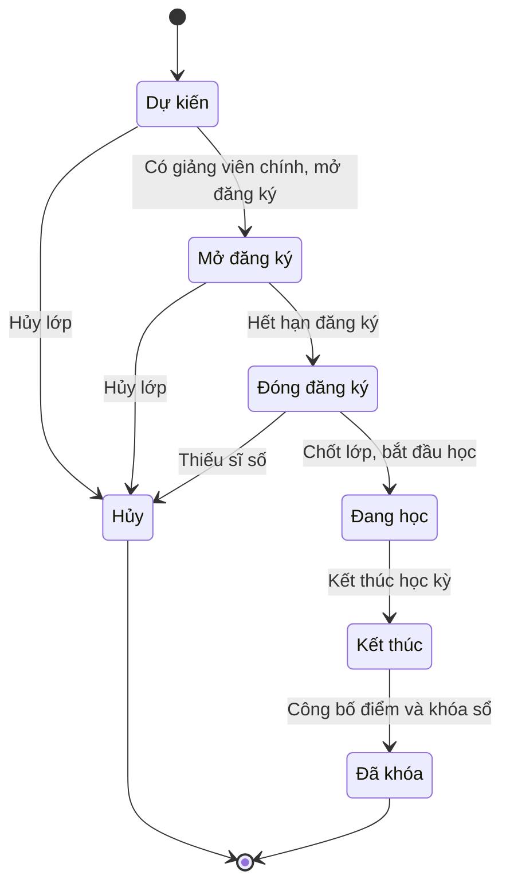
```mermaid
stateDiagram-v2
    state "Dự kiến" as DuKien
    state "Mở đăng ký" as MoDangKy
    state "Đóng đăng ký" as DongDangKy
    state "Đang học" as DangHoc
    state "Kết thúc" as KetThuc
    state "Đã khóa" as DaKhoa
    state "Hủy" as Huy
    [*] --> DuKien
    DuKien --> MoDangKy : Có giảng viên chính, mở đăng ký
    MoDangKy --> DongDangKy : Hết hạn đăng ký
    DongDangKy --> DangHoc : Chốt lớp, bắt đầu học
    DangHoc --> KetThuc : Kết thúc học kỳ
    KetThuc --> DaKhoa : Công bố điểm và khóa sổ
    DuKien --> Huy : Hủy lớp
    MoDangKy --> Huy : Hủy lớp
    DongDangKy --> Huy : Thiếu sĩ số
    Huy --> [*]
    DaKhoa --> [*]
```

**Tiêu chí nghiệm thu (mức nghiệp vụ)**

- **Cho** lớp học phần chưa có giảng viên chính, **khi** `ACAD` chuyển sang Mở đăng ký, **thì** bị từ chối kèm lý do.
- **Cho** lớp có sĩ số tối thiểu 15, **khi** đóng đăng ký chỉ có 8 sinh viên, **thì** lớp vào danh sách chờ xử lý; sau khi `ACAD` hủy lớp, sinh viên nhận thông báo và có thể đăng ký lớp khác trong đợt bổ sung.
- **Cho** sinh viên đang ở lớp hành chính A, **khi** chuyển sang lớp B, **thì** lịch sử ghi lớp A (đến ngày) và lớp B (từ ngày), danh sách hai lớp cập nhật đúng.
- **Cho** giảng viên đã đạt định mức giờ dạy tối đa, **khi** gán thêm lớp học phần, **thì** hệ thống cảnh báo vượt định mức và yêu cầu xác nhận.

**Lưu ý:** một lớp học phần có thể gồm sinh viên của nhiều lớp hành chính hoặc nhiều ngành (lớp ghép); lớp học phần không gắn cứng với một lớp hành chính.

### 6.4 FAC — Faculty / Department Management

| Thuộc tính | Nội dung |
|---|---|
| Tên tiếng Việt | Quản lý Khoa / Bộ môn (cơ cấu tổ chức đào tạo) |
| Mục tiêu | Quản lý cơ cấu Khoa → Bộ môn, Ngành → Chuyên ngành và hệ đào tạo; là gốc của phân quyền theo phạm vi dữ liệu và của thống kê |
| Tác nhân | `ACAD`, `ADMIN` (quản lý); `DEAN` (xem và cập nhật thông tin đơn vị mình); mọi người dùng (tra cứu) |
| Ưu tiên · Giai đoạn · Công sức | Must · P1 · S |
| Phụ thuộc | `AUTH` |

**Luồng nghiệp vụ chính**

1. `ACAD` hoặc `ADMIN` khởi tạo danh mục khoa và bộ môn.
2. Tạo ngành và chuyên ngành thuộc từng khoa.
3. Gán lãnh đạo đơn vị theo nhiệm kỳ (đồng bộ vai trò `DEAN`).
4. Các module khác (`STU`, `TCH`, `SUB`, `CUR`, `CLS`) tham chiếu cơ cấu này.

**Yêu cầu chức năng**

| ID | Chức năng | Mô tả và ràng buộc | Tác nhân | Ưu tiên |
|---|---|---|---|---|
| FR-FAC-001 | Quản lý khoa | CRUD khoa: mã, tên (vi / en), ngày thành lập, liên hệ, mô tả, trạng thái | `ACAD`, `ADMIN` | M |
| FR-FAC-002 | Quản lý bộ môn | CRUD bộ môn thuộc khoa: mã, tên, mô tả, trạng thái | `ACAD`, `ADMIN` | M |
| FR-FAC-003 | Quản lý ngành đào tạo | CRUD ngành: mã ngành, tên, trình độ, khoa quản lý, tổng tín chỉ chuẩn, thời gian đào tạo chuẩn (số học kỳ) | `ACAD` | M |
| FR-FAC-004 | Quản lý chuyên ngành | CRUD chuyên ngành thuộc ngành | `ACAD` | S |
| FR-FAC-005 | Quản lý hệ đào tạo | Danh mục hệ / loại hình đào tạo (chính quy, liên thông…); mặc định chính quy | `ACAD` | S |
| FR-FAC-006 | Lãnh đạo đơn vị theo nhiệm kỳ | Gán trưởng / phó khoa, trưởng bộ môn theo nhiệm kỳ (từ – đến), lưu lịch sử; đồng bộ vai trò `DEAN` trong `AUTH` | `ACAD`, `ADMIN` | M |
| FR-FAC-007 | Sơ đồ tổ chức | Hiển thị dạng cây Khoa → Bộ môn → Ngành → Chuyên ngành; mở rộng / thu gọn; in hoặc xuất | Mọi người dùng | S |
| FR-FAC-008 | Thống kê đơn vị | Số giảng viên, sinh viên, lớp, ngành của từng khoa và bộ môn | `ACAD`, `DEAN` | S |
| FR-FAC-009 | Ngừng, đổi tên, sáp nhập đơn vị | Ngừng hoạt động, đổi tên hoặc sáp nhập có chuyển dữ liệu liên quan (giảng viên, ngành, lớp) và lưu lịch sử | `ACAD`, `ADMIN` | C |
| FR-FAC-010 | Tìm kiếm và xuất danh mục | Tìm, lọc, xuất danh sách đơn vị ra Excel | `ACAD` | S |

**Quy tắc nghiệp vụ**

| ID | Quy tắc |
|---|---|
| BR-FAC-01 | Mã khoa, bộ môn, ngành duy nhất; không đổi sau khi đã có dữ liệu liên quan (đổi tên thì được, đổi mã cần quy trình đặc biệt) |
| BR-FAC-02 | Bộ môn thuộc đúng một khoa; ngành thuộc đúng một khoa quản lý; chuyên ngành thuộc đúng một ngành |
| BR-FAC-03 | Mỗi giảng viên có đúng một đơn vị chính (bộ môn), có thể kiêm nhiệm đơn vị khác (`TCH`) |
| BR-FAC-04 | Trưởng khoa, trưởng bộ môn phải là giảng viên hoặc cán bộ đang hoạt động thuộc đơn vị đó (cho phép ngoại lệ bằng cấu hình); mỗi đơn vị có tối đa một người giữ chức vụ trưởng tại một thời điểm |
| BR-FAC-05 | Không xóa đơn vị còn giảng viên, ngành, lớp hoặc sinh viên; chỉ ngừng hoạt động sau khi chuyển hết dữ liệu liên quan |
| BR-FAC-06 | Thay đổi lãnh đạo đơn vị có hiệu lực theo ngày; vai trò `DEAN` và phạm vi dữ liệu `FACULTY` của người dùng cập nhật theo |
| BR-FAC-07 | Thời gian đào tạo chuẩn của ngành (số học kỳ) là căn cứ tính thời gian học tối đa (`STU`) và khối lượng học tập trung bình mỗi học kỳ (`ENR`) |

**Dữ liệu chính**

- **Faculty**, **Department**, **Major**, **Specialization**: mã, tên (vi / en), đơn vị cha, trạng thái.
- **Major** bổ sung: trình độ, tổng tín chỉ chuẩn, thời gian đào tạo chuẩn. **TrainingType**: mã, tên hệ đào tạo.
- **LeadershipTerm**: đơn vị, người giữ chức vụ, chức vụ, từ ngày – đến ngày.

**Tiêu chí nghiệm thu (mức nghiệp vụ)**

- **Cho** khoa còn bộ môn hoặc ngành đang hoạt động, **khi** ngừng hoạt động khoa, **thì** bị từ chối và liệt kê dữ liệu cần chuyển.
- **Cho** trưởng khoa mới có hiệu lực từ ngày D, **khi** đến ngày D, **thì** quyền `DEAN` của người cũ bị thu hồi, người mới có phạm vi dữ liệu của khoa và lịch sử nhiệm kỳ vẫn đầy đủ.
- **Cho** mã ngành đã có CTĐT, **khi** cố đổi mã ngành, **thì** bị chặn.

### 6.5 SUB — Subject / Course Management

| Thuộc tính | Nội dung |
|---|---|
| Tên tiếng Việt | Quản lý học phần (môn học) |
| Mục tiêu | Quản lý danh mục học phần dùng chung: thông tin, tín chỉ, quan hệ tiên quyết, cơ cấu điểm, đề cương; là gốc cho mở lớp, đăng ký và tính điểm |
| Tác nhân | `ACAD` (chính); `DEAN` (đề xuất, duyệt cấp bộ môn); `LEC` (cập nhật đề cương học phần phụ trách); `STU` (xem) |
| Ưu tiên · Giai đoạn · Công sức | Must · P1 · M |
| Phụ thuộc | `FAC` |

**Luồng nghiệp vụ chính**

1. Bộ môn đề xuất học phần mới hoặc điều chỉnh học phần; `DEAN` duyệt cấp khoa.
2. `ACAD` ban hành vào danh mục dùng chung.
3. `CUR` gán học phần vào chương trình đào tạo; `CLS` mở lớp học phần.
4. Thay đổi quan trọng (tín chỉ, cơ cấu điểm, quan hệ) tạo **phiên bản mới** áp dụng từ học kỳ hoặc khóa chỉ định.

**Yêu cầu chức năng**

| ID | Chức năng | Mô tả và ràng buộc | Tác nhân | Ưu tiên |
|---|---|---|---|---|
| FR-SUB-001 | Quản lý học phần | CRUD học phần: mã, tên (vi / en), bộ môn quản lý, mô tả, ngôn ngữ giảng dạy, trạng thái | `ACAD`, `DEAN` | M |
| FR-SUB-002 | Tín chỉ và số tiết | Tổng tín chỉ, tín chỉ lý thuyết, thực hành, số tiết hoặc giờ tín chỉ, giờ tự học; kiểm tra tính hợp lệ | `ACAD` | M |
| FR-SUB-003 | Phân loại học phần | Bắt buộc / tự chọn; khối kiến thức (đại cương, cơ sở ngành, chuyên ngành, thực tập, đồ án / khóa luận); cờ "tính vào GPA" và "điều kiện tốt nghiệp" (ví dụ giáo dục thể chất, quốc phòng – an ninh) | `ACAD` | M |
| FR-SUB-004 | Quan hệ giữa các học phần | Tiên quyết, học trước, song hành, tương đương / thay thế; chống vòng lặp | `ACAD` | M |
| FR-SUB-005 | Cơ cấu điểm | Định nghĩa thành phần điểm (chuyên cần, bài tập, giữa kỳ, thực hành, cuối kỳ…), trọng số, điểm sàn; là mặc định cho lớp học phần (`GRD` kế thừa) | `ACAD`, `DEAN` | M |
| FR-SUB-006 | Đề cương chi tiết | Mục tiêu, chuẩn đầu ra, nội dung theo tuần hoặc chương, phương pháp giảng dạy, đánh giá, tài liệu; tải tệp PDF; lưu phiên bản | `LEC`, `DEAN` | S |
| FR-SUB-007 | Phiên bản học phần | Thay đổi tín chỉ, cơ cấu điểm, quan hệ tạo phiên bản mới có ngày hiệu lực; các khóa cũ giữ phiên bản cũ | `ACAD` | S |
| FR-SUB-008 | Ngừng giảng dạy và thay thế | Ngừng học phần, chỉ định học phần thay thế hoặc tương đương | `ACAD` | S |
| FR-SUB-009 | Tìm kiếm và tra cứu | Tìm, lọc học phần; xem học phần thuộc những CTĐT nào và những học kỳ nào đã mở lớp | `ACAD`, `STU` | S |
| FR-SUB-010 | Năng lực giảng dạy | Danh sách giảng viên có thể giảng dạy học phần (gợi ý khi phân công) | `DEAN` | S |
| FR-SUB-011 | Import học phần | Nhập danh mục học phần từ Excel theo mẫu | `ACAD` | S |
| FR-SUB-012 | Tài liệu học tập | Gắn giáo trình hoặc tài liệu (tệp, liên kết) vào học phần | `LEC` | C |
| FR-SUB-013 | Duyệt học phần mới | Luồng đề xuất → duyệt cấp khoa → ban hành bởi `ACAD` | `DEAN`, `ACAD` | C |

**Quy tắc nghiệp vụ**

| ID | Quy tắc |
|---|---|
| BR-SUB-01 | Mã học phần duy nhất; không đổi sau khi đã có lớp hoặc điểm |
| BR-SUB-02 | Số tín chỉ là số nguyên không âm; tín chỉ lý thuyết + thực hành bằng tổng tín chỉ; học phần điều kiện không tín chỉ cho phép bằng 0 |
| BR-SUB-03 | Không được thiết lập vòng lặp tiên quyết (A → B → A) và một học phần không thể là tiên quyết của chính nó |
| BR-SUB-04 | Mỗi học phần có tối thiểu 3 điểm thành phần; tổng trọng số bằng 100%; trọng số điểm thi cuối kỳ tối thiểu 50% và đánh giá từ xa không quá 50% (mặc định tham chiếu Thông tư 56/2026/TT-BGDĐT, cấu hình được) |
| BR-SUB-05 | Học phần đã có lớp hoặc điểm không xóa, chỉ ngừng; thay đổi tín chỉ hoặc cơ cấu điểm chỉ áp dụng từ học kỳ hoặc khóa chưa phát sinh dữ liệu (qua phiên bản mới) |
| BR-SUB-06 | Học phần "không tính GPA" vẫn phải đạt (đạt / không đạt) nếu là điều kiện tốt nghiệp trong CTĐT |
| BR-SUB-07 | Quan hệ tương đương do khoa quyết định, có hiệu lực theo ngày; dùng cho ánh xạ khi đổi CTĐT hoặc chuyển ngành (`CUR`, `STU`) |
| BR-SUB-08 | Đề cương phải được duyệt trước khi áp dụng cho lớp học phần mới (bật / tắt bằng cấu hình) |

**Dữ liệu chính**

- **Subject** và **SubjectVersion**: mã, tên (vi / en), bộ môn, tín chỉ (tổng, lý thuyết, thực hành), số tiết, loại, khối kiến thức, cờ tính GPA, cờ điều kiện tốt nghiệp, trạng thái, hiệu lực từ ngày.
- **SubjectRelation**: học phần, học phần liên quan, loại quan hệ (tiên quyết, học trước, song hành, tương đương).
- **GradeComponentTemplate**: tên thành phần, trọng số, điểm sàn, bắt buộc. **Syllabus** (phiên bản, tệp, trạng thái duyệt). **SubjectQualification**, **SubjectMaterial**.

**Tiêu chí nghiệm thu (mức nghiệp vụ)**

- **Cho** học phần A là tiên quyết của B, **khi** đặt B là tiên quyết của A, **thì** bị chặn do vòng lặp.
- **Cho** cơ cấu điểm có tổng trọng số 90%, **khi** lưu, **thì** bị từ chối kèm thông báo rõ nguyên nhân.
- **Cho** học phần đã có lớp, **khi** đổi số tín chỉ, **thì** hệ thống tạo phiên bản mới áp dụng từ học kỳ chỉ định và lớp cũ giữ nguyên.
- **Cho** học phần giáo dục thể chất đặt cờ "không tính GPA", **khi** tính GPA, **thì** học phần không xuất hiện trong công thức; **khi** xét tốt nghiệp, **thì** vẫn yêu cầu kết quả Đạt.

### 6.6 ENR — Enrollment Management

| Thuộc tính | Nội dung |
|---|---|
| Tên tiếng Việt | Quản lý đăng ký học phần |
| Mục tiêu | Cho sinh viên đăng ký, hủy, đổi lớp học phần đúng quy chế và đúng thời hạn; kiểm tra điều kiện chính xác, không vượt sĩ số; làm căn cứ cho thời khóa biểu, điểm và học phí |
| Tác nhân | `STU`, `ACAD`; `ADV` (hỗ trợ); `LEC`, `FIN` (xem) |
| Ưu tiên · Giai đoạn · Công sức | Must · P1 · L |
| Phụ thuộc | `STU`, `CLS`, `CUR`, `SUB`, `ACY`, `TTB`, `FEE` |

**Luồng nghiệp vụ chính** (sơ đồ chi tiết ở [mục 3.3.1](#331-đăng-ký-học-phần))

1. `ACAD` cấu hình đợt đăng ký: học kỳ, đối tượng, thời gian, các vòng, giới hạn tín chỉ.
2. Sinh viên xem các lớp học phần được phép đăng ký, chọn lớp; hệ thống kiểm tra điều kiện theo thời gian thực rồi ghi nhận.
3. Trong thời hạn, sinh viên hủy hoặc đổi lớp; sau hạn thì rút học phần theo chính sách.
4. Hết hạn: chốt đăng ký → xử lý lớp thiếu sĩ số → đăng ký bổ sung → phát sinh công nợ (`FEE`).
5. Sau khi chốt, mọi thay đổi do `ACAD` thực hiện với lý do và nhật ký.

**Yêu cầu chức năng**

| ID | Chức năng | Mô tả và ràng buộc | Tác nhân | Ưu tiên |
|---|---|---|---|---|
| FR-ENR-001 | Đợt đăng ký học phần | Cấu hình đợt: học kỳ, đối tượng (khóa, ngành, lớp), thời gian mở – đóng, các vòng (vòng 1, vòng 2, bổ sung), giới hạn tín chỉ | `ACAD` | M |
| FR-ENR-002 | Danh sách lớp được phép đăng ký | Hiển thị lớp học phần theo CTĐT và học kỳ, kèm sĩ số còn lại, lịch, giảng viên, phòng; lớp không đủ điều kiện được đánh dấu kèm lý do | `STU` | M |
| FR-ENR-003 | Đăng ký lớp học phần | Sinh viên chọn lớp; hệ thống kiểm tra điều kiện theo thời gian thực và ghi nhận kết quả | `STU` | M |
| FR-ENR-004 | Kiểm tra điều kiện đăng ký | Đối tượng, trạng thái sinh viên, tiên quyết và song hành, trùng lịch, tối đa tín chỉ, sĩ số, công nợ (nếu bật), học phần đã đạt; nêu lý do từ chối cụ thể | Hệ thống | M |
| FR-ENR-005 | Hủy đăng ký | Hủy trong thời hạn đăng ký; cập nhật sĩ số và giải phóng chỗ | `STU` | M |
| FR-ENR-006 | Rút học phần | Sau thời hạn hủy và trước hạn rút: ghi nhận "rút học phần" (không tính vào GPA); học phí xử lý theo chính sách của `FEE` | `STU`, `ACAD` | M |
| FR-ENR-007 | Đổi lớp học phần | Chuyển sang lớp khác của cùng học phần trong một thao tác nguyên tử (giữ chỗ cũ cho tới khi chuyển thành công) | `STU` | S |
| FR-ENR-008 | Chống tranh chấp đồng thời | Khi nhiều sinh viên cùng đăng ký chỗ cuối, chỉ chấp nhận đúng số chỗ còn lại; kiểm tra và ghi nhận là một thao tác nguyên tử | Hệ thống | M |
| FR-ENR-009 | Đăng ký thay và ngoại lệ | Cán bộ đăng ký, hủy, điều chỉnh thay sinh viên; được bỏ qua một số điều kiện kèm lý do, người phê duyệt và nhật ký | `ACAD` | M |
| FR-ENR-010 | Kết quả và phiếu đăng ký | Sinh viên xem kết quả đăng ký, thời khóa biểu cá nhân; xuất và in phiếu đăng ký PDF | `STU` | M |
| FR-ENR-011 | Học lại và học cải thiện | Đăng ký học lại (chưa đạt) và học cải thiện (đã đạt, muốn nâng điểm); đánh dấu loại đăng ký | `STU` | S |
| FR-ENR-012 | Chốt đăng ký | Khóa sổ đăng ký sau hạn: kiểm tra mức tối thiểu, xử lý lớp thiếu sĩ số, phát sinh công nợ (`FEE`), gửi thông báo | `ACAD` | M |
| FR-ENR-013 | Theo dõi và thống kê | Danh sách đăng ký theo lớp và theo sinh viên; thống kê số lượng, lớp đầy hoặc thiếu, sinh viên chưa đăng ký hoặc thiếu tín chỉ | `ACAD`, `DEAN` | M |
| FR-ENR-014 | Danh sách chờ | Khi lớp đầy, sinh viên vào danh sách chờ có thứ tự; khi có chỗ thì tự động xếp và thông báo | `STU` | C |
| FR-ENR-015 | Đăng ký sơ bộ (nguyện vọng) | Sinh viên đăng ký trước học phần dự định học để dự báo nhu cầu mở lớp | `STU` | C |
| FR-ENR-016 | Thông báo đăng ký | Thông báo mở / đóng đợt, xác nhận đăng ký hoặc hủy, lớp bị hủy hoặc thay đổi | Hệ thống | S |
| FR-ENR-017 | Nhật ký đăng ký | Lưu thời điểm, IP, kết quả và lý do từ chối của mỗi lần thử để tra cứu khiếu nại | `ACAD` | S |

**Quy tắc nghiệp vụ**

| ID | Quy tắc |
|---|---|
| BR-ENR-01 | Chỉ sinh viên có trạng thái Đang học và thuộc đối tượng của đợt đăng ký mới được đăng ký |
| BR-ENR-02 | Khối lượng học tập mỗi học kỳ nằm trong khung [tối thiểu, tối đa]. Mặc định tham chiếu Thông tư 56/2026/TT-BGDĐT (theo bản tổng hợp, cần đối chiếu): tối thiểu bằng 2/3 và tối đa bằng 3/2 khối lượng trung bình một học kỳ của CTĐT; có khung riêng cho sinh viên bị cảnh báo học vụ, học kỳ cuối và sinh viên học lực khá trở lên (cấu hình). Mức **tối đa** kiểm tra ở mỗi lần đăng ký, mức **tối thiểu** kiểm tra khi chốt đăng ký |
| BR-ENR-03 | Chỉ đăng ký học phần khi đã đạt các học phần tiên quyết (đạt theo `BR-GRD-03`) và đáp ứng học trước; học phần song hành phải đăng ký cùng hoặc trước |
| BR-ENR-04 | Không đăng ký hai lớp học phần trùng lịch (trùng thứ, tiết và tuần học); không đăng ký hai lớp của cùng một học phần trong cùng học kỳ (trừ khi cấu hình cho phép) |
| BR-ENR-05 | Sĩ số đăng ký không vượt sĩ số tối đa; việc kiểm tra và ghi nhận phải thực hiện nguyên tử trong một giao dịch |
| BR-ENR-06 | Mốc thời gian: giai đoạn 1 đăng ký và hủy tự do; giai đoạn 2 rút học phần có ghi nhận; sau mốc rút học phần thì không được rút (ngày mốc theo lịch học vụ `ACY`). Học phần rút không tính vào GPA; học phí xử lý theo chính sách `FEE` |
| BR-ENR-07 | Học lại: học phần chưa đạt phải học lại theo quy định của CTĐT. Học cải thiện: học phần đã đạt nhưng điểm dưới ngưỡng cải thiện (cấu hình) được đăng ký lại. Điểm tính vào GPA tích lũy theo `BR-GRD-04` |
| BR-ENR-08 | Sau khi chốt đăng ký, mọi thay đổi chỉ do `ACAD` thực hiện, có lý do và nhật ký; đồng bộ ngay sang `FEE` để điều chỉnh công nợ |
| BR-ENR-09 | Sinh viên có công nợ quá hạn vượt ngưỡng cấu hình bị chặn đăng ký mới (bật hoặc tắt bằng cấu hình, xem [Q-10](#12-vấn-đề-mở-và-câu-hỏi-cần-xác-nhận)) |
| BR-ENR-10 | Danh sách chờ (nếu bật): xếp theo thời điểm đăng ký; khi có chỗ chỉ tự chuyển thành đăng ký nếu sinh viên vẫn thỏa mọi điều kiện lúc đó |
| BR-ENR-11 | Mọi lần đăng ký hoặc hủy ghi nhận theo thời gian của máy chủ, không dùng giờ của máy người dùng |

> **Ví dụ minh họa `BR-ENR-02`:** CTĐT 120 tín chỉ chia trong 8 học kỳ → trung bình 15 tín chỉ mỗi học kỳ → khung mặc định xấp xỉ từ 10 đến 22 tín chỉ (làm tròn theo cấu hình của trường).

**Dữ liệu chính**

- **RegistrationPeriod**: học kỳ, đối tượng áp dụng, các vòng và cửa sổ thời gian, khung tín chỉ.
- **Enrollment**: sinh viên, lớp học phần, loại (thường, học lại, cải thiện), trạng thái, thời điểm đăng ký, nguồn (sinh viên hoặc cán bộ), lý do ngoại lệ.
- **EnrollmentLog** (mỗi lần thử), **Waitlist** (thứ tự, thời điểm).

**Vòng đời đăng ký**

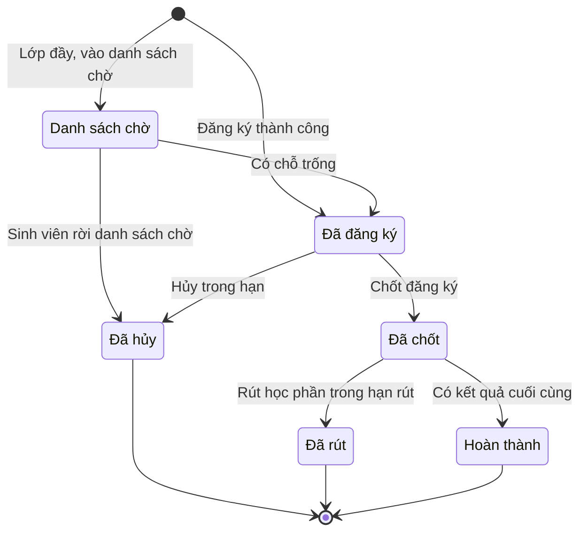
```mermaid
stateDiagram-v2
    state "Danh sách chờ" as ChoCho
    state "Đã đăng ký" as DaDangKy
    state "Đã chốt" as DaChot
    state "Hoàn thành" as HoanThanh
    state "Đã hủy" as DaHuy
    state "Đã rút" as DaRut
    [*] --> DaDangKy : Đăng ký thành công
    [*] --> ChoCho : Lớp đầy, vào danh sách chờ
    ChoCho --> DaDangKy : Có chỗ trống
    ChoCho --> DaHuy : Sinh viên rời danh sách chờ
    DaDangKy --> DaHuy : Hủy trong hạn
    DaDangKy --> DaChot : Chốt đăng ký
    DaChot --> DaRut : Rút học phần trong hạn rút
    DaChot --> HoanThanh : Có kết quả cuối cùng
    DaHuy --> [*]
    DaRut --> [*]
    HoanThanh --> [*]
```

**Tiêu chí nghiệm thu (mức nghiệp vụ)**

- **Cho** sinh viên chưa đạt học phần tiên quyết, **khi** đăng ký, **thì** bị từ chối và hệ thống nêu rõ học phần tiên quyết còn thiếu.
- **Cho** sinh viên đã đăng ký lớp thứ Hai tiết 1–3, **khi** đăng ký lớp khác thứ Hai tiết 3–5, **thì** bị từ chối do trùng tiết 3.
- **Cho** lớp còn đúng 1 chỗ, **khi** hai sinh viên cùng đăng ký đồng thời, **thì** chỉ một người thành công, người còn lại nhận thông báo hết chỗ và sĩ số không vượt tối đa.
- **Cho** sinh viên đang đăng ký đúng mức tối đa, **khi** đăng ký thêm học phần, **thì** bị từ chối do vượt khối lượng cho phép.
- **Cho** đợt đăng ký đã chốt, **khi** sinh viên hủy một học phần, **thì** thao tác bị chặn; `ACAD` xử lý với lý do và công nợ được điều chỉnh tương ứng.
- **Cho** lớp bị hủy do thiếu sĩ số, **khi** `ACAD` xác nhận hủy, **thì** sinh viên nhận thông báo và có thể đăng ký lớp thay thế trong đợt bổ sung.

### 6.7 TTB — Class Schedule / Timetable

| Thuộc tính | Nội dung |
|---|---|
| Tên tiếng Việt | Thời khóa biểu (lịch học) |
| Mục tiêu | Xếp, công bố và điều chỉnh lịch học của lớp học phần (thời gian, phòng, giảng viên) không xung đột; cung cấp thời khóa biểu cho sinh viên, giảng viên, phòng; sinh các buổi học cụ thể làm nền cho điểm danh |
| Tác nhân | `ACAD` (chính); `DEAN`, `LEC` (đề xuất); `STU`, `ADV` (xem) |
| Ưu tiên · Giai đoạn · Công sức | Must · P1 → P2 · L |
| Phụ thuộc | `CLS`, `ROM`, `TCH`, `ACY` |

**Luồng nghiệp vụ chính**

1. `ACAD` định nghĩa khung tiết học trong ngày; `ACY` cung cấp tuần học và ngày nghỉ.
2. Với mỗi lớp học phần: chọn thứ, tiết bắt đầu, số tiết, phòng, các tuần học → hệ thống kiểm tra xung đột.
3. Thời khóa biểu ở trạng thái nháp → công bố → mở đăng ký (`ENR`).
4. Trong học kỳ: đổi phòng hoặc tiết, báo nghỉ, dạy bù (có duyệt và thông báo).
5. Hệ thống sinh các **buổi học cụ thể theo ngày** để `ATT` sử dụng.

**Yêu cầu chức năng**

| ID | Chức năng | Mô tả và ràng buộc | Tác nhân | Ưu tiên |
|---|---|---|---|---|
| FR-TTB-001 | Khung tiết học | Định nghĩa tiết học trong ngày (số tiết, giờ bắt đầu – kết thúc, giờ nghỉ), dùng chung hoặc theo cơ sở | `ACAD` | M |
| FR-TTB-002 | Xếp lịch lớp học phần | Chọn thứ, tiết bắt đầu, số tiết, phòng, mẫu tuần học (ví dụ tuần 1–15, tuần chẵn hoặc lẻ) cho từng lớp | `ACAD` | M |
| FR-TTB-003 | Kiểm tra xung đột | Tự động phát hiện trùng phòng, trùng giảng viên, trùng lịch sinh viên (lớp bắt buộc cùng khóa), vượt sức chứa, sai loại phòng; chặn hoặc cảnh báo theo cấu hình | Hệ thống | M |
| FR-TTB-004 | Xem thời khóa biểu | Xem theo sinh viên, giảng viên, lớp học phần, lớp hành chính, phòng, khoa; dạng tuần, tháng, học kỳ | Mọi người dùng | M |
| FR-TTB-005 | Sinh buổi học cụ thể | Từ mẫu lịch và lịch học vụ tạo danh sách buổi học theo ngày (loại trừ ngày nghỉ); là cơ sở điểm danh (`ATT`) và tính số buổi | Hệ thống | M |
| FR-TTB-006 | Nháp, công bố, khóa | Thời khóa biểu qua các trạng thái nháp → công bố → khóa; thay đổi sau công bố cần lý do và thông báo | `ACAD` | M |
| FR-TTB-007 | Điều chỉnh lịch trong học kỳ | Đổi phòng, đổi tiết, đổi ngày cho một hoặc nhiều buổi; kiểm tra xung đột; thông báo sinh viên và giảng viên | `ACAD` | M |
| FR-TTB-008 | Báo nghỉ và dạy bù | Giảng viên báo nghỉ và đề xuất dạy bù (hệ thống gợi ý phòng, tiết trống phù hợp cả lớp); `ACAD` duyệt; thông báo | `LEC`, `ACAD` | S |
| FR-TTB-009 | Ngày nghỉ lễ tự động | Buổi trùng ngày nghỉ (`ACY`) tự chuyển sang trạng thái Nghỉ và đề xuất dạy bù | Hệ thống | S |
| FR-TTB-010 | Lịch bận và tải giảng | Giảng viên khai báo lịch bận; cảnh báo khi xếp ngoài lịch hoặc vượt số buổi tối đa mỗi ngày hoặc tuần | `LEC`, `ACAD` | S |
| FR-TTB-011 | Tìm phòng và giờ trống | Tìm theo thời gian, sức chứa, loại phòng, thiết bị; xem mức sử dụng phòng | `ACAD` | S |
| FR-TTB-012 | Xuất thời khóa biểu | Xuất PDF / Excel; xuất iCal để nhập vào Google Calendar hoặc Outlook | Mọi người dùng | S |
| FR-TTB-013 | Liên kết lớp trực tuyến | Lưu đường dẫn phòng họp trực tuyến cho lớp hoặc buổi học | `LEC`, `ACAD` | C |
| FR-TTB-014 | Xếp thời khóa biểu tự động | Gợi ý lịch theo ràng buộc cứng (xung đột) và ràng buộc mềm (nguyện vọng giảng viên, dồn lịch sinh viên) | `ACAD` | C |

**Quy tắc nghiệp vụ**

| ID | Quy tắc |
|---|---|
| BR-TTB-01 | Một phòng chỉ phục vụ một lớp tại một thời điểm; một giảng viên chỉ dạy một lớp tại một thời điểm; một sinh viên không có hai lớp trùng giờ (kiểm tra tại `ENR`) |
| BR-TTB-02 | Sĩ số lớp không vượt sức chứa phòng; loại phòng phù hợp với loại buổi (thực hành → phòng máy hoặc phòng thí nghiệm) |
| BR-TTB-03 | Một buổi học không vắt qua giờ nghỉ trưa và không kết thúc muộn hơn giờ quy định (cấu hình) |
| BR-TTB-04 | Tổng số tiết các buổi học bằng số tiết quy định của học phần (theo tín chỉ nhân hệ số quy đổi); hệ thống cảnh báo khi lệch |
| BR-TTB-05 | Sau khi công bố, mọi thay đổi phải ghi lý do, người duyệt và thông báo cho người liên quan trước tối thiểu X giờ (cấu hình, mặc định 24 giờ; trường hợp khẩn cấp là ngoại lệ có ghi nhận) |
| BR-TTB-06 | Buổi học trùng ngày nghỉ lễ tự chuyển sang Nghỉ; buổi nghỉ không tính vào tỷ lệ vắng của sinh viên (`ATT`) |
| BR-TTB-07 | Không xếp lịch cho phòng đang bảo trì hoặc ngừng sử dụng (`ROM`) và không xếp ngoài khoảng thời gian của học kỳ |
| BR-TTB-08 | Thay đổi lịch của lớp đã có sinh viên đăng ký phải kiểm tra lại trùng lịch của từng sinh viên và thông báo những người bị ảnh hưởng |

**Dữ liệu chính**

- **Period** (tiết học): số tiết, giờ bắt đầu – kết thúc. **ScheduleRule**: lớp học phần, thứ, tiết bắt đầu, số tiết, phòng, mẫu tuần học.
- **ClassSession** (buổi học cụ thể): lớp học phần, ngày, tiết, phòng, trạng thái (Dự kiến, Đã dạy, Nghỉ, Dạy bù, Hủy).
- **SessionChange** (lịch sử điều chỉnh), **LecturerAvailability**, **OnlineLink**; ngày nghỉ lấy từ `ACY`.

**Tiêu chí nghiệm thu (mức nghiệp vụ)**

- **Cho** phòng P đã có lớp A thứ Ba tiết 1–3, **khi** xếp lớp B vào phòng P thứ Ba tiết 3–5, **thì** hệ thống chặn hoặc cảnh báo trùng tiết 3 và nêu rõ lớp gây xung đột.
- **Cho** lớp 60 sinh viên, **khi** xếp vào phòng sức chứa 50, **thì** bị từ chối.
- **Cho** lịch học kỳ có ngày lễ rơi vào buổi học thứ 5, **khi** sinh buổi học, **thì** buổi đó có trạng thái Nghỉ và được đề xuất dạy bù.
- **Cho** thời khóa biểu đã công bố, **khi** `ACAD` đổi phòng của buổi tuần 7, **thì** hệ thống yêu cầu lý do, thông báo sinh viên và giảng viên của lớp và ghi nhật ký.
- **Cho** sinh viên mở thời khóa biểu tuần, **khi** có buổi dạy bù, **thì** buổi dạy bù hiển thị đúng ngày, giờ và phòng.

### 6.8 ATT — Attendance Management

| Thuộc tính | Nội dung |
|---|---|
| Tên tiếng Việt | Quản lý điểm danh (chuyên cần) |
| Mục tiêu | Ghi nhận chuyên cần theo từng buổi học, tính tỷ lệ vắng, cảnh báo sớm và xác định sinh viên không đủ điều kiện dự thi |
| Tác nhân | `LEC` (chính); `STU` (xem, gửi đơn nghỉ); `ADV`, `DEAN`, `ACAD`, `EXAM` (xem, xử lý ngoại lệ) |
| Ưu tiên · Giai đoạn · Công sức | Should · P2 · M |
| Phụ thuộc | `TTB` (buổi học), `ENR`, `CLS`, `REQ` (đơn nghỉ), `NOT` |

**Luồng nghiệp vụ chính**

1. `TTB` đã sinh các buổi học và `ENR` cung cấp danh sách sinh viên của lớp.
2. Đến buổi học, giảng viên mở phiên điểm danh và đánh dấu Có mặt / Vắng / Đi muộn / Vắng có phép (hoặc sinh viên tự điểm danh bằng mã QR hoặc OTP nếu bật).
3. Hệ thống cập nhật tỷ lệ vắng của từng sinh viên; vượt ngưỡng cảnh báo thì thông báo sinh viên và CVHT.
4. Vượt ngưỡng cấm thi thì đánh dấu "không đủ điều kiện dự thi" và chuyển cho `EXM`.
5. Cuối kỳ khóa sổ điểm danh.

**Yêu cầu chức năng**

| ID | Chức năng | Mô tả và ràng buộc | Tác nhân | Ưu tiên |
|---|---|---|---|---|
| FR-ATT-001 | Danh sách điểm danh theo buổi | Tạo tự động từ buổi học (`TTB`) và danh sách sinh viên của lớp (`ENR`); không gồm sinh viên đã hủy hoặc rút học phần | Hệ thống | M |
| FR-ATT-002 | Điểm danh bởi giảng viên | Đánh dấu Có mặt, Vắng không phép, Vắng có phép, Đi muộn cho từng sinh viên trên web hoặc điện thoại; có ghi chú | `LEC` | M |
| FR-ATT-003 | Điểm danh nhanh | Nút "tất cả có mặt" rồi chỉnh ngoại lệ; điểm danh theo danh sách có ảnh sinh viên | `LEC` | S |
| FR-ATT-004 | Điểm danh bằng QR hoặc mã OTP | Giảng viên hiển thị mã có hiệu lực ngắn; sinh viên quét hoặc nhập để tự điểm danh; giới hạn thời gian, tùy chọn kiểm tra IP hoặc vị trí | `LEC`, `STU` | C |
| FR-ATT-005 | Chỉnh sửa điểm danh | Cho sửa trong khung thời gian (mặc định 7 ngày), sau đó cần phê duyệt; mọi chỉnh sửa lưu nhật ký (ai, khi nào, giá trị cũ – mới, lý do) | `LEC`, `ACAD` | M |
| FR-ATT-006 | Đơn xin nghỉ có phép | Sinh viên gửi đơn kèm minh chứng (qua `REQ`); cố vấn hoặc giảng viên duyệt thì buổi vắng chuyển thành "Vắng có phép" | `STU`, `ADV`, `LEC` | S |
| FR-ATT-007 | Xem chuyên cần cá nhân | Sinh viên xem lịch sử điểm danh và tỷ lệ vắng theo từng học phần và từng buổi | `STU` | M |
| FR-ATT-008 | Tính tỷ lệ và điểm chuyên cần | Tự tính tỷ lệ vắng và điểm chuyên cần (nếu thuộc cơ cấu điểm) theo công thức cấu hình, chuyển sang `GRD` | Hệ thống | S |
| FR-ATT-009 | Cảnh báo vắng và cấm thi | Vượt ngưỡng cảnh báo (mặc định 10%) → thông báo sinh viên và CVHT; vượt ngưỡng cấm thi (mặc định 20%) → đánh dấu không đủ điều kiện dự thi và chuyển cho `EXM` | Hệ thống | M |
| FR-ATT-010 | Báo cáo chuyên cần | Theo lớp học phần, lớp hành chính, khoa, sinh viên, khoảng thời gian; xuất Excel | `LEC`, `ADV`, `DEAN`, `ACAD` | M |
| FR-ATT-011 | Điểm danh buổi bù và buổi đổi lịch | Gắn đúng buổi học cụ thể đã thay đổi (`TTB`) | `LEC` | S |
| FR-ATT-012 | Nhật ký giảng dạy (sổ đầu bài) | Giảng viên xác nhận buổi đã dạy, số tiết thực dạy, nội dung buổi; làm căn cứ khối lượng giảng dạy (`TCH`) | `LEC` | S |
| FR-ATT-013 | Khóa sổ điểm danh | Cuối kỳ khóa dữ liệu điểm danh; mở khóa qua ngoại lệ có phê duyệt | `ACAD` | M |
| FR-ATT-014 | Import điểm danh | Nhập điểm danh từ thiết bị hoặc file Excel theo mẫu | `LEC`, `ACAD` | C |

**Quy tắc nghiệp vụ**

| ID | Quy tắc |
|---|---|
| BR-ATT-01 | Chỉ giảng viên được phân công (chính hoặc trợ giảng) mới điểm danh lớp đó; phiên điểm danh chỉ mở trong ngày học (cộng trừ một khoảng cấu hình) |
| BR-ATT-02 | Tỷ lệ vắng = số buổi vắng ÷ tổng số buổi dự kiến của học phần; mặc định vắng có phép vẫn tính vào tỷ lệ vắng (có tham số hệ số cho vắng có phép) |
| BR-ATT-03 | Ngưỡng cấm thi mặc định: vắng quá 20% tổng số buổi thì không đủ điều kiện dự thi (quy định phổ biến ở các trường, cấu hình theo quy chế của trường); ngoại lệ do `ACAD` hoặc `EXAM` xét, có lý do và nhật ký |
| BR-ATT-04 | Đi muộn quá X phút (cấu hình) tính là vắng; N lần đi muộn quy đổi thành 1 buổi vắng (cấu hình) |
| BR-ATT-05 | Không điểm danh buổi chưa diễn ra, buổi bị hủy hoặc nghỉ, hay sinh viên đã hủy hoặc rút học phần |
| BR-ATT-06 | Buổi nghỉ do nhà trường (nghỉ lễ, giảng viên báo nghỉ) không tính vào mẫu số của tỷ lệ vắng |
| BR-ATT-07 | Dữ liệu điểm danh đã khóa sổ chỉ do `ACAD` sửa, kèm lý do và nhật ký |
| BR-ATT-08 | Sinh viên chỉ xem điểm danh của chính mình; giảng viên chỉ xem và sửa lớp mình dạy |
| BR-ATT-09 | Mã QR hoặc OTP chỉ có hiệu lực cho một buổi và một khoảng thời gian ngắn; mỗi sinh viên chỉ điểm danh một lần cho một buổi |

**Dữ liệu chính**

- **AttendanceRecord**: buổi học, sinh viên, trạng thái (Có mặt, Vắng không phép, Vắng có phép, Đi muộn), ghi chú, người ghi, thời điểm ghi.
- **AttendanceExcuse**: liên kết đơn xin nghỉ, người duyệt. **AttendanceSummary**: sinh viên, lớp học phần, số buổi vắng, tỷ lệ vắng, cờ cảnh báo / cấm thi. **TeachingLog**: buổi học, số tiết thực dạy, nội dung.

**Tiêu chí nghiệm thu (mức nghiệp vụ)**

- **Cho** lớp 30 sinh viên, **khi** giảng viên bấm "tất cả có mặt" rồi đánh dấu 2 sinh viên vắng, **thì** hệ thống lưu 28 có mặt, 2 vắng và cập nhật tỷ lệ vắng.
- **Cho** sinh viên có 10 buổi theo lịch đã vắng 3 buổi (30%) với ngưỡng cấm thi 20%, **khi** xét điều kiện dự thi, **thì** sinh viên bị đánh dấu không đủ điều kiện và `EXM` loại khỏi danh sách thi.
- **Cho** điểm danh đã quá 7 ngày, **khi** giảng viên sửa, **thì** phải gửi yêu cầu và chỉ có hiệu lực sau khi `ACAD` duyệt.
- **Cho** buổi rơi vào ngày nghỉ lễ, **khi** mở điểm danh, **thì** không có phiên điểm danh và buổi đó không tính vào tổng số buổi.
- **Cho** sinh viên vắng chạm ngưỡng cảnh báo 10%, **khi** hệ thống tính lại, **thì** sinh viên và CVHT nhận thông báo trong ngày.

### 6.9 GRD — Grade Management

| Thuộc tính | Nội dung |
|---|---|
| Tên tiếng Việt | Quản lý điểm |
| Mục tiêu | Quản lý toàn bộ vòng đời điểm: cấu hình cơ cấu điểm, nhập điểm thành phần, tự động tính điểm học phần và GPA, duyệt, công bố, khiếu nại và điều chỉnh có lịch sử, bảng điểm |
| Tác nhân | `LEC` (nhập điểm); `DEAN` (duyệt cấp khoa); `ACAD`, `EXAM` (xác nhận, công bố, khóa); `STU` (xem, phúc khảo); `ADV` (xem) |
| Ưu tiên · Giai đoạn · Công sức | Must · P1 · L |
| Phụ thuộc | `ENR`, `EXM`, `SUB`, `ATT`, `ACY` |

**Luồng nghiệp vụ chính** (sơ đồ chi tiết ở [mục 3.3.2](#332-nhập-duyệt-và-công-bố-điểm))

1. Lớp học phần kế thừa cơ cấu điểm từ học phần; giảng viên nhập điểm thành phần.
2. Hệ thống tự tính điểm tổng kết, điểm chữ, điểm hệ 4 và kết quả Đạt / Không đạt.
3. Giảng viên nộp điểm → khoa duyệt (nếu bật) → `ACAD` hoặc `EXAM` xác nhận → công bố.
4. Sinh viên xem điểm; trong thời hạn có thể phúc khảo hoặc đề nghị điều chỉnh.
5. Hết hạn khiếu nại thì khóa sổ điểm; hệ thống tính GPA học kỳ và GPA tích lũy.

**Yêu cầu chức năng**

| ID | Chức năng | Mô tả và ràng buộc | Tác nhân | Ưu tiên |
|---|---|---|---|---|
| FR-GRD-001 | Cơ cấu điểm lớp học phần | Kế thừa cơ cấu điểm từ học phần (`SUB`); `ACAD` hoặc giảng viên điều chỉnh trong giới hạn cho phép trước khi nhập; khóa cơ cấu sau khi đã có điểm | `ACAD`, `LEC` | M |
| FR-GRD-002 | Nhập điểm thành phần | Lưới nhập điểm theo lớp; kiểm tra khoảng 0–10 và bước điểm; lưu nháp; import Excel theo mẫu | `LEC` | M |
| FR-GRD-003 | Tính điểm học phần | Tự tính điểm tổng kết theo trọng số, làm tròn theo quy định, quy đổi điểm chữ và hệ 4, kết quả Đạt / Không đạt | Hệ thống | M |
| FR-GRD-004 | Quy trình duyệt điểm | Nháp → Đã nộp → (duyệt cấp khoa nếu bật) → Đã xác nhận → Đã công bố → Đã khóa; có thể trả lại kèm lý do | `LEC`, `DEAN`, `ACAD`, `EXAM` | M |
| FR-GRD-005 | Công bố điểm | Công bố theo lớp hoặc theo đợt, có thể hẹn lịch; sinh viên xem điểm theo học kỳ và chi tiết thành phần | `ACAD`, `EXAM`, `STU` | M |
| FR-GRD-006 | Điều chỉnh điểm sau công bố | Tạo yêu cầu điều chỉnh (lý do, minh chứng), duyệt nhiều cấp, sinh phiên bản điểm mới và giữ lịch sử đầy đủ | `LEC`, `DEAN`, `ACAD` | M |
| FR-GRD-007 | Phúc khảo | Sinh viên gửi đơn trong thời hạn; phân công chấm lại; cập nhật điểm và thông báo kết quả | `STU`, `ACAD`, `EXAM` | S |
| FR-GRD-008 | GPA học kỳ và tích lũy | Tính GPA học kỳ, GPA tích lũy (CGPA), tín chỉ đăng ký / đạt / tích lũy theo quy tắc cấu hình | Hệ thống | M |
| FR-GRD-009 | Xếp loại học lực | Xếp loại học lực mỗi học kỳ và năm học; sinh danh sách sinh viên chạm ngưỡng cảnh báo để `GRA` xử lý | Hệ thống | M |
| FR-GRD-010 | Bảng điểm cá nhân (transcript) | Bảng điểm toàn khóa hoặc theo học kỳ; xuất PDF tiếng Việt / tiếng Anh có mã QR xác thực (`DOC`) | `STU`, `ACAD` | M |
| FR-GRD-011 | Sổ điểm lớp học phần | Xuất Excel / PDF có chữ ký; thống kê phổ điểm, tỷ lệ đạt, điểm trung bình lớp | `LEC`, `ACAD`, `DEAN` | M |
| FR-GRD-012 | Trạng thái điểm đặc biệt | Vắng thi, hoãn thi, cấm thi, miễn hoặc công nhận, chưa đủ dữ liệu, rút học phần; ký hiệu cấu hình theo quy chế của trường | `LEC`, `ACAD` | M |
| FR-GRD-013 | Học lại và cải thiện | Ghi nhận nhiều lần học của cùng học phần; chọn kết quả tính vào GPA theo quy tắc cấu hình | Hệ thống | M |
| FR-GRD-014 | Miễn và công nhận tín chỉ | Công nhận kết quả học tập cho sinh viên chuyển trường, chuyển ngành hoặc chương trình; nhập thủ công kèm minh chứng | `ACAD` | S |
| FR-GRD-015 | Theo dõi hạn nhập điểm | Đặt hạn nhập và nộp điểm cho từng lớp; nhắc giảng viên; báo cáo lớp chưa nhập hoặc chưa nộp; khóa nhập sau hạn (mở lại qua ngoại lệ) | `ACAD` | S |
| FR-GRD-016 | Nhận điểm thi từ `EXM` | Tiếp nhận điểm thi cuối kỳ từ `EXM` vào thành phần "thi cuối kỳ" tương ứng | `EXAM`, `LEC` | S |
| FR-GRD-017 | Kiểm tra bất thường | Cảnh báo điểm thiếu, trọng số sai, thay đổi lớn so với lịch sử, dữ liệu trùng lặp | Hệ thống | C |
| FR-GRD-018 | Mô phỏng GPA | Sinh viên nhập điểm dự kiến để ước tính GPA (không lưu vào hệ thống) | `STU` | C |

**Quy tắc nghiệp vụ**

| ID | Quy tắc |
|---|---|
| BR-GRD-01 | Thang điểm gốc là 10; điểm chữ và điểm hệ 4 quy đổi theo bảng cấu hình theo khóa. **Mặc định** (tham chiếu Thông tư 56/2026/TT-BGDĐT): A 8,5–10 → 4,0; B 7,0–8,49 → 3,0; C 5,5–6,99 → 2,0; D 4,0–5,49 → 1,0; F dưới 4,0 → 0 (thang mở rộng có B+, C+, D+ ở [Phụ lục C](#phụ-lục-c--bảng-quy-đổi-điểm-và-xếp-loại-mặc-định)) |
| BR-GRD-02 | Điểm học phần = tổng (điểm thành phần × trọng số); làm tròn đến 1 chữ số thập phân (số chữ số cấu hình được); tổng trọng số bằng 100% |
| BR-GRD-03 | Học phần đạt khi điểm tổng kết từ 4,0 trở lên (mức D) và đạt điểm sàn của các thành phần bắt buộc (nếu có); ngưỡng cấu hình theo CTĐT |
| BR-GRD-04 | GPA = Σ(điểm hệ 4 × tín chỉ) ÷ Σ tín chỉ của các học phần được tính; không tính học phần điều kiện, học phần rút, học phần miễn hoặc công nhận, học phần đạt / không đạt. GPA học kỳ tính các học phần đăng ký trong kỳ (kể cả F); GPA tích lũy lấy **kết quả cao nhất** của mỗi học phần (mặc định; có thể chọn "lần học gần nhất", xem [Q-12](#12-vấn-đề-mở-và-câu-hỏi-cần-xác-nhận)) |
| BR-GRD-05 | Chỉ giảng viên được phân công (và người được ủy quyền) mới nhập điểm; chỉ nhập cho sinh viên có đăng ký hợp lệ; sinh viên bị cấm thi không có điểm thi (ghi trạng thái "cấm thi") |
| BR-GRD-06 | Điểm đã công bố hoặc đã khóa không sửa trực tiếp; mọi điều chỉnh tạo phiên bản mới kèm lý do và người duyệt; lịch sử là bất biến |
| BR-GRD-07 | Vắng thi không lý do: thành phần thi ghi 0 điểm (hoặc "vắng" theo cấu hình). Vắng thi có lý do chính đáng được duyệt: hoãn thi, chưa có điểm và được thi ở lần kế tiếp mà không mất lượt |
| BR-GRD-08 | Sinh viên chỉ thấy điểm ở trạng thái Đã công bố; giảng viên chỉ xem điểm lớp mình dạy; khoa xem điểm sinh viên của khoa |
| BR-GRD-09 | Thời hạn phúc khảo mặc định 7 ngày kể từ ngày công bố (cấu hình); mỗi thành phần phúc khảo tối đa một lần |
| BR-GRD-10 | Điểm hợp lệ trong khoảng 0–10, bước điểm theo cấu hình (mặc định 0,1); thiếu điểm thành phần bắt buộc thì chưa tính điểm tổng kết ("chưa đủ dữ liệu") |
| BR-GRD-11 | Học phần đánh giá đạt / không đạt không có điểm số; không tính vào GPA nhưng tính vào tín chỉ tích lũy |
| BR-GRD-12 | Điểm thi cuối kỳ có trọng số tối thiểu 50% và mỗi học phần có tối thiểu 3 điểm thành phần (mặc định, xem `BR-SUB-04`) |

**Ví dụ minh họa `BR-GRD-01` đến `BR-GRD-04`**

| Học phần | Tín chỉ | Điểm 10 | Điểm chữ | Hệ 4 | Tín chỉ × hệ 4 |
|---|---|---|---|---|---|
| Giải tích | 3 | 8,7 | A | 4,0 | 12,0 |
| Vật lý | 3 | 6,8 | C | 2,0 | 6,0 |
| Lập trình cơ bản | 4 | 7,5 | B | 3,0 | 12,0 |
| Triết học | 2 | 3,5 | F | 0,0 | 0,0 |
| **Tổng** | **12** | | | | **30,0** |

- GPA học kỳ = 30,0 ÷ 12 = **2,50** → xếp loại **Khá** (từ 2,50 đến 3,19).
- Giả sử học lại Triết học và đạt 5,6 (C, 2,0): GPA tích lũy lấy kết quả cao nhất của mỗi học phần = (12,0 + 6,0 + 12,0 + 2 × 2,0) ÷ 12 = 34,0 ÷ 12 ≈ **2,83**.

**Dữ liệu chính**

- **GradeScale**: bảng quy đổi điểm 10 → chữ → hệ 4, áp dụng theo khóa. **SectionGradeComponent**: lớp học phần, thành phần, trọng số, điểm sàn.
- **GradeEntry**: đăng ký, thành phần, điểm, trạng thái điểm. **CourseResult**: đăng ký, điểm tổng kết, điểm chữ, hệ 4, kết quả đạt, trạng thái quy trình.
- **GradeVersion** (lịch sử phiên bản), **GradeChangeRequest**, **TermGPA** (sinh viên, học kỳ, GPA, tín chỉ), **CumulativeGPA**.

**Vòng đời điểm của một lớp học phần**

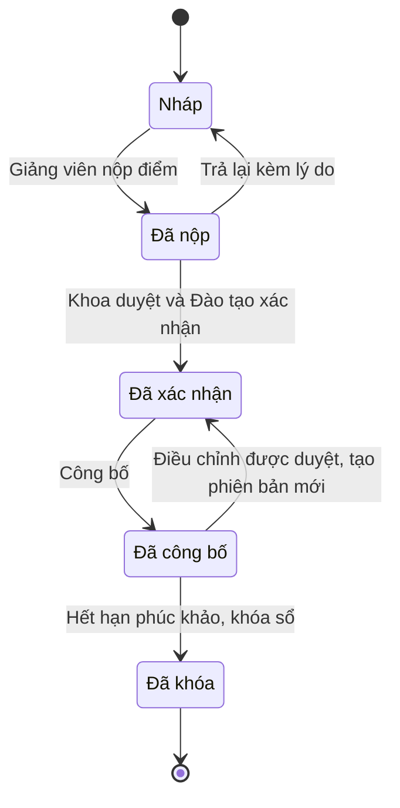
```mermaid
stateDiagram-v2
    state "Nháp" as Nhap
    state "Đã nộp" as DaNop
    state "Đã xác nhận" as DaXacNhan
    state "Đã công bố" as DaCongBo
    state "Đã khóa" as DaKhoa
    [*] --> Nhap
    Nhap --> DaNop : Giảng viên nộp điểm
    DaNop --> Nhap : Trả lại kèm lý do
    DaNop --> DaXacNhan : Khoa duyệt và Đào tạo xác nhận
    DaXacNhan --> DaCongBo : Công bố
    DaCongBo --> DaXacNhan : Điều chỉnh được duyệt, tạo phiên bản mới
    DaCongBo --> DaKhoa : Hết hạn phúc khảo, khóa sổ
    DaKhoa --> [*]
```

**Tiêu chí nghiệm thu (mức nghiệp vụ)**

- **Cho** cơ cấu điểm chuyên cần 10%, giữa kỳ 30%, cuối kỳ 60%, **khi** giảng viên nhập 9,0 / 7,0 / 6,5, **thì** điểm tổng kết = 0,9 + 2,1 + 3,9 = **6,9** → điểm chữ C, hệ 4 là 2,0, kết quả Đạt.
- **Cho** bốn học phần trong bảng ví dụ, **khi** tính GPA học kỳ, **thì** kết quả là 2,50 và xếp loại Khá.
- **Cho** điểm đã công bố, **khi** giảng viên cố sửa trực tiếp, **thì** bị chặn; chỉ tạo được yêu cầu điều chỉnh. Sau khi được duyệt, sinh viên nhận thông báo, bảng điểm hiển thị điểm mới và lịch sử còn lưu điểm cũ.
- **Cho** giảng viên không được phân công lớp L, **khi** nhập điểm cho L, **thì** bị từ chối.
- **Cho** điểm chưa công bố, **khi** sinh viên mở trang kết quả, **thì** không thấy bất kỳ điểm nào của học phần đó (kể cả điểm thành phần).
- **Cho** điểm công bố ngày D, **khi** sinh viên nộp đơn phúc khảo sau ngày D + 7, **thì** bị từ chối vì quá hạn.

### 6.10 FEE — Tuition / Fee Management

| Thuộc tính | Nội dung |
|---|---|
| Tên tiếng Việt | Quản lý học phí và các khoản thu |
| Mục tiêu | Tính đúng học phí theo đăng ký, quản lý miễn giảm, thu tiền, công nợ và hoàn tiền có chứng từ rõ ràng; giúp sinh viên nắm thông tin minh bạch và kế toán đối soát được |
| Tác nhân | `FIN` (chính); `STU` (xem, thanh toán); `CTSV` (xác nhận đối tượng miễn giảm); `ACAD`, `DEAN`, `ADV` (xem tổng hợp) |
| Ưu tiên · Giai đoạn · Công sức | Should · P2 · L |
| Phụ thuộc | `ENR`, `STU`, `ACY`, `SCH`, `NOT` |

**Luồng nghiệp vụ chính** (sơ đồ chi tiết ở [mục 3.3.3](#333-thu-học-phí))

1. `FIN` cấu hình danh mục khoản thu và khung đơn giá.
2. Sau khi chốt đăng ký, hệ thống tính học phí từng sinh viên (tín chỉ tính phí × đơn giá × hệ số − miễn giảm), tạo hóa đơn và thông báo.
3. Sinh viên thanh toán (tiền mặt, chuyển khoản, trực tuyến); `FIN` ghi nhận hoặc hệ thống đối soát tự động.
4. Hệ thống gạch nợ, phát hành biên lai, cập nhật công nợ.
5. Quá hạn: nhắc nợ và áp chính sách chặn.
6. Rút học phần hoặc thôi học: tính hoàn tiền hoặc chuyển trừ sang kỳ sau (có duyệt).
7. Cuối kỳ: đối soát, khóa sổ kỳ thu, báo cáo.

**Yêu cầu chức năng**

| ID | Chức năng | Mô tả và ràng buộc | Tác nhân | Ưu tiên |
|---|---|---|---|---|
| FR-FEE-001 | Danh mục khoản thu | Học phí, lệ phí thi lại, phí học cải thiện, phí làm thẻ, bảo hiểm y tế, phí cấp giấy tờ…; thuộc tính: bắt buộc hay không, thu theo kỳ hay một lần | `FIN` | M |
| FR-FEE-002 | Khung đơn giá | Đơn giá theo tín chỉ, theo học phần hoặc theo học kỳ; theo ngành – khóa – hệ; hiệu lực theo thời gian; hệ số học phần (thực hành, ngoại ngữ…) | `FIN` | M |
| FR-FEE-003 | Tính học phí tự động | Sau khi chốt đăng ký tính tiền theo công thức; học lại và cải thiện tính phí theo chính sách; tính lại khi đăng ký thay đổi | Hệ thống | M |
| FR-FEE-004 | Miễn giảm học phí | Chính sách miễn giảm (theo %, số tiền, đối tượng); duyệt hồ sơ miễn giảm; tự áp vào hóa đơn | `FIN`, `CTSV` | M |
| FR-FEE-005 | Hóa đơn và thông báo học phí | Tạo hóa đơn từng sinh viên theo học kỳ, có hạn nộp; xuất PDF; gửi thông báo | `FIN`, Hệ thống | M |
| FR-FEE-006 | Ghi nhận thanh toán | Tiền mặt tại quầy, chuyển khoản, trực tuyến (tùy chọn); thanh toán một phần; phân bổ vào hóa đơn | `FIN` | M |
| FR-FEE-007 | Đối soát sao kê | Import sao kê ngân hàng (CSV hoặc Excel), tự khớp theo mã tham chiếu hoặc MSSV; giao dịch không khớp đưa vào danh sách xử lý tay | `FIN` | S |
| FR-FEE-008 | Biên lai | Phát hành biên lai có số liên tục; in hoặc xuất PDF (hóa đơn điện tử thuộc ngoài phạm vi) | `FIN` | M |
| FR-FEE-009 | Công nợ | Theo dõi đã thu / còn nợ / quá hạn theo sinh viên, lớp, khoa, học kỳ; tuổi nợ | `FIN`, `DEAN` | M |
| FR-FEE-010 | Nhắc nợ | Nhắc tự động (email, trong ứng dụng) theo lịch; danh sách nợ xuất Excel | `FIN` | S |
| FR-FEE-011 | Hoàn tiền và điều chỉnh | Hoàn tiền hoặc chuyển trừ kỳ sau khi rút học phần, thôi học, nộp thừa; duyệt hai bước | `FIN` | S |
| FR-FEE-012 | Chính sách chặn | Chặn đăng ký, xem điểm, dự thi, nhận bằng theo mức nợ (bật hoặc tắt từng loại) | `FIN`, `ACAD` | S |
| FR-FEE-013 | Sinh viên xem học phí | Xem khoản phải nộp, chi tiết cách tính, lịch sử giao dịch, tải biên lai | `STU` | M |
| FR-FEE-014 | Học bổng khấu trừ | Áp học bổng (`SCH`) vào công nợ | `FIN` | C |
| FR-FEE-015 | Khóa sổ kỳ thu và báo cáo | Khóa sổ khi đối soát xong; báo cáo thu – công nợ – miễn giảm theo kỳ, khoản, phương thức; xuất cho kế toán | `FIN` | M |
| FR-FEE-016 | Phạt nộp muộn | Tính phí chậm nộp theo cấu hình | `FIN` | C |
| FR-FEE-017 | Trả góp | Chia hóa đơn thành nhiều đợt và theo dõi từng đợt | `FIN` | C |
| FR-FEE-018 | Hủy và điều chỉnh hóa đơn | Hủy (void) hóa đơn hoặc biên lai có lý do bằng bút toán đảo; không sửa hay xóa giao dịch cũ | `FIN` | M |
| FR-FEE-019 | Thanh toán trực tuyến | Tích hợp cổng thanh toán (bắt đầu bằng sandbox), xử lý callback có tính idempotent | Hệ thống | C |
| FR-FEE-020 | Hóa đơn điện tử | Phát hành hóa đơn điện tử theo quy định thuế | `FIN` | W |

**Quy tắc nghiệp vụ**

| ID | Quy tắc |
|---|---|
| BR-FEE-01 | Học phí = Σ(tín chỉ tính học phí × đơn giá áp dụng × hệ số) − miễn giảm; làm tròn đến đồng |
| BR-FEE-02 | Đơn giá áp dụng theo khung giá hiệu lực của khóa (đóng băng theo khóa) hoặc theo học kỳ (cấu hình); không thay đổi hồi tố với hóa đơn đã phát hành |
| BR-FEE-03 | Giao dịch tài chính là **bất biến**: không sửa, không xóa; sai sót xử lý bằng bút toán điều chỉnh hoặc đảo, có lý do và người duyệt |
| BR-FEE-04 | Mỗi thanh toán gắn với một hoặc nhiều hóa đơn; tổng phân bổ không vượt số tiền thanh toán; phần dư thành số dư có của sinh viên, tự trừ vào kỳ sau hoặc hoàn lại |
| BR-FEE-05 | Hóa đơn quá hạn mang cờ "Quá hạn"; chính sách chặn và nhắc nợ áp dụng theo cấu hình |
| BR-FEE-06 | Hoàn tiền khi rút học phần theo mốc thời gian (ví dụ trước hạn hủy: 100%; trong hạn rút: theo tỷ lệ cấu hình; sau hạn: 0%) |
| BR-FEE-07 | Phân tách nhiệm vụ: người lập yêu cầu hoàn tiền khác người duyệt (maker–checker) |
| BR-FEE-08 | Đơn vị tiền tệ là VND, không có phần thập phân; mọi thời điểm theo UTC+7 |
| BR-FEE-09 | Mỗi hóa đơn có mã tham chiếu thanh toán duy nhất (dùng làm nội dung chuyển khoản) để đối soát tự động |
| BR-FEE-10 | Học phí chỉ phát sinh cho học phần đã chốt; học phần hủy trước khi chốt không phát sinh phí |
| BR-FEE-11 | Miễn giảm có hiệu lực theo học kỳ, cần minh chứng và người duyệt; một khoản chỉ áp một chính sách miễn giảm, trừ khi cấu hình cho phép cộng dồn có trần |
| BR-FEE-12 | Sinh viên chỉ xem hóa đơn và giao dịch của chính mình; `ADV` chỉ xem mức nợ tổng hợp, không xem chi tiết giao dịch |

> **Ví dụ minh họa `BR-FEE-01`** (số liệu giả định, không phải mức phí thực tế): 18 tín chỉ tính phí × 450.000 đồng = 8.100.000 đồng; miễn giảm 50% → phải nộp **4.050.000 đồng**.

**Dữ liệu chính**

- **FeeType**, **FeeSchedule** (đơn giá, hiệu lực, phạm vi ngành – khóa – hệ), **Invoice**, **InvoiceLine**, **Payment**, **PaymentAllocation**, **Receipt**.
- **WaiverPolicy**, **StudentWaiver**, **Refund**, **StudentLedger** (sổ cái số dư), **BankStatementImport** (và các dòng), **TermBillingClosure**.

**Vòng đời hóa đơn** (cờ "Quá hạn" được suy ra từ hạn nộp, không phải một trạng thái riêng)

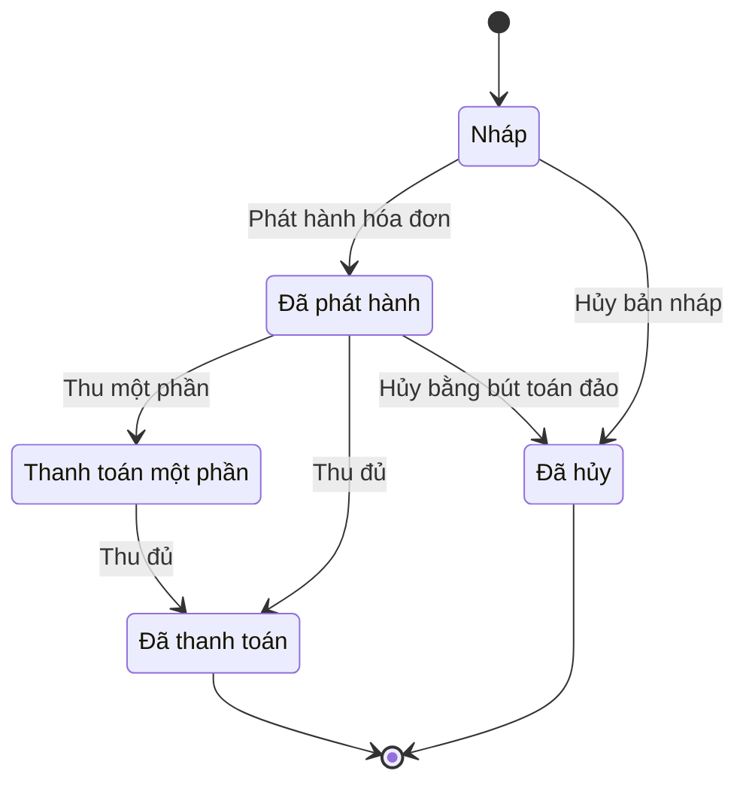
```mermaid
stateDiagram-v2
    state "Nháp" as Nhap
    state "Đã phát hành" as PhatHanh
    state "Thanh toán một phần" as MotPhan
    state "Đã thanh toán" as DaTT
    state "Đã hủy" as Huy
    [*] --> Nhap
    Nhap --> PhatHanh : Phát hành hóa đơn
    PhatHanh --> MotPhan : Thu một phần
    PhatHanh --> DaTT : Thu đủ
    MotPhan --> DaTT : Thu đủ
    Nhap --> Huy : Hủy bản nháp
    PhatHanh --> Huy : Hủy bằng bút toán đảo
    DaTT --> [*]
    Huy --> [*]
```

**Tiêu chí nghiệm thu (mức nghiệp vụ)**

- **Cho** sinh viên chốt 18 tín chỉ tính phí, đơn giá 450.000 đồng, miễn giảm 50%, **khi** tạo hóa đơn, **thì** số tiền phải nộp là 4.050.000 đồng.
- **Cho** hóa đơn 4.050.000 đồng, **khi** sinh viên thanh toán 2.000.000 đồng, **thì** hóa đơn chuyển "Thanh toán một phần", còn nợ 2.050.000 đồng và biên lai ghi đúng số tiền.
- **Cho** một giao dịch đã ghi sai số tiền, **khi** `FIN` muốn sửa, **thì** không sửa trực tiếp được; hệ thống tạo bút toán điều chỉnh và lịch sử hiển thị cả hai bản ghi.
- **Cho** file sao kê 100 dòng trong đó 95 dòng khớp mã tham chiếu, **khi** import, **thì** 95 giao dịch tự gạch nợ và 5 dòng vào danh sách "không khớp" chờ xử lý.
- **Cho** yêu cầu hoàn tiền do rút học phần, **khi** người lập yêu cầu cũng là người duyệt, **thì** hệ thống từ chối; người duyệt phải là người khác.
- **Cho** sinh viên nợ quá hạn và chính sách chặn đăng ký đang bật, **khi** đăng ký học phần, **thì** bị chặn kèm thông báo số nợ.

### 6.11 DOC — Student Documents

| Thuộc tính | Nội dung |
|---|---|
| Tên tiếng Việt | Hồ sơ và giấy tờ sinh viên |
| Mục tiêu | Quản lý (A) hồ sơ sinh viên nộp lên (CCCD, học bạ…) với kiểm tra đầy đủ và xác minh; (B) văn bản nhà trường cấp cho sinh viên (giấy xác nhận, bảng điểm…) sinh từ mẫu, có số hiệu và mã QR xác thực |
| Tác nhân | `STU`, `CTSV`, `ACAD` (chính); `ADV`, `DEAN`, `FIN` (xem theo phạm vi) |
| Ưu tiên · Giai đoạn · Công sức | Should · P2 · M |
| Phụ thuộc | `STU`, `GRD` (bảng điểm), `REQ`, `SYS` (kho tệp, mẫu), `NOT` |

**Luồng nghiệp vụ chính**

*A. Hồ sơ nộp lên:* danh mục loại hồ sơ bắt buộc → sinh viên hoặc cán bộ tải tài liệu → cán bộ xác minh (hợp lệ / không hợp lệ / cần bổ sung) → checklist hoàn thiện và nhắc bổ sung.

*B. Giấy tờ cấp cho sinh viên:* sinh viên gửi yêu cầu cấp giấy (`REQ`) → duyệt → hệ thống sinh văn bản từ mẫu, đánh số và gắn mã QR → sinh viên tải hoặc nhận bản in → bên thứ ba quét QR để xác thực.

**Yêu cầu chức năng**

| ID | Chức năng | Mô tả và ràng buộc | Tác nhân | Ưu tiên |
|---|---|---|---|---|
| FR-DOC-001 | Danh mục loại hồ sơ | Định nghĩa loại hồ sơ (CCCD, học bạ, bằng tốt nghiệp THPT, giấy khai sinh, ảnh, giấy tờ ưu tiên…): bắt buộc hay không, định dạng, dung lượng tối đa, hạn hiệu lực | `CTSV`, `ACAD` | M |
| FR-DOC-002 | Tải hồ sơ lên | Sinh viên hoặc cán bộ tải PDF / JPG / PNG, gắn loại hồ sơ, xem trước; kiểm tra định dạng và dung lượng | `STU`, `CTSV` | M |
| FR-DOC-003 | Checklist hồ sơ | Hiển thị đã nộp / thiếu / cần bổ sung; tỷ lệ hoàn thiện; danh sách sinh viên thiếu hồ sơ; nhắc bổ sung | `CTSV`, `STU` | M |
| FR-DOC-004 | Xác minh hồ sơ | Cán bộ duyệt: Hợp lệ / Không hợp lệ / Cần bổ sung kèm lý do; thông báo cho sinh viên | `CTSV`, `ACAD` | M |
| FR-DOC-005 | Phiên bản tài liệu | Tải bản mới thay thế, giữ bản cũ; không xóa vật lý bản đã duyệt | `STU`, `CTSV` | S |
| FR-DOC-006 | Phân quyền truy cập tài liệu | Sinh viên xem hồ sơ của mình; cán bộ theo vai trò; tài liệu nhạy cảm chỉ vai trò đặc biệt; đường dẫn tải có kiểm quyền và thời hạn; mỗi lần xem hoặc tải tài liệu nhạy cảm đều ghi nhật ký | Hệ thống | M |
| FR-DOC-007 | Mẫu văn bản | Quản lý mẫu giấy tờ (giấy xác nhận sinh viên, giấy giới thiệu thực tập, bảng điểm, giấy xác nhận vay vốn…) với trường dữ liệu động như `{{ho_ten}}`, `{{mssv}}`; hỗ trợ tiếng Việt và tiếng Anh | `ACAD`, `CTSV` | M |
| FR-DOC-008 | Sinh văn bản từ mẫu | Sinh PDF với số văn bản tự động theo sổ, ngày cấp, người ký (ảnh chữ ký hoặc họ tên), mã QR xác thực | Hệ thống | M |
| FR-DOC-009 | Yêu cầu cấp giấy | Sinh viên chọn loại giấy, số bản, mục đích → gửi qua `REQ` → duyệt → sinh hoặc in → nhận (tại quầy hoặc tải PDF) | `STU`, `CTSV`, `ACAD` | M |
| FR-DOC-010 | Xác thực văn bản công khai | Trang công khai: nhập mã hoặc quét QR → hiển thị kết quả (hợp lệ / không hợp lệ / đã thu hồi) mà không lộ dữ liệu nhạy cảm | Công khai | S |
| FR-DOC-011 | Sổ đăng ký văn bản | Sổ cấp văn bản (số hiệu, ngày cấp, người nhận, trạng thái thu hồi); tra cứu | `CTSV`, `ACAD` | S |
| FR-DOC-012 | Kiểm tra an toàn khi tải lên | Kiểm tra loại tệp thực tế, kích thước, quét mã độc (nếu có), đổi tên tệp an toàn | Hệ thống | S |
| FR-DOC-013 | Chính sách lưu trữ | Thời hạn lưu theo loại hồ sơ; nhắc hồ sơ sắp hết hạn (ví dụ giấy khám sức khỏe); xóa hoặc ẩn danh hóa theo chính sách | `ACAD`, `ADMIN` | C |
| FR-DOC-014 | Tải gói hồ sơ | Xuất gói (zip) hồ sơ của một sinh viên hoặc của lớp, có kiểm quyền và nhật ký | `CTSV` | C |
| FR-DOC-015 | OCR trích thông tin giấy tờ | Tự đọc thông tin từ CCCD hoặc giấy tờ để điền hồ sơ | `CTSV` | W |
| FR-DOC-016 | Chữ ký số trên văn bản | Ký số PDF bằng chứng thư số của người có thẩm quyền | `ACAD` | W |

**Quy tắc nghiệp vụ**

| ID | Quy tắc |
|---|---|
| BR-DOC-01 | Định dạng cho phép: PDF, JPG, PNG; mỗi tệp tối đa 5 MB (cấu hình); tên tệp được chuẩn hóa; lưu ở kho tệp riêng, ngoài thư mục web công khai; truy cập qua đường dẫn có kiểm quyền và thời hạn |
| BR-DOC-02 | Hồ sơ bắt buộc phải đầy đủ trong thời hạn quy định (mặc định 30 ngày kể từ nhập học); quá hạn thì sinh viên vào danh sách "thiếu hồ sơ" |
| BR-DOC-03 | Văn bản cấp ra có số văn bản duy nhất theo sổ (loại + năm + số thứ tự); không sửa sau khi cấp; sai sót xử lý bằng thu hồi và cấp lại bản mới |
| BR-DOC-04 | Mỗi lượt xem hoặc tải tài liệu nhạy cảm (CCCD, giấy tờ y tế…) ghi nhật ký: ai, khi nào, mục đích (nếu có) |
| BR-DOC-05 | Giấy tờ chứa thông tin tài chính hoặc điểm chính thức chỉ cấp khi sinh viên đáp ứng điều kiện cấu hình (ví dụ không nợ học phí đối với bảng điểm chính thức) |
| BR-DOC-06 | Mã QR xác thực chỉ chứa mã tra cứu ngẫu nhiên, không chứa dữ liệu cá nhân; trang xác thực hiển thị tối thiểu (tên văn bản, ngày cấp, trạng thái, họ tên che một phần) |
| BR-DOC-07 | Dữ liệu cá nhân trong hồ sơ chỉ thu thập đúng mục đích quản lý đào tạo và tuân thủ Luật Bảo vệ dữ liệu cá nhân 91/2025/QH15: có thông báo mục đích, giới hạn thời gian lưu, bảo đảm quyền truy cập, chỉnh sửa, yêu cầu xóa của chủ thể dữ liệu trong phạm vi nhà trường được phép lưu theo quy định |
| BR-DOC-08 | Tài liệu đã xác minh hợp lệ không bị thay thế âm thầm: tải bản mới sẽ đưa trạng thái về "Chờ xác minh" |

**Dữ liệu chính**

- **DocumentType**, **StudentDocument**, **DocumentVersion**, **DocumentVerification**, **DocumentAccessLog**.
- **DocumentTemplate** (và phiên bản), **IssuedDocument** (số văn bản, mã tra cứu, trạng thái thu hồi), **DocumentRegister**.

**Tiêu chí nghiệm thu (mức nghiệp vụ)**

- **Cho** loại hồ sơ CCCD bắt buộc, **khi** sinh viên tải tệp `.exe` hoặc tệp PDF 8 MB (vượt 5 MB), **thì** bị từ chối kèm lý do.
- **Cho** sinh viên thiếu 2 hồ sơ bắt buộc quá 30 ngày, **khi** hệ thống rà soát hằng ngày, **thì** sinh viên nằm trong danh sách thiếu hồ sơ và nhận nhắc.
- **Cho** yêu cầu cấp giấy xác nhận đã được duyệt, **khi** hệ thống sinh văn bản, **thì** PDF có số văn bản duy nhất và mã QR; quét QR trên trang xác thực hiển thị "Hợp lệ".
- **Cho** văn bản đã bị thu hồi, **khi** quét mã QR, **thì** trang xác thực hiển thị "Đã thu hồi".
- **Cho** cán bộ không có quyền xem CCCD, **khi** truy cập trực tiếp đường dẫn tệp, **thì** bị từ chối và sự kiện được ghi nhật ký.

### 6.12 NOT — Notification Management

| Thuộc tính | Nội dung |
|---|---|
| Tên tiếng Việt | Quản lý thông báo |
| Mục tiêu | Hạ tầng thông báo dùng chung: gửi thông báo tự động theo sự kiện của các module và thông báo thủ công tới đúng đối tượng, đúng kênh; theo dõi trạng thái gửi và đã đọc |
| Tác nhân | Mọi người dùng (nhận); `ACAD`, `EXAM`, `CTSV`, `FIN`, `DEAN`, `LEC`, `ADV` (soạn và gửi theo phạm vi); `ADMIN` (mẫu, kênh, giám sát) |
| Ưu tiên · Giai đoạn · Công sức | Should · P1 → P2 · M |
| Phụ thuộc | `AUTH`, `SYS`; được mọi module gọi tới |

**Luồng nghiệp vụ chính**

*Tự động:* module nguồn phát sự kiện (`EV-…`, xem [Phụ lục A](#phụ-lục-a--danh-mục-sự-kiện-thông-báo)) → `NOT` tra cấu hình sự kiện (người nhận, kênh, mẫu) → tạo thông báo cho từng người nhận → đưa vào hàng đợi theo kênh (trong ứng dụng, email…) → ghi trạng thái (đã gửi, lỗi, đã đọc) và thử lại khi lỗi.

*Thủ công:* cán bộ hoặc giảng viên soạn nội dung, chọn đối tượng trong phạm vi quyền (lớp, khóa, khoa…) → xem trước số người nhận → gửi ngay hoặc hẹn giờ → theo dõi tỷ lệ đã đọc.

**Yêu cầu chức năng**

| ID | Chức năng | Mô tả và ràng buộc | Tác nhân | Ưu tiên |
|---|---|---|---|---|
| FR-NOT-001 | Trung tâm thông báo trong ứng dụng | Biểu tượng chuông với số chưa đọc; danh sách, lọc, đánh dấu đã đọc hoặc đọc tất cả; mở thẳng tới đối tượng liên quan | Mọi người dùng | M |
| FR-NOT-002 | Gửi email | Gửi email theo mẫu qua SMTP; hỗ trợ tiêu đề, nội dung HTML, tệp đính kèm giới hạn | Hệ thống | M |
| FR-NOT-003 | Kênh bổ sung | SMS, Zalo OA, thông báo đẩy qua bộ điều hợp kênh có thể cắm thêm | Hệ thống | C |
| FR-NOT-004 | Thông báo tự động theo sự kiện | Danh mục sự kiện ([Phụ lục A](#phụ-lục-a--danh-mục-sự-kiện-thông-báo)) → người nhận, kênh, mẫu cấu hình được; bật hoặc tắt từng sự kiện | `ADMIN`, Hệ thống | M |
| FR-NOT-005 | Mẫu thông báo | Quản lý mẫu có biến động như `{{ho_ten}}`, `{{hoc_ky}}`; đa ngôn ngữ; xem trước; gửi thử | `ADMIN`, `ACAD` | M |
| FR-NOT-006 | Thông báo thủ công | Soạn thông báo; chọn đối tượng (toàn trường, khoa, ngành, khóa, lớp, lớp học phần, danh sách cá nhân, nhóm theo bộ lọc) trong phạm vi quyền; đính kèm tệp; hẹn giờ; ghim; đặt hạn hiển thị | Cán bộ, `LEC`, `ADV` | M |
| FR-NOT-007 | Tùy chọn nhận thông báo | Người dùng bật hoặc tắt theo kênh và loại thông báo (trừ loại bắt buộc) | Mọi người dùng | S |
| FR-NOT-008 | Hàng đợi và thử lại | Gửi qua hàng đợi, giới hạn tốc độ, thử lại khi lỗi theo thời gian giãn dần; lưu trạng thái Chờ gửi / Đã gửi / Lỗi / Bị trả lại | Hệ thống | M |
| FR-NOT-009 | Lịch sử và theo dõi | Lịch sử thông báo đã gửi; tỷ lệ đã đọc; danh sách người chưa đọc; nhắc lại | Người gửi, `ADMIN` | S |
| FR-NOT-010 | Thông báo khẩn | Hiển thị nổi bật (banner); yêu cầu xác nhận đã đọc | `ACAD`, `ADMIN` | S |
| FR-NOT-011 | Nhắc lịch | Nhắc lịch học, lịch thi, hạn đăng ký, hạn nộp học phí trước một khoảng thời gian cấu hình | Hệ thống | S |
| FR-NOT-012 | Bảng tin chung | Trang tin tức và thông báo chung của trường, phân loại danh mục, có tìm kiếm | `ACAD`, `CTSV` | C |
| FR-NOT-013 | Gộp và chống trùng lặp | Gộp nhiều thông báo cùng loại thành bản tóm tắt (digest); loại thông báo trùng | Hệ thống | C |
| FR-NOT-014 | Thông báo cho phụ huynh | Gửi tới email liên hệ của người giám hộ khi sinh viên đồng ý | `CTSV` | C |
| FR-NOT-015 | Nhóm người nhận | Lưu nhóm người nhận (danh sách tĩnh hoặc bộ lọc động) để dùng lại | Cán bộ | S |

**Quy tắc nghiệp vụ**

| ID | Quy tắc |
|---|---|
| BR-NOT-01 | Thông báo được tạo riêng cho từng người nhận; người dùng chỉ thấy thông báo của chính mình |
| BR-NOT-02 | Thông báo loại bắt buộc (bảo mật, học vụ, học phí, thay đổi lịch học hoặc lịch thi) không cho tắt |
| BR-NOT-03 | Không gửi dữ liệu nhạy cảm (điểm, số nợ cụ thể, CCCD) qua kênh kém an toàn như email hoặc SMS; chỉ gửi nội dung nhắc và liên kết yêu cầu đăng nhập |
| BR-NOT-04 | Gửi lỗi thì thử lại tối đa 3 lần với thời gian giãn dần (mặc định); sau đó đánh dấu Lỗi và ghi nhật ký; thông báo trong ứng dụng không phụ thuộc kênh email |
| BR-NOT-05 | Người gửi thủ công chỉ chọn đối tượng trong phạm vi dữ liệu của mình (giảng viên: lớp mình dạy; khoa: sinh viên của khoa) |
| BR-NOT-06 | Thông báo hết hạn tự ẩn khỏi trang chính nhưng vẫn lưu theo chính sách lưu trữ |
| BR-NOT-07 | Giới hạn tốc độ gửi theo từng kênh để tránh bị chặn; thông báo hàng loạt được chia lô |
| BR-NOT-08 | Mọi thông báo thủ công ghi người gửi và phạm vi; `ADMIN` có thể thu hồi thông báo trong ứng dụng (không thu hồi được email đã gửi) |
| BR-NOT-09 | Mỗi thay đổi trạng thái chỉ phát sự kiện đúng một lần (idempotent theo mã sự kiện) để tránh thông báo trùng |

**Dữ liệu chính**

- **Notification**, **NotificationRecipient** (trạng thái, thời điểm đọc), **NotificationTemplate**, **EventSubscription** (sự kiện → người nhận, kênh, mẫu).
- **DeliveryLog** (kênh, trạng thái, số lần thử), **NotificationPreference**, **Announcement** (thông báo thủ công), **RecipientGroup**.

**Tiêu chí nghiệm thu (mức nghiệp vụ)**

- **Cho** sự kiện "Công bố điểm", **khi** `ACAD` công bố điểm của lớp 40 sinh viên, **thì** hệ thống tạo 40 thông báo trong ứng dụng (mỗi sinh viên một thông báo) và gửi email theo cấu hình; nội dung thông báo **không** chứa điểm.
- **Cho** máy chủ email lỗi tạm thời, **khi** gửi thất bại, **thì** hệ thống thử lại tối đa 3 lần, sau đó đánh dấu Lỗi; thông báo trong ứng dụng vẫn hiển thị bình thường.
- **Cho** giảng viên soạn thông báo, **khi** chọn đối tượng là lớp học phần không thuộc quyền của mình, **thì** lựa chọn không khả dụng hoặc bị từ chối.
- **Cho** sinh viên đã tắt "nhắc lịch học", **khi** có thông báo học phí (loại bắt buộc), **thì** sinh viên vẫn nhận được thông báo học phí và không nhận nhắc lịch học.
- **Cho** thông báo hẹn giờ 08:00, **khi** đến giờ, **thì** hệ thống bắt đầu gửi trong vòng 5 phút.

### 6.13 EXM — Exam Management

| Thuộc tính | Nội dung |
|---|---|
| Tên tiếng Việt | Quản lý thi |
| Mục tiêu | Tổ chức kỳ thi: xét điều kiện dự thi, lập lịch, phân phòng, số báo danh, giám thị, xử lý vi phạm, thi lại và chuyển điểm thi sang `GRD` |
| Tác nhân | `EXAM` (chính); `ACAD`, `DEAN`, `LEC` (giám thị, chấm thi); `STU`, `ADV` (xem) |
| Ưu tiên · Giai đoạn · Công sức | Should · P2 · L |
| Phụ thuộc | `ENR`, `ATT`, `FEE`, `ROM`, `TCH`, `ACY`, `GRD` |

**Luồng nghiệp vụ chính** (sơ đồ chi tiết ở [mục 3.3.4](#334-tổ-chức-kỳ-thi))

1. `EXAM` tạo kỳ thi và chọn các học phần thi.
2. Hệ thống xét điều kiện dự thi, sinh danh sách đủ và không đủ điều kiện.
3. Lập lịch: ngày, ca, phòng, chia sinh viên, cấp số báo danh, phân công giám thị; kiểm tra xung đột.
4. Công bố lịch, in danh sách phòng thi và phiếu báo dự thi.
5. Tổ chức thi, lập biên bản; chấm thi và nhập điểm thi; chuyển sang `GRD`.

**Yêu cầu chức năng**

| ID | Chức năng | Mô tả và ràng buộc | Tác nhân | Ưu tiên |
|---|---|---|---|---|
| FR-EXM-001 | Kỳ thi | Tạo kỳ thi (giữa kỳ, cuối kỳ, thi lại, thi phụ) thuộc học kỳ: thời gian, phạm vi, trạng thái | `EXAM` | M |
| FR-EXM-002 | Danh sách học phần thi | Chọn lớp học phần hoặc học phần thi; hình thức (viết, trắc nghiệm, vấn đáp, thực hành, đồ án), thời lượng, tài liệu được mang vào | `EXAM` | M |
| FR-EXM-003 | Xét điều kiện dự thi | Tự động xét theo chuyên cần (`ATT`), công nợ (`FEE`, nếu bật), điểm quá trình, trạng thái đăng ký; sinh danh sách đủ và không đủ điều kiện; xử lý ngoại lệ có lý do | `EXAM`, `ACAD` | M |
| FR-EXM-004 | Lập lịch thi | Gán ngày, ca, giờ, phòng thi (`ROM`); chia sinh viên vào phòng; cấp số báo danh; kiểm tra xung đột phòng, sinh viên, giám thị | `EXAM` | M |
| FR-EXM-005 | Phân công giám thị | Gán giám thị theo phòng thi và kiểm tra trùng lịch; hạn chế giảng viên coi thi học phần mình dạy (cấu hình); thống kê số buổi coi thi | `EXAM`, `DEAN` | M |
| FR-EXM-006 | Công bố lịch thi | Công bố cho sinh viên và giảng viên; sinh viên tra cứu lịch thi cá nhân; in phiếu báo dự thi hoặc thẻ dự thi | `EXAM`, `STU` | M |
| FR-EXM-007 | Danh sách phòng thi và biên bản | In danh sách ký tên và biên bản coi thi (số bài, vắng thi, vi phạm); ghi nhận kết quả thực tế sau thi | `EXAM`, `LEC` | M |
| FR-EXM-008 | Vi phạm quy chế thi | Ghi nhận vi phạm (nhắc nhở, khiển trách, cảnh cáo, đình chỉ thi, 0 điểm) kèm biên bản; chuyển kết quả cho `GRD` và `SCH` (kỷ luật) | `EXAM`, `LEC` | S |
| FR-EXM-009 | Thi lại, thi bổ sung | Đăng ký thi lại, thi cải thiện, thi bổ sung theo quy chế; thu lệ phí qua `FEE` | `STU`, `EXAM` | S |
| FR-EXM-010 | Ngân hàng đề và đề thi | Quản lý ngân hàng câu hỏi, tạo đề, duyệt đề, bảo mật; sinh đề ngẫu nhiên | `EXAM`, `LEC` | C |
| FR-EXM-011 | Đánh số phách và ghép phách | Sinh mã phách, ghi nhận bài thi, ghép phách sau khi chấm; tách quyền người ghép với người chấm | `EXAM` | C |
| FR-EXM-012 | Chấm thi và nhập điểm thi | Phân công người chấm (chấm 1, chấm 2); nhập điểm theo SBD, phách hoặc MSSV; xử lý chênh lệch; chuyển điểm sang `GRD` (`FR-GRD-016`) | `EXAM`, `LEC` | S |
| FR-EXM-013 | Phúc khảo bài thi | Tiếp nhận yêu cầu phúc khảo từ `GRD`, phân công chấm lại, trả kết quả | `EXAM` | S |
| FR-EXM-014 | Thống kê kỳ thi | Số sinh viên dự thi, vắng thi, vi phạm; mức sử dụng phòng; báo cáo gửi lãnh đạo | `EXAM`, `ACAD` | S |
| FR-EXM-015 | Khóa và thay đổi lịch thi | Khóa lịch sau công bố; thay đổi cần duyệt, lý do và thông báo ngay các bên liên quan | `EXAM` | S |
| FR-EXM-016 | Thi trực tuyến | Làm bài thi trực tuyến, chấm tự động, giám sát cơ bản | — | W |

**Quy tắc nghiệp vụ**

| ID | Quy tắc |
|---|---|
| BR-EXM-01 | Sinh viên chỉ được xếp lịch thi các học phần đã đăng ký hợp lệ và đủ điều kiện dự thi; sinh viên không đủ điều kiện bị loại khỏi danh sách và nhận thông báo |
| BR-EXM-02 | Một sinh viên không có hai ca thi trùng giờ; một phòng không có hai ca chồng thời gian; số sinh viên trong phòng không vượt sức chứa thi (có thể thấp hơn sức chứa học để giãn cách) |
| BR-EXM-03 | Mỗi phòng thi có tối thiểu 2 giám thị (cấu hình theo số sinh viên, ví dụ 1 giám thị cho 25–35 sinh viên); giảng viên không coi thi học phần mình trực tiếp giảng dạy (mặc định bật); không phân công giám thị trùng lịch |
| BR-EXM-04 | Lịch thi đã công bố chỉ thay đổi khi có lý do, người duyệt và thông báo ngay đến sinh viên và giám thị |
| BR-EXM-05 | Số lần thi lại tối đa của mỗi học phần theo quy chế của trường (mặc định: không tổ chức thi lại — sinh viên không đạt phải học lại; bật nếu trường có quy định) |
| BR-EXM-06 | Điểm thi chỉ do người được phân công nhập; khi chấm theo phách, người chấm không xem được danh tính sinh viên |
| BR-EXM-07 | Vi phạm quy chế thi xử lý theo mức quy định của trường; mức đình chỉ thi cho điểm thành phần thi bằng 0 và thông báo sinh viên, CVHT |
| BR-EXM-08 | Mỗi sinh viên tối đa N ca thi mỗi ngày (mặc định 2) và khoảng nghỉ giữa hai ca tối thiểu X phút (cấu hình) |
| BR-EXM-09 | Danh sách thi, đề thi và dữ liệu phách là dữ liệu mật: truy cập theo vai trò và ghi nhật ký |
| BR-EXM-10 | Không đủ điều kiện dự thi vì công nợ chỉ áp dụng khi chính sách chặn dự thi của `FEE` đang bật |

**Dữ liệu chính**

- **ExamPeriod**, **ExamSession** (học phần hoặc lớp, ngày, ca, hình thức, thời lượng, trạng thái), **ExamRoomAssignment** (phòng, giám thị), **ExamCandidate** (số báo danh, trạng thái điều kiện).
- **ExamInvigilator**, **ExamIncident** (vi phạm), **ExamEligibilityOverride** (ngoại lệ), **ExamRetakeRegistration**, **QuestionBank** (tùy chọn).

**Vòng đời ca thi**

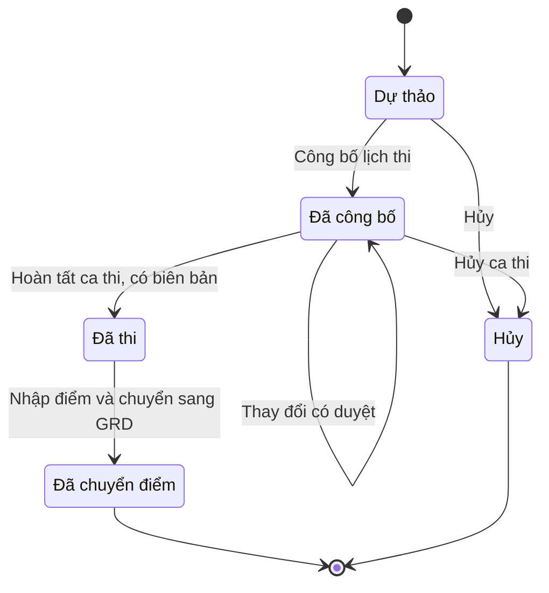
```mermaid
stateDiagram-v2
    state "Dự thảo" as DuThao
    state "Đã công bố" as DaCongBo
    state "Đã thi" as DaThi
    state "Đã chuyển điểm" as DaChuyenDiem
    state "Hủy" as Huy
    [*] --> DuThao
    DuThao --> DaCongBo : Công bố lịch thi
    DaCongBo --> DaCongBo : Thay đổi có duyệt
    DaCongBo --> DaThi : Hoàn tất ca thi, có biên bản
    DaThi --> DaChuyenDiem : Nhập điểm và chuyển sang GRD
    DuThao --> Huy : Hủy
    DaCongBo --> Huy : Hủy ca thi
    DaChuyenDiem --> [*]
    Huy --> [*]
```

**Tiêu chí nghiệm thu (mức nghiệp vụ)**

- **Cho** sinh viên vắng 25% với ngưỡng cấm thi 20%, **khi** sinh danh sách dự thi, **thì** sinh viên thuộc nhóm không đủ điều kiện, không được xếp phòng và nhận thông báo.
- **Cho** hai ca thi cùng giờ có chung một sinh viên, **khi** lập lịch, **thì** hệ thống cảnh báo trùng ca của sinh viên đó.
- **Cho** phòng thi sức chứa 40 và 45 sinh viên cần xếp, **khi** chia phòng, **thì** hệ thống tự chia không quá 40 người mỗi phòng và cảnh báo nếu không đủ phòng.
- **Cho** giảng viên đang dạy học phần X, **khi** phân công coi thi học phần X, **thì** bị chặn (theo cấu hình mặc định).
- **Cho** lịch thi đã công bố, **khi** đổi phòng, **thì** hệ thống yêu cầu lý do và thông báo ngay sinh viên cùng giám thị.
- **Cho** kết quả chấm thi, **khi** nhập điểm và chuyển, **thì** `GRD` nhận điểm vào thành phần thi cuối kỳ ở trạng thái nháp để giảng viên xác nhận.

### 6.14 TCH — Teacher / Lecturer Management

| Thuộc tính | Nội dung |
|---|---|
| Tên tiếng Việt | Quản lý giảng viên |
| Mục tiêu | Quản lý hồ sơ giảng viên, phân công giảng dạy, khối lượng giảng dạy và vai trò cố vấn học tập; cung cấp cổng giảng viên cho công việc hằng ngày (lịch dạy, điểm danh, nhập điểm) |
| Tác nhân | `ACAD`, `DEAN` (quản lý); `LEC`, `ADV` (xem và cập nhật phần được phép); `STU` (xem thông tin cơ bản) |
| Ưu tiên · Giai đoạn · Công sức | Must · P1 · M |
| Phụ thuộc | `FAC`, `AUTH`; cung cấp cho `CLS`, `TTB`, `ATT`, `EXM`, `GRD` |

**Luồng nghiệp vụ chính**

1. `ACAD` hoặc `DEAN` nhập hồ sơ giảng viên (hoặc import) → hệ thống cấp tài khoản và vai trò `LEC`.
2. Hằng kỳ: giảng viên khai báo nguyện vọng giảng dạy và lịch bận → Khoa đề xuất phân công → `ACAD` gán giảng viên vào lớp học phần (`CLS`).
3. Trong kỳ: giảng viên dùng cổng giảng viên (lịch dạy, điểm danh, nhập điểm, thông báo).
4. Cuối kỳ: hệ thống tổng hợp khối lượng giảng dạy so với định mức.
5. Giảng viên nghỉ phép hoặc nghỉ việc: hệ thống hỗ trợ chuyển lớp cho giảng viên khác.

**Yêu cầu chức năng**

| ID | Chức năng | Mô tả và ràng buộc | Tác nhân | Ưu tiên |
|---|---|---|---|---|
| FR-TCH-001 | Hồ sơ giảng viên | CRUD hồ sơ: mã, họ tên, ngày sinh, giới tính, CCCD, liên hệ, đơn vị chính, chức danh (giảng viên, giảng viên chính, phó giáo sư, giáo sư), học vị, chuyên môn, ngày vào làm, trạng thái | `ACAD`, `DEAN` | M |
| FR-TCH-002 | Loại hình và hợp đồng | Cơ hữu, thỉnh giảng, trợ giảng; thông tin hợp đồng và thời hạn hiệu lực | `ACAD` | S |
| FR-TCH-003 | Kiêm nhiệm đơn vị và chức vụ | Gán giảng viên vào bộ môn hoặc khoa kiêm nhiệm; chức vụ quản lý (liên kết `FAC`) | `ACAD`, `DEAN` | M |
| FR-TCH-004 | Trình độ và công trình | Bằng cấp, chứng chỉ, lý lịch khoa học tóm tắt, công trình (tùy chọn) | `ACAD`, `LEC` | S |
| FR-TCH-005 | Năng lực giảng dạy | Danh sách học phần giảng viên có thể giảng dạy (đồng bộ với `FR-SUB-010`) | `DEAN` | S |
| FR-TCH-006 | Phân công giảng dạy | Xem và đề xuất phân công giảng viên cho lớp học phần (thực hiện tại `CLS`); kiểm tra tải giảng | `DEAN`, `ACAD` | M |
| FR-TCH-007 | Khối lượng giảng dạy | Tính giờ chuẩn quy đổi (hệ số lớp đông, thực hành, ngôn ngữ…) theo kỳ và năm, so với định mức; xuất bảng tổng hợp | `ACAD`, `DEAN` | S |
| FR-TCH-008 | Lịch dạy và nguyện vọng | Giảng viên xem lịch dạy cá nhân; khai báo lịch bận và nguyện vọng học phần cho học kỳ tới | `LEC` | S |
| FR-TCH-009 | Cổng giảng viên | Dashboard: lịch hôm nay, lớp cần điểm danh hoặc nhập điểm, hạn chót, thông báo, lối tắt tới các lớp đang dạy | `LEC` | M |
| FR-TCH-010 | Quản lý cố vấn học tập | Danh sách lớp được phân công; xem tình hình học tập, chuyên cần, mức nợ tổng hợp của sinh viên; ghi nhận buổi sinh hoạt hoặc tư vấn (biên bản) | `ADV` | S |
| FR-TCH-011 | Xem danh sách sinh viên | Giảng viên xem danh sách sinh viên các lớp mình dạy (họ tên, MSSV, ảnh, lớp, email trường); thông tin nhạy cảm bị che | `LEC` | M |
| FR-TCH-012 | Nghỉ phép, công tác | Khai báo thời gian vắng mặt; ảnh hưởng đến lịch dạy (báo nghỉ, tìm người thay thế) | `LEC`, `DEAN` | S |
| FR-TCH-013 | Import và xuất danh sách | Nhập giảng viên từ Excel theo mẫu; xuất danh sách theo khoa và chức danh | `ACAD` | S |
| FR-TCH-014 | Kết quả khảo sát | Xem kết quả đánh giá của sinh viên (`EVA`) và lịch sử | `LEC`, `DEAN` | C |
| FR-TCH-015 | Hướng dẫn đồ án, khóa luận | Ghi nhận số sinh viên hướng dẫn (liên kết module thực tập – khóa luận nếu có sau này) | `DEAN` | C |
| FR-TCH-016 | Thanh toán thù lao thỉnh giảng | Tính và chi trả thù lao giảng dạy (thuộc hệ thống nhân sự – tiền lương) | — | W |

**Quy tắc nghiệp vụ**

| ID | Quy tắc |
|---|---|
| BR-TCH-01 | Mã giảng viên duy nhất; mỗi hồ sơ giảng viên gắn với tối đa một tài khoản đăng nhập |
| BR-TCH-02 | Chỉ giảng viên đang hoạt động mới được phân công mới; khi nghỉ việc hoặc nghỉ hưu: giữ lịch sử, khóa phân công mới, các lớp đang dạy phải chuyển cho giảng viên khác |
| BR-TCH-03 | Tải giảng dạy tối đa mỗi tuần hoặc học kỳ theo chức danh (cấu hình); cảnh báo khi vượt, cho phép ngoại lệ có duyệt |
| BR-TCH-04 | Giảng viên chỉ xem được thông tin sinh viên thuộc lớp mình giảng dạy hoặc cố vấn; thông tin nhạy cảm (CCCD, địa chỉ, tài chính chi tiết) bị che |
| BR-TCH-05 | Giảng viên thỉnh giảng chỉ được phân công trong thời gian hợp đồng còn hiệu lực |
| BR-TCH-06 | Một giảng viên chỉ giữ chức vụ trưởng ở một đơn vị tại một thời điểm |
| BR-TCH-07 | Giảng viên chỉ tự sửa các trường được phép (liên hệ, ảnh, công trình); đổi họ tên, chức danh, học vị cần cán bộ có thẩm quyền xác nhận |
| BR-TCH-08 | Giờ chuẩn quy đổi tính từ số buổi thực dạy đã xác nhận (`FR-ATT-012`) và hệ số cấu hình theo quy định của trường |
| BR-TCH-09 | Cố vấn học tập phải là giảng viên đang hoạt động; mỗi lớp hành chính có tối đa một CVHT hiệu lực (xem `BR-CLS-07`) |

**Dữ liệu chính**

- **Lecturer**, **LecturerQualification**, **LecturerContract**, **LecturerUnit** (kiêm nhiệm), **LecturerAvailability**, **LecturerLeave**.
- **TeachingAssignment** (tham chiếu phân công tại `CLS`), **AdvisorAssignment**, **AdvisingNote** (biên bản tư vấn), **TeachingWorkload** (tổng hợp theo kỳ).

**Tiêu chí nghiệm thu (mức nghiệp vụ)**

- **Cho** giảng viên thỉnh giảng có hợp đồng đến 31/12, **khi** gán lớp học phần kết thúc ngày 15/01, **thì** hệ thống chặn hoặc cảnh báo vì vượt hiệu lực hợp đồng.
- **Cho** giảng viên đang dạy 3 lớp, **khi** chuyển trạng thái sang nghỉ việc, **thì** hệ thống liệt kê 3 lớp cần chuyển giảng viên và không cho hoàn tất cho đến khi xử lý.
- **Cho** giảng viên A, **khi** mở danh sách sinh viên của lớp học phần do giảng viên B phụ trách, **thì** bị từ chối.
- **Cho** giảng viên xem danh sách sinh viên, **khi** hiển thị, **thì** số CCCD và địa chỉ không xuất hiện.
- **Cho** giảng viên có 2 lớp 3 tín chỉ trong kỳ, **khi** xem khối lượng giảng dạy, **thì** bảng tổng hợp hiển thị số giờ chuẩn quy đổi theo hệ số đã cấu hình.

### 6.15 RPT — Dashboard & Reports

| Thuộc tính | Nội dung |
|---|---|
| Tên tiếng Việt | Bảng điều khiển và báo cáo |
| Mục tiêu | Cung cấp dashboard theo vai trò và báo cáo chuẩn dựa trên dữ liệu của mọi module, có bộ lọc, phân quyền theo phạm vi dữ liệu, xuất file và lập lịch |
| Tác nhân | Mọi người dùng (theo phạm vi dữ liệu); `ACAD`, `DEAN`, `FIN` (báo cáo quản lý) |
| Ưu tiên · Giai đoạn · Công sức | Must · P1 → P3 · M |
| Phụ thuộc | Tất cả module |

**Luồng nghiệp vụ chính**

1. Người dùng đăng nhập → vào dashboard theo vai trò (các widget chỉ số).
2. Chọn báo cáo trong danh mục ([Phụ lục B](#phụ-lục-b--danh-mục-báo-cáo)) → đặt bộ lọc (học kỳ, khoa, ngành…) → xem trên màn hình.
3. Xuất PDF / Excel / CSV; lưu bộ lọc yêu thích; lập lịch gửi định kỳ.
4. Báo cáo nặng chạy nền và thông báo khi xong.

**Yêu cầu chức năng**

| ID | Chức năng | Mô tả và ràng buộc | Tác nhân | Ưu tiên |
|---|---|---|---|---|
| FR-RPT-001 | Dashboard theo vai trò | Mỗi vai trò có dashboard riêng: quản trị và đào tạo, khoa, giảng viên, sinh viên, tài chính | Mọi người dùng | M |
| FR-RPT-002 | Widget chỉ số (KPI) | Số sinh viên theo trạng thái, nhập học mới, bảo lưu và thôi học, GPA trung bình, tỷ lệ đạt, chuyên cần, công nợ, doanh thu học phí, sĩ số lớp, tiến độ nhập điểm | `ACAD`, `DEAN`, `FIN` | M |
| FR-RPT-003 | Biểu đồ và drill-down | Biểu đồ cột, đường, tròn, bản đồ nhiệt có bộ lọc kỳ / khoa / ngành / khóa; nhấp để xem chi tiết | `ACAD`, `DEAN` | S |
| FR-RPT-004 | Danh mục báo cáo chuẩn | Các báo cáo ở Phụ lục B; mỗi báo cáo có mô tả, tham số và vai trò được xem | Theo quyền | M |
| FR-RPT-005 | Bộ lọc tham số | Học kỳ, năm học, khoa, ngành, khóa, lớp, trạng thái, khoảng ngày; lưu bộ lọc yêu thích | Mọi người dùng | M |
| FR-RPT-006 | Xuất báo cáo | PDF, Excel (xlsx), CSV; in theo biểu mẫu của trường (đầu trang, chữ ký) | Theo quyền `X` | M |
| FR-RPT-007 | Báo cáo định kỳ | Lập lịch chạy và gửi email báo cáo hằng tuần, tháng hoặc kỳ | `ACAD`, `FIN`, `DEAN` | C |
| FR-RPT-008 | Phạm vi dữ liệu | Mọi báo cáo và dashboard chỉ hiển thị dữ liệu trong phạm vi của người dùng | Hệ thống | M |
| FR-RPT-009 | Dashboard sinh viên | GPA theo kỳ, tín chỉ tích lũy và còn thiếu, lịch hôm nay, hạn chót, công nợ, thông báo mới | `STU` | M |
| FR-RPT-010 | Dashboard giảng viên | Lịch dạy hôm nay, lớp cần điểm danh hoặc nhập điểm, hạn chót, thông báo | `LEC` | M |
| FR-RPT-011 | Số liệu chốt kỳ | Chụp lại (snapshot) số liệu cuối kỳ để so sánh theo thời gian, không đổi khi dữ liệu nguồn bị sửa muộn | `ACAD` | S |
| FR-RPT-012 | Báo cáo chạy nền | Báo cáo nặng chạy nền, có thông báo khi xong, lưu kết quả tạm thời | Hệ thống | S |
| FR-RPT-013 | Công cụ tạo báo cáo tùy biến | Chọn trường dữ liệu, bộ lọc, nhóm theo; lưu thành báo cáo cá nhân | `ACAD`, `DEAN` | C |
| FR-RPT-014 | Cảnh báo sớm | Phát hiện sinh viên có nguy cơ (vắng nhiều + điểm thấp + nợ học phí) để tư vấn | `ACAD`, `ADV` | C |
| FR-RPT-015 | Từ điển chỉ số | Trang mô tả công thức và nguồn dữ liệu của từng chỉ số | Mọi người dùng | S |
| FR-RPT-016 | Báo cáo thống kê gửi cơ quan quản lý | Xuất số liệu theo mẫu của cơ quan quản lý giáo dục | `ACAD` | W |

**Quy tắc nghiệp vụ**

| ID | Quy tắc |
|---|---|
| BR-RPT-01 | Số liệu báo cáo lấy từ cùng một nguồn dữ liệu (không tính tay riêng); báo cáo chốt kỳ dùng snapshot |
| BR-RPT-02 | Mọi báo cáo áp dụng phạm vi dữ liệu theo vai trò; xuất file chứa dữ liệu nhạy cảm cần quyền riêng và ghi nhật ký |
| BR-RPT-03 | Mỗi chỉ số có định nghĩa công bố trong từ điển chỉ số. Ví dụ: tỷ lệ đạt học phần = số sinh viên đạt ÷ số sinh viên có điểm chính thức; GPA theo `BR-GRD-04`; tỷ lệ chuyên cần = 1 − tỷ lệ vắng (`BR-ATT-02`) |
| BR-RPT-04 | Báo cáo hiển thị thời điểm tạo, người tạo, bộ lọc áp dụng và loại dữ liệu (đã chốt hay trực tiếp) |
| BR-RPT-05 | Báo cáo vượt ngưỡng kích thước (mặc định 50.000 dòng) chạy nền và giới hạn số lần chạy đồng thời |
| BR-RPT-06 | Báo cáo chứa thông tin cá nhân chỉ gửi qua email dưới dạng liên kết cần đăng nhập, không đính kèm dữ liệu thô (theo `BR-NOT-03`) |
| BR-RPT-07 | Dashboard tự làm mới theo chu kỳ cấu hình (mặc định 5 phút) hoặc khi người dùng yêu cầu |

**Dữ liệu chính**

- **ReportDefinition** (mã, tên, tham số, vai trò được xem), **ReportRun** (người chạy, tham số, trạng thái, tệp kết quả), **SavedFilter**, **ScheduledReport**.
- **DashboardLayout** và **DashboardWidget**, **KpiDefinition**, **DataSnapshot**.

**Tiêu chí nghiệm thu (mức nghiệp vụ)**

- **Cho** trưởng khoa Công nghệ thông tin, **khi** xem báo cáo danh sách sinh viên, **thì** chỉ thấy sinh viên của khoa mình.
- **Cho** báo cáo bảng điểm lớp 3.000 dòng, **khi** xuất Excel, **thì** hoàn tất trong thời gian quy định ở `NFR-PERF-03` và file đúng theo bộ lọc.
- **Cho** số liệu cuối kỳ đã chốt (snapshot), **khi** điểm của một sinh viên bị điều chỉnh sau đó, **thì** báo cáo "số liệu chốt" không đổi còn báo cáo "trực tiếp" được cập nhật.
- **Cho** báo cáo vượt 50.000 dòng, **khi** người dùng yêu cầu, **thì** hệ thống chuyển sang chạy nền và thông báo khi xong.
- **Cho** sinh viên đăng nhập, **khi** mở dashboard, **thì** GPA, tín chỉ tích lũy và lịch hôm nay khớp với dữ liệu của `GRD` và `TTB`.

### 6.16 SYS — System Administration

| Thuộc tính | Nội dung |
|---|---|
| Tên tiếng Việt | Quản trị hệ thống |
| Mục tiêu | Cấu hình và vận hành hệ thống: tham số, danh mục dùng chung, quy chế học vụ theo khóa, nhật ký kiểm toán, sao lưu, import / export, tác vụ nền, khóa sổ học kỳ |
| Tác nhân | `ADMIN` (chính); `ACAD` (cấu hình quy chế đào tạo) |
| Ưu tiên · Giai đoạn · Công sức | Must · P1 → P3 · M |
| Phụ thuộc | `AUTH` |

**Luồng nghiệp vụ chính**

1. Cài đặt ban đầu: tham số của trường, năm học hiện hành, danh mục dùng chung, bộ quy chế mặc định.
2. Vận hành: giám sát lỗi và tác vụ nền, sao lưu hằng ngày.
3. Trước mỗi kỳ: rà soát cấu hình quy chế theo khóa; sau mỗi kỳ: khóa sổ.
4. Truy vết: tra cứu nhật ký khi có tranh chấp.

**Yêu cầu chức năng**

| ID | Chức năng | Mô tả và ràng buộc | Tác nhân | Ưu tiên |
|---|---|---|---|---|
| FR-SYS-001 | Tham số hệ thống | Tên trường, logo, năm học và học kỳ hiện hành, múi giờ, ngôn ngữ mặc định, định dạng ngày, thông tin liên hệ, chính sách phiên | `ADMIN` | M |
| FR-SYS-002 | Danh mục dùng chung | Giới tính, dân tộc, tôn giáo, quốc tịch, đối tượng ưu tiên, loại hợp đồng…; danh mục đơn vị hành chính (tỉnh / thành phố – xã / phường theo mô hình hai cấp từ 01/07/2025, hỗ trợ dữ liệu ba cấp cũ); import danh mục chuẩn | `ADMIN` | M |
| FR-SYS-003 | Cấu hình quy chế đào tạo | Thang điểm và bảng quy đổi; ngưỡng đạt; cấm thi; khung tín chỉ; xếp loại học lực; cảnh báo và buộc thôi học; mốc rút học phần… Mỗi bộ quy chế có hiệu lực theo khóa và ngày áp dụng | `ADMIN`, `ACAD` | M |
| FR-SYS-004 | Nhật ký kiểm toán | Ghi ai, làm gì, trên đối tượng nào, khi nào, từ đâu (IP, thiết bị), giá trị trước – sau; tìm kiếm, lọc, xuất; không thể sửa hoặc xóa | `ADMIN` | M |
| FR-SYS-005 | Nhật ký lỗi và giám sát | Ghi lỗi hệ thống, kiểm tra tình trạng (health check), cảnh báo `ADMIN` khi có lỗi nghiêm trọng | `ADMIN` | S |
| FR-SYS-006 | Sao lưu và khôi phục | Sao lưu tự động hằng ngày (cơ sở dữ liệu và tệp), giữ N bản, khôi phục có kiểm soát; kiểm tra khôi phục định kỳ | `ADMIN` | M |
| FR-SYS-007 | Trung tâm import / export | Quản lý mẫu import, kiểm tra, xem trước, báo cáo lỗi, lịch sử import, hoàn tác theo lô | `ADMIN`, `ACAD` | M |
| FR-SYS-008 | Quản lý mẫu | Tập trung mẫu email, văn bản, báo cáo (liên kết `NOT`, `DOC`, `RPT`) | `ADMIN` | S |
| FR-SYS-009 | Đa ngôn ngữ | Tiếng Việt (mặc định) và tiếng Anh; quản lý chuỗi dịch | `ADMIN` | S |
| FR-SYS-010 | Chế độ bảo trì | Bật bảo trì kèm thông báo; khóa hệ thống theo thời điểm (ví dụ lúc chốt sổ) | `ADMIN` | S |
| FR-SYS-011 | Tác vụ nền | Lịch và trạng thái tác vụ (nhắc nợ, snapshot, sao lưu, gửi thông báo); chạy lại; xem nhật ký | `ADMIN` | S |
| FR-SYS-012 | Quản lý tệp và dung lượng | Thống kê dung lượng, dọn tệp tạm và tệp mồ côi theo chính sách | `ADMIN` | C |
| FR-SYS-013 | Khóa sổ học kỳ | Kiểm tra điều kiện (đã công bố điểm, đã chốt học phí…) rồi khóa dữ liệu của kỳ; mở khóa chỉ qua quy trình ngoại lệ có phê duyệt và nhật ký | `ADMIN`, `ACAD` | M |
| FR-SYS-014 | Cấu hình tích hợp | SMTP, SMS, cổng thanh toán, SSO; bí mật (mật khẩu, khóa API) lưu mã hóa và không hiển thị lại | `ADMIN` | S |
| FR-SYS-015 | Khóa API và webhook | Cấp khóa API hoặc webhook cho tích hợp ngoài, có phạm vi và hạn dùng | `ADMIN` | C |
| FR-SYS-016 | Dữ liệu mẫu và chế độ demo | Sinh bộ dữ liệu mẫu quy mô cấu hình được; chế độ demo cho phép xóa và khôi phục dữ liệu mẫu | `ADMIN` | S |
| FR-SYS-017 | Thông tin phiên bản | Hiển thị phiên bản, ngày phát hành, thay đổi | `ADMIN` | C |
| FR-SYS-018 | Chính sách lưu trữ và ẩn danh hóa | Quy tắc thời gian lưu theo loại dữ liệu; ẩn danh hóa hoặc xóa dữ liệu hết hạn; xử lý yêu cầu của chủ thể dữ liệu | `ADMIN` | S |

**Quy tắc nghiệp vụ**

| ID | Quy tắc |
|---|---|
| BR-SYS-01 | Nhật ký kiểm toán chỉ ghi thêm (append-only); lưu tối thiểu 5 năm hoặc theo quy định lưu trữ của trường |
| BR-SYS-02 | Cấu hình quy chế có hiệu lực theo thời điểm và theo khóa; thay đổi không hồi tố trên dữ liệu đã chốt |
| BR-SYS-03 | Thao tác nguy hiểm (khôi phục dữ liệu, mở khóa kỳ, can thiệp dữ liệu đã chốt, xóa hàng loạt) yêu cầu xác nhận lại mật khẩu hoặc hai người phê duyệt, và ghi nhật ký mức cao |
| BR-SYS-04 | Bản sao lưu được mã hóa và lưu tách biệt với máy chủ ứng dụng; mục tiêu RPO không quá 24 giờ, RTO không quá 4 giờ (mức tối thiểu cho đồ án) |
| BR-SYS-05 | Bí mật cấu hình (mật khẩu SMTP, khóa API) lưu mã hóa; sau khi lưu không hiển thị lại |
| BR-SYS-06 | Sau khi khóa sổ học kỳ, mọi sửa điểm, đăng ký, học phí của kỳ đó cần quy trình ngoại lệ có phê duyệt |
| BR-SYS-07 | Mỗi lần import là một lô có mã; lỗi từng dòng phải được báo cáo; chỉ lưu dòng hợp lệ khi người dùng chọn rõ; có thể hoàn tác theo lô nếu chưa phát sinh dữ liệu phụ thuộc |
| BR-SYS-08 | Thay đổi cấu hình quan trọng (quy chế, thang điểm, phân quyền) ghi nhật ký trước – sau và thông báo cho các `ADMIN` khác |
| BR-SYS-09 | Danh mục dùng chung có mã ổn định; khi đã được tham chiếu thì ngừng sử dụng chứ không xóa |
| BR-SYS-10 | Dữ liệu mẫu và chế độ demo chỉ bật trên môi trường không phải sản xuất |

**Dữ liệu chính**

- **SystemSetting**, **PolicySet** (bộ quy chế có phiên bản, phạm vi khóa, ngày hiệu lực) và **PolicyItem**, **LookupCategory** và **LookupValue**.
- **AuditLog**, **ErrorLog**, **BackupJob**, **ImportBatch** và **ImportRow**, **ScheduledJob**, **TermLock**, **IntegrationConfig**, **ApiKey**, **RetentionRule**.

**Tiêu chí nghiệm thu (mức nghiệp vụ)**

- **Cho** điểm của một sinh viên bị sửa, **khi** `ADMIN` tra nhật ký, **thì** thấy đủ người sửa, thời điểm, điểm cũ – mới, lý do; giao diện không có cách xóa dòng nhật ký.
- **Cho** bộ quy chế mới áp dụng cho khóa K2026 từ ngày D, **khi** tính GPA, **thì** sinh viên K2025 vẫn tính theo bộ cũ còn sinh viên K2026 tính theo bộ mới.
- **Cho** sao lưu hằng ngày, **khi** chạy khôi phục thử trên môi trường kiểm thử, **thì** số lượng bản ghi chính khớp với bản sao lưu.
- **Cho** học kỳ còn lớp chưa công bố điểm, **khi** `ADMIN` khóa sổ, **thì** bị từ chối và hệ thống liệt kê các lớp còn thiếu.
- **Cho** mật khẩu SMTP đã lưu, **khi** mở lại màn hình cấu hình, **thì** mật khẩu chỉ hiển thị dạng che, không xem lại được nội dung.

### 6.17 ACY — Academic Year & Semester *(đề xuất bổ sung — nhóm A)*

| Thuộc tính | Nội dung |
|---|---|
| Tên tiếng Việt | Năm học và học kỳ |
| Mục tiêu | Quản lý trục thời gian đào tạo: năm học, học kỳ, lịch học vụ (các mốc thời gian) và ngày nghỉ; là gốc cho đăng ký, thời khóa biểu, thi, điểm và học phí |
| Tác nhân | `ACAD`, `ADMIN` (quản lý); mọi người dùng (xem) |
| Ưu tiên · Giai đoạn · Công sức | Must · P1 · S |
| Phụ thuộc | `SYS`; cung cấp cho `CLS`, `ENR`, `TTB`, `EXM`, `GRD`, `FEE` |

**Luồng nghiệp vụ chính**

1. `ACAD` tạo năm học rồi các học kỳ (HK1, HK2, hè) với ngày bắt đầu và kết thúc.
2. Thiết lập lịch học vụ: mốc đăng ký, bắt đầu học, hạn hủy và rút, thi, nhập điểm, công bố điểm, nộp học phí, nghỉ lễ, nghỉ hè.
3. Đặt học kỳ hiện hành; các module mặc định làm việc với kỳ này.
4. Kết thúc kỳ → khóa sổ (`FR-SYS-013`).

**Yêu cầu chức năng**

| ID | Chức năng | Mô tả và ràng buộc | Tác nhân | Ưu tiên |
|---|---|---|---|---|
| FR-ACY-001 | Năm học | CRUD năm học (ví dụ 2026–2027) với ngày bắt đầu – kết thúc | `ACAD` | M |
| FR-ACY-002 | Học kỳ | CRUD học kỳ thuộc năm học: loại (chính, hè), tên, ngày bắt đầu – kết thúc, số tuần học | `ACAD` | M |
| FR-ACY-003 | Học kỳ hiện hành | Đặt học kỳ hiện hành; màn hình và báo cáo mặc định theo kỳ này; tối đa một kỳ chính "đang diễn ra" | `ACAD` | M |
| FR-ACY-004 | Lịch học vụ | Các mốc theo kỳ: mở và đóng đăng ký, bắt đầu học, hạn hủy, hạn rút, thi, nhập điểm, công bố điểm, nộp học phí, kết thúc kỳ; kiểm tra thứ tự hợp lý | `ACAD` | M |
| FR-ACY-005 | Ngày nghỉ | Quản lý ngày nghỉ lễ, nghỉ hè, nghỉ trường; cung cấp cho `TTB` để loại trừ buổi học | `ACAD` | M |
| FR-ACY-006 | Trạng thái học kỳ | Dự kiến → Đăng ký → Đang diễn ra → Thi và nhập điểm → Kết thúc → Đã khóa; chuyển trạng thái có điều kiện | `ACAD` | M |
| FR-ACY-007 | Sao chép từ kỳ trước | Tạo học kỳ mới bằng cách sao chép lịch học vụ và cấu hình từ kỳ trước | `ACAD` | S |
| FR-ACY-008 | Nhắc mốc thời gian | Nhắc cán bộ liên quan khi mốc sắp đến (qua `NOT`) | Hệ thống | S |

**Quy tắc nghiệp vụ**

| ID | Quy tắc |
|---|---|
| BR-ACY-01 | Học kỳ thuộc đúng một năm học; các học kỳ chính trong một năm học không chồng thời gian; học kỳ hè (nếu có) không chồng với học kỳ chính |
| BR-ACY-02 | Các mốc trong lịch học vụ theo thứ tự hợp lý: mở đăng ký < đóng đăng ký ≤ bắt đầu học; hạn hủy < hạn rút < kết thúc giảng dạy < thi < công bố điểm |
| BR-ACY-03 | Tại một thời điểm chỉ có một học kỳ chính ở trạng thái "Đang diễn ra" |
| BR-ACY-04 | Không xóa năm học hoặc học kỳ đã có dữ liệu liên quan; chỉ khóa |
| BR-ACY-05 | Sửa ngày hoặc mốc của học kỳ đã bắt đầu cần lý do, người duyệt và thông báo cho người liên quan |
| BR-ACY-06 | Chuyển học kỳ sang "Đã khóa" chỉ thực hiện qua `FR-SYS-013` sau khi đáp ứng điều kiện |

**Dữ liệu chính**

- **AcademicYear**, **Term** (loại, ngày bắt đầu – kết thúc, số tuần, trạng thái), **TermMilestone** (loại mốc, ngày), **Holiday** (ngày, tên, phạm vi), **CurrentTermSetting**.

**Vòng đời học kỳ**

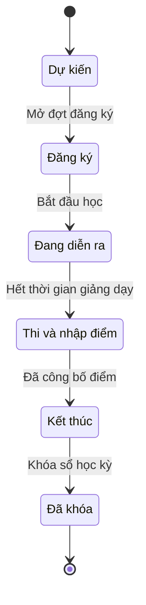
```mermaid
stateDiagram-v2
    state "Dự kiến" as DuKien
    state "Đăng ký" as DangKy
    state "Đang diễn ra" as DienRa
    state "Thi và nhập điểm" as Thi
    state "Kết thúc" as KetThuc
    state "Đã khóa" as DaKhoa
    [*] --> DuKien
    DuKien --> DangKy : Mở đợt đăng ký
    DangKy --> DienRa : Bắt đầu học
    DienRa --> Thi : Hết thời gian giảng dạy
    Thi --> KetThuc : Đã công bố điểm
    KetThuc --> DaKhoa : Khóa sổ học kỳ
    DaKhoa --> [*]
```

**Tiêu chí nghiệm thu (mức nghiệp vụ)**

- **Cho** học kỳ 1 chạy từ 01/09 đến 10/01, **khi** tạo học kỳ 2 bắt đầu 05/01, **thì** bị từ chối do chồng thời gian.
- **Cho** lịch học vụ có hạn rút học phần sớm hơn hạn hủy, **khi** lưu, **thì** bị từ chối kèm lý do.
- **Cho** học kỳ 2 được đặt là hiện hành, **khi** mở màn hình đăng ký, thời khóa biểu và báo cáo, **thì** mặc định hiển thị học kỳ 2.
- **Cho** ngày lễ 02/09 nằm trong học kỳ, **khi** sinh buổi học, **thì** buổi trùng ngày lễ được đánh dấu Nghỉ (`TTB`).

### 6.18 CUR — Curriculum / Training Program *(đề xuất bổ sung — nhóm A)*

| Thuộc tính | Nội dung |
|---|---|
| Tên tiếng Việt | Chương trình đào tạo |
| Mục tiêu | Định nghĩa cấu trúc chương trình đào tạo của từng ngành theo khóa: khối kiến thức, học phần bắt buộc và tự chọn, học kỳ dự kiến, điều kiện tốt nghiệp; làm căn cứ cho đăng ký, tiến độ học tập và xét tốt nghiệp |
| Tác nhân | `ACAD` (chính); `DEAN` (xây dựng, duyệt cấp khoa); `STU`, `ADV`, `LEC` (xem) |
| Ưu tiên · Giai đoạn · Công sức | Must · P1 · M |
| Phụ thuộc | `FAC`, `SUB`, `ACY`; cung cấp cho `STU`, `ENR`, `GRA` |

**Luồng nghiệp vụ chính**

1. Khoa xây dựng CTĐT cho ngành và khóa áp dụng: chọn học phần từ `SUB`, xếp vào khối kiến thức và học kỳ dự kiến, thiết lập nhóm tự chọn.
2. `DEAN` duyệt → `ACAD` ban hành phiên bản.
3. Khi nhập học, sinh viên được gán CTĐT theo ngành – khóa.
4. Thay đổi CTĐT tạo phiên bản mới cho khóa mới; các khóa cũ giữ nguyên.
5. Hệ thống đối chiếu kết quả học tập với CTĐT để tính tiến độ và điều kiện tốt nghiệp.

**Yêu cầu chức năng**

| ID | Chức năng | Mô tả và ràng buộc | Tác nhân | Ưu tiên |
|---|---|---|---|---|
| FR-CUR-001 | Chương trình đào tạo | CRUD CTĐT theo ngành (và chuyên ngành), khóa áp dụng, hệ đào tạo: mã, tên, tổng tín chỉ, thời gian chuẩn (số học kỳ), phiên bản | `ACAD`, `DEAN` | M |
| FR-CUR-002 | Khối kiến thức | Cấu trúc CTĐT thành các khối (đại cương, cơ sở ngành, chuyên ngành, tự chọn, thực tập, tốt nghiệp) và số tín chỉ yêu cầu từng khối | `ACAD`, `DEAN` | M |
| FR-CUR-003 | Học phần của CTĐT | Gán học phần (`SUB`) vào CTĐT: bắt buộc hoặc tự chọn, khối kiến thức, học kỳ dự kiến, thứ tự; nhóm tự chọn dạng "chọn tối thiểu x tín chỉ trong nhóm" | `ACAD`, `DEAN` | M |
| FR-CUR-004 | Điều kiện tốt nghiệp | Tổng tín chỉ, CGPA tối thiểu, học phần điều kiện (thể chất, quốc phòng – an ninh), chuẩn đầu ra ngoại ngữ và tin học, thực tập, khóa luận… | `ACAD` | M |
| FR-CUR-005 | Phiên bản CTĐT | Thay đổi sau ban hành tạo phiên bản mới áp dụng cho khóa chỉ định; các khóa cũ giữ nguyên | `ACAD` | M |
| FR-CUR-006 | Gán CTĐT cho sinh viên | Gán tự động theo ngành – khóa khi nhập học; khi chuyển ngành thì gán CTĐT mới và ánh xạ học phần tương đương | `ACAD` | M |
| FR-CUR-007 | Sơ đồ CTĐT | Xem CTĐT theo lộ trình từng học kỳ và sơ đồ quan hệ tiên quyết | Mọi người dùng | S |
| FR-CUR-008 | Tiến độ học tập (degree audit) | Đối chiếu kết quả của sinh viên với CTĐT: tín chỉ đạt và còn thiếu theo khối, học phần còn nợ, dự kiến thời gian tốt nghiệp | `STU`, `ADV`, `ACAD` | S |
| FR-CUR-009 | Học phần tương đương trong CTĐT | Khai báo học phần tương đương hoặc thay thế giữa các phiên bản CTĐT | `ACAD` | S |
| FR-CUR-010 | Quy trình duyệt và ban hành | Nháp → Khoa duyệt → Đào tạo duyệt → Ban hành | `DEAN`, `ACAD` | S |
| FR-CUR-011 | Xuất CTĐT | Xuất PDF / Excel để công bố | `ACAD` | S |

**Quy tắc nghiệp vụ**

| ID | Quy tắc |
|---|---|
| BR-CUR-01 | Mỗi sinh viên áp dụng đúng một CTĐT theo ngành và khóa nhập học (trừ khi được chuyển ngành) |
| BR-CUR-02 | Tổng tín chỉ trong CTĐT (bắt buộc cộng mức tối thiểu của tự chọn) phải đáp ứng yêu cầu tổng tín chỉ; từng khối đáp ứng số tín chỉ yêu cầu của khối |
| BR-CUR-03 | Một học phần chỉ xuất hiện một lần trong cùng CTĐT; học phần tiên quyết của học phần trong CTĐT phải thuộc CTĐT (hoặc được xác nhận là điều kiện ngoài chương trình) và có học kỳ dự kiến sớm hơn |
| BR-CUR-04 | CTĐT đã ban hành không sửa trực tiếp: thay đổi tạo phiên bản mới; phiên bản cũ vẫn áp dụng cho các khóa đã học |
| BR-CUR-05 | Điều kiện tốt nghiệp mặc định (tham chiếu Thông tư 56/2026/TT-BGDĐT): tích lũy đủ tín chỉ theo CTĐT, CGPA từ 2,00 trở lên, hoàn thành học phần điều kiện và chuẩn đầu ra, không đang bị kỷ luật đình chỉ học tập |
| BR-CUR-06 | Thời gian đào tạo chuẩn của CTĐT khớp với ngành (`FAC`) và là căn cứ tính thời gian học tối đa (`BR-STU-08`) |
| BR-CUR-07 | Chỉ mở lớp học phần cho học phần thuộc ít nhất một CTĐT đang áp dụng (`BR-CLS-03`) |

**Dữ liệu chính**

- **Curriculum** và **CurriculumVersion**, **KnowledgeBlock** (số tín chỉ yêu cầu), **CurriculumSubject** (học phần, khối, bắt buộc hoặc tự chọn, học kỳ dự kiến, nhóm tự chọn), **ElectiveGroup** (số tín chỉ tối thiểu).
- **GraduationRequirement**, **CurriculumEquivalence**, **StudentCurriculum** (lịch sử gán CTĐT cho sinh viên).

**Tiêu chí nghiệm thu (mức nghiệp vụ)**

- **Cho** CTĐT yêu cầu 120 tín chỉ nhưng các khối cộng lại chỉ 118, **khi** ban hành, **thì** hệ thống từ chối và nêu rõ thiếu 2 tín chỉ.
- **Cho** học phần B có tiên quyết A nhưng A không thuộc CTĐT, **khi** lưu, **thì** hệ thống cảnh báo.
- **Cho** CTĐT 2026 đã ban hành, **khi** sửa số tín chỉ của học phần X, **thì** hệ thống tạo phiên bản mới cho khóa chỉ định và sinh viên các khóa trước không đổi.
- **Cho** sinh viên K2026 chuyển sang ngành khác, **khi** xác nhận chuyển, **thì** sinh viên được gán CTĐT mới, các học phần đã đạt được ánh xạ tương đương và tín chỉ còn thiếu hiển thị trong tiến độ học tập.
- **Cho** sinh viên mở tiến độ học tập, **khi** hiển thị, **thì** thấy tín chỉ đạt và còn thiếu theo từng khối cùng danh sách học phần còn nợ.

### 6.19 ROM — Classroom & Facility *(đề xuất bổ sung — nhóm A)*

| Thuộc tính | Nội dung |
|---|---|
| Tên tiếng Việt | Phòng học và cơ sở vật chất |
| Mục tiêu | Quản lý danh mục tòa nhà, phòng học và phòng thi, sức chứa, loại phòng, tình trạng để `TTB` và `EXM` xếp lịch không xung đột và khai thác phòng hiệu quả |
| Tác nhân | `ACAD`, `ADMIN` (quản lý); mọi người dùng (xem, tìm phòng trống) |
| Ưu tiên · Giai đoạn · Công sức | Must (danh mục) · P1, nâng cao P2 · S |
| Phụ thuộc | `SYS`; cung cấp cho `TTB`, `EXM` |

**Luồng nghiệp vụ chính**

1. Tạo cơ sở, tòa nhà, phòng kèm loại phòng và sức chứa.
2. `TTB` và `EXM` chọn phòng phù hợp.
3. Phòng bảo trì thì chặn xếp lịch.
4. Báo cáo mức sử dụng phòng.

**Yêu cầu chức năng**

| ID | Chức năng | Mô tả và ràng buộc | Tác nhân | Ưu tiên |
|---|---|---|---|---|
| FR-ROM-001 | Danh mục cơ sở, tòa nhà, phòng | CRUD cơ sở, tòa nhà, phòng: mã, tầng, sức chứa học, sức chứa thi, loại phòng (lý thuyết, máy tính, thí nghiệm, hội trường, phòng thi), thiết bị | `ACAD`, `ADMIN` | M |
| FR-ROM-002 | Tình trạng phòng | Sử dụng được / bảo trì / ngừng sử dụng; lịch bảo trì chặn xếp lịch | `ACAD` | S |
| FR-ROM-003 | Lịch sử dụng phòng | Xem lịch sử dụng theo phòng, ngày, tuần; tỷ lệ lấp đầy | `ACAD` | S |
| FR-ROM-004 | Tìm phòng trống | Tìm phòng trống theo thời gian, sức chứa, loại phòng, thiết bị | `ACAD` | S |
| FR-ROM-005 | Đặt phòng ngoài giờ | Đặt phòng cho sự kiện hoặc học bù ngoài thời khóa biểu; có quy trình duyệt | `ACAD` | C |
| FR-ROM-006 | Thiết bị và sự cố | Danh mục thiết bị trong phòng; ghi nhận báo hỏng và xử lý sự cố | `ACAD`, `ADMIN` | C |

**Quy tắc nghiệp vụ**

| ID | Quy tắc |
|---|---|
| BR-ROM-01 | Mã phòng duy nhất; sức chứa là số nguyên dương; sức chứa thi không lớn hơn sức chứa vật lý |
| BR-ROM-02 | Chỉ xếp lịch cho phòng đang "Sử dụng được" và không trùng lịch bảo trì |
| BR-ROM-03 | Loại phòng phải phù hợp với loại buổi (thực hành → phòng máy hoặc phòng thí nghiệm) |
| BR-ROM-04 | Không xóa phòng đã có lịch sử sử dụng; chỉ ngừng sử dụng |
| BR-ROM-05 | Đặt phòng ngoài giờ không được chiếm khung giờ đã có lịch học hoặc lịch thi |

**Dữ liệu chính**

- **Campus**, **Building**, **Room** (mã, tầng, sức chứa học, sức chứa thi, trạng thái), **RoomType**, **RoomEquipment**, **RoomMaintenance**, **RoomBooking**.

**Tiêu chí nghiệm thu (mức nghiệp vụ)**

- **Cho** phòng P bảo trì từ 10/10 đến 15/10, **khi** xếp lớp vào phòng P ngày 12/10, **thì** bị chặn.
- **Cho** yêu cầu tìm phòng trống thứ Tư tiết 7–9, sức chứa từ 60, loại phòng máy, **khi** tìm, **thì** chỉ trả về phòng đáp ứng đủ điều kiện và chưa có lịch.
- **Cho** phòng đã có lịch sử sử dụng, **khi** xóa, **thì** chỉ được chuyển sang ngừng sử dụng.

### 6.20 GRA — Graduation & Academic Standing *(đề xuất bổ sung — nhóm B)*

| Thuộc tính | Nội dung |
|---|---|
| Tên tiếng Việt | Học vụ và tốt nghiệp |
| Mục tiêu | Khép kín vòng đời học vụ: xếp loại học lực, cảnh báo học vụ, buộc thôi học, xét và công nhận tốt nghiệp, xếp hạng tốt nghiệp, cấp bằng hoặc giấy chứng nhận |
| Tác nhân | `ACAD` (chính); `DEAN`, `CTSV`, `FIN` (xác nhận không nợ), `ADV`, `EXAM`; `STU` (xem, đăng ký xét) |
| Ưu tiên · Giai đoạn · Công sức | Should · P3 · M |
| Phụ thuộc | `GRD`, `CUR`, `FEE`, `SCH`, `STU`, `DOC` |

**Luồng nghiệp vụ chính**

*Học vụ mỗi kỳ:* cuối học kỳ → xếp loại học lực → sinh danh sách cảnh báo → `ACAD` duyệt → thông báo sinh viên, CVHT, Khoa → theo dõi cảnh báo liên tiếp → buộc thôi học khi vượt giới hạn.

*Xét tốt nghiệp:* xem sơ đồ ở [mục 3.3.6](#336-xét-tốt-nghiệp).

**Yêu cầu chức năng**

| ID | Chức năng | Mô tả và ràng buộc | Tác nhân | Ưu tiên |
|---|---|---|---|---|
| FR-GRA-001 | Xếp loại học lực | Xếp loại mỗi học kỳ và năm học (xuất sắc, giỏi, khá, trung bình, yếu, kém) theo GPA và bảng cấu hình theo khóa | Hệ thống, `ACAD` | M |
| FR-GRA-002 | Cảnh báo học vụ tự động | Cuối kỳ phát hiện sinh viên chạm ngưỡng (tín chỉ không đạt vượt 50% tín chỉ đã đăng ký; GPA kỳ dưới ngưỡng; tổng tín chỉ nợ vượt giới hạn — cấu hình); lập danh sách chờ duyệt | Hệ thống, `ACAD` | M |
| FR-GRA-003 | Duyệt và thông báo cảnh báo | `ACAD` duyệt danh sách cảnh báo; thông báo sinh viên, CVHT, Khoa; áp khung tín chỉ riêng cho kỳ sau | `ACAD` | M |
| FR-GRA-004 | Buộc thôi học | Lập danh sách sinh viên vượt số lần cảnh báo tối đa (mặc định 3 lần liên tiếp, cấu hình) hoặc vượt thời gian học tối đa; ra quyết định; cập nhật trạng thái trong `STU` | `ACAD` | S |
| FR-GRA-005 | Mở đợt xét tốt nghiệp | Tạo đợt (thời gian, đối tượng); tự lập danh sách dự kiến theo điều kiện hoặc cho sinh viên đăng ký xét | `ACAD` | S |
| FR-GRA-006 | Kiểm tra điều kiện tốt nghiệp | Tự động đối chiếu: tín chỉ CTĐT, CGPA, học phần điều kiện, chứng chỉ, học phí, kỷ luật, thời gian học; nêu rõ lý do thiếu | Hệ thống | M |
| FR-GRA-007 | Hội đồng xét tốt nghiệp | Danh sách đủ và thiếu điều kiện; duyệt; số quyết định, ngày hiệu lực; biên bản | `ACAD` | M |
| FR-GRA-008 | Xếp hạng tốt nghiệp | Xếp hạng theo CGPA toàn khóa; tự giảm một mức nếu học phần học lại vượt 10% khối lượng chuẩn, bị kỷ luật từ cảnh cáo trở lên hoặc vi phạm liêm chính học thuật (cấu hình) | Hệ thống, `ACAD` | S |
| FR-GRA-009 | Cấp bằng và giấy chứng nhận | Giấy chứng nhận tốt nghiệp tạm thời; sổ cấp bằng (số hiệu, số vào sổ), ngày cấp, trạng thái nhận bằng | `ACAD` | S |
| FR-GRA-010 | Cập nhật trạng thái tốt nghiệp | Chuyển sinh viên sang Đã tốt nghiệp, khóa đăng ký, chuyển tài khoản sang chỉ đọc; hỗ trợ tra cứu cựu sinh viên | Hệ thống | S |
| FR-GRA-011 | Chứng chỉ điều kiện | Nộp và xác minh chứng chỉ ngoại ngữ, tin học… làm điều kiện tốt nghiệp (có hiệu lực và hạn dùng) | `STU`, `ACAD` | S |
| FR-GRA-012 | Báo cáo cuối khóa | Danh sách tốt nghiệp, xếp hạng, tỷ lệ tốt nghiệp đúng hạn, nguyên nhân chưa đủ điều kiện | `ACAD`, `DEAN` | S |

**Quy tắc nghiệp vụ**

| ID | Quy tắc |
|---|---|
| BR-GRA-01 | Xếp loại học lực theo GPA hệ 4, bảng mặc định (tham chiếu Thông tư 56/2026/TT-BGDĐT): Xuất sắc 3,60–4,00; Giỏi 3,20–3,59; Khá 2,50–3,19; Trung bình 2,00–2,49; Yếu 1,00–1,99; Kém dưới 1,00 ([Phụ lục C](#phụ-lục-c--bảng-quy-đổi-điểm-và-xếp-loại-mặc-định)) |
| BR-GRA-02 | Cảnh báo học vụ khi: số tín chỉ không đạt trong kỳ vượt 50% số tín chỉ đã đăng ký; hoặc GPA kỳ dưới ngưỡng (mặc định 0,80 với kỳ đầu của khóa và 1,00 với các kỳ sau); hoặc tổng tín chỉ nợ vượt ngưỡng của trường. Thông tư giao cơ sở đào tạo quy định chi tiết nên mọi ngưỡng là tham số cấu hình |
| BR-GRA-03 | Buộc thôi học khi số lần cảnh báo liên tiếp vượt giới hạn (mặc định 3 lần) hoặc vượt thời gian học tối đa (`BR-STU-08`); thực hiện bằng quyết định có số và ngày hiệu lực; sinh viên có quyền khiếu nại trong thời hạn |
| BR-GRA-04 | Điều kiện tốt nghiệp: tích lũy đủ tín chỉ và hoàn thành yêu cầu của CTĐT (`CUR`); CGPA từ 2,00 trở lên; không đang bị kỷ luật đình chỉ học tập; đáp ứng chuẩn đầu ra và học phần điều kiện; hoàn thành nghĩa vụ học phí theo cấu hình (mặc định tham chiếu Thông tư 56/2026/TT-BGDĐT) |
| BR-GRA-05 | Xếp hạng tốt nghiệp theo CGPA toàn khóa (Xuất sắc, Giỏi, Khá, Trung bình); hạng bị giảm một mức nếu thuộc một trong các trường hợp: khối lượng học phần phải học lại vượt 10% khối lượng chuẩn của CTĐT; bị kỷ luật từ cảnh cáo trở lên; vi phạm liêm chính học thuật. Các hạng áp dụng quy tắc giảm hạng (mặc định Xuất sắc và Giỏi) và ngưỡng 10% là tham số cấu hình |
| BR-GRA-06 | Quyết định xét tốt nghiệp và buộc thôi học có số quyết định, ngày hiệu lực, người ký; sau khi ban hành không sửa, chỉ điều chỉnh hoặc thu hồi bằng quyết định mới |
| BR-GRA-07 | Chỉ cấp giấy chứng nhận hoặc bằng khi trạng thái sinh viên là Đã tốt nghiệp và đã hoàn tất nghĩa vụ theo chính sách; số hiệu bằng duy nhất và không tái sử dụng |
| BR-GRA-08 | Sinh viên bị cảnh báo học vụ được áp khung tín chỉ riêng cho học kỳ kế tiếp (`BR-ENR-02`) |

**Dữ liệu chính**

- **AcademicStanding** (sinh viên, học kỳ, GPA, xếp loại), **AcademicWarning** (lý do, lần thứ mấy, trạng thái), **DismissalDecision**.
- **GraduationBatch**, **GraduationRecord** (sinh viên, đợt, kết quả kiểm tra, lý do thiếu, hạng, số quyết định), **DiplomaRegister**, **QualificationRecord** (chứng chỉ điều kiện).

**Vòng đời hồ sơ xét tốt nghiệp**

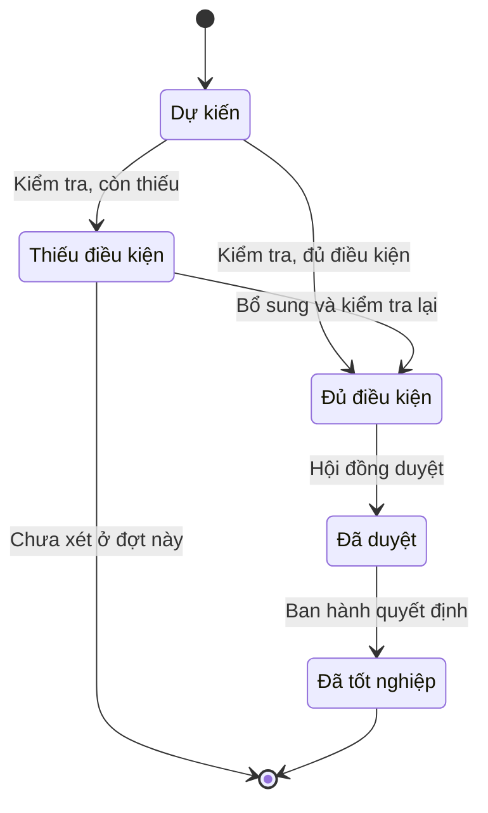
```mermaid
stateDiagram-v2
    state "Dự kiến" as DuKien
    state "Thiếu điều kiện" as Thieu
    state "Đủ điều kiện" as Du
    state "Đã duyệt" as DaDuyet
    state "Đã tốt nghiệp" as TotNghiep
    [*] --> DuKien
    DuKien --> Thieu : Kiểm tra, còn thiếu
    DuKien --> Du : Kiểm tra, đủ điều kiện
    Thieu --> Du : Bổ sung và kiểm tra lại
    Du --> DaDuyet : Hội đồng duyệt
    DaDuyet --> TotNghiep : Ban hành quyết định
    Thieu --> [*] : Chưa xét ở đợt này
    TotNghiep --> [*]
```

**Tiêu chí nghiệm thu (mức nghiệp vụ)**

- **Cho** sinh viên có GPA kỳ đầu là 0,7 với ngưỡng 0,8, **khi** cuối kỳ chạy xếp loại, **thì** sinh viên vào danh sách cảnh báo; sau khi `ACAD` duyệt, sinh viên và CVHT nhận thông báo và khung tín chỉ kỳ sau theo quy định cảnh báo.
- **Cho** sinh viên nhận cảnh báo lần thứ 4 liên tiếp (giới hạn 3), **khi** hệ thống rà soát, **thì** sinh viên nằm trong danh sách đề xuất buộc thôi học chờ quyết định.
- **Cho** sinh viên thiếu 3 tín chỉ khối chuyên ngành, **khi** kiểm tra tốt nghiệp, **thì** kết quả là "Thiếu điều kiện" kèm lý do cụ thể.
- **Cho** sinh viên có CGPA 3,65 nhưng học lại 12% khối lượng, **khi** xếp hạng, **thì** hạng giảm từ Xuất sắc xuống Giỏi và hệ thống nêu rõ lý do.
- **Cho** quyết định tốt nghiệp đã ban hành, **khi** có người sửa số quyết định, **thì** bị chặn; chỉ điều chỉnh bằng quyết định mới.

### 6.21 REQ — Student Requests & Petitions *(đề xuất bổ sung — nhóm B)*

| Thuộc tính | Nội dung |
|---|---|
| Tên tiếng Việt | Đơn từ và yêu cầu của sinh viên |
| Mục tiêu | Cơ chế chung cho mọi loại đơn và yêu cầu của sinh viên với luồng duyệt cấu hình được, theo dõi tiến độ, SLA và hành động tự động sau khi duyệt — thay cho việc mỗi module tự làm một luồng riêng |
| Tác nhân | `STU` (gửi đơn); `ADV`, `LEC`, `DEAN`, `ACAD`, `EXAM`, `CTSV`, `FIN` (duyệt theo luồng); `ADMIN` (cấu hình ban đầu) |
| Ưu tiên · Giai đoạn · Công sức | Should · P3 · M |
| Phụ thuộc | `AUTH`, `STU`, `DOC`, `NOT`; tác động tới `STU`, `GRD`, `FEE`, `DOC`, `ATT` |

**Luồng nghiệp vụ chính** (sơ đồ chi tiết ở [mục 3.3.5](#335-xử-lý-đơn-từ))

1. Sinh viên chọn loại đơn, điền biểu mẫu, đính kèm minh chứng và gửi.
2. Hệ thống kiểm tra điều kiện của loại đơn rồi định tuyến theo luồng duyệt đã cấu hình.
3. Người duyệt xử lý: duyệt / từ chối / yêu cầu bổ sung.
4. Sau bước duyệt cuối, hệ thống tự thực thi hành động (đổi trạng thái sinh viên, sinh giấy tờ, điều chỉnh điểm…).
5. Thông báo kết quả và lưu nhật ký.

**Danh mục loại đơn mặc định** (cấu hình được; SLA tính theo ngày làm việc)

| Mã | Loại đơn | Luồng duyệt mặc định | Hành động tự động sau duyệt | SLA |
|---|---|---|---|---|
| REQ-T01 | Xin giấy xác nhận sinh viên | `CTSV` | Sinh PDF từ mẫu (`DOC`) | 2 |
| REQ-T02 | Xin bảng điểm chính thức | `ACAD` | Sinh bảng điểm có QR sau khi kiểm tra điều kiện (`DOC`, `GRD`) | 2 |
| REQ-T03 | Xin bảo lưu / tạm dừng học | `ADV` → `DEAN` → `ACAD` | Chuyển trạng thái Bảo lưu (`STU`) | 5 |
| REQ-T04 | Xin thôi học | `ADV` → `DEAN` → `ACAD` | Chuyển trạng thái Thôi học; tính hoàn tiền (`FEE`) | 5 |
| REQ-T05 | Xin chuyển ngành / lớp | `DEAN` (khoa đi) → `DEAN` (khoa đến) → `ACAD` | Cập nhật ngành, CTĐT, lớp (`STU`, `CUR`) | 7 |
| REQ-T06 | Phúc khảo điểm | `ACAD` → `LEC` | Phân công chấm lại, cập nhật điểm (`GRD`, `EXM`) | 7 |
| REQ-T07 | Xin nghỉ có phép | `ADV` hoặc `LEC` | Chuyển buổi vắng thành có phép (`ATT`) | 2 |
| REQ-T08 | Xin đăng ký vượt / thiếu tín chỉ | `ADV` → `ACAD` | Nới khung tín chỉ cho sinh viên (`ENR`) | 3 |
| REQ-T09 | Xin miễn giảm học phí | `CTSV` → `FIN` | Áp miễn giảm (`FEE`) | 7 |
| REQ-T10 | Xin hoãn thi | `LEC` → `EXAM` | Đánh dấu hoãn thi (`EXM`, `GRD`) | 3 |
| REQ-T11 | Xin cấp lại thẻ sinh viên | `CTSV` | Tạo khoản phí (`FEE`), xuất dữ liệu in thẻ (`STU`) | 3 |
| REQ-T12 | Khiếu nại, góp ý | `ACAD` hoặc `CTSV` | Ghi nhận và phản hồi | 5 |

**Yêu cầu chức năng**

| ID | Chức năng | Mô tả và ràng buộc | Tác nhân | Ưu tiên |
|---|---|---|---|---|
| FR-REQ-001 | Danh mục loại đơn | Định nghĩa loại đơn: biểu mẫu động (trường, tệp đính kèm bắt buộc), điều kiện được gửi, phí (nếu có), SLA, luồng duyệt, hành động sau duyệt | `ACAD`, `ADMIN` | M |
| FR-REQ-002 | Gửi đơn | Sinh viên chọn loại đơn, điền biểu mẫu, đính kèm minh chứng; xem trước và gửi; nhận mã theo dõi | `STU` | M |
| FR-REQ-003 | Luồng duyệt cấu hình được | Định tuyến 1 đến n cấp theo loại đơn (theo vai trò hoặc đơn vị duyệt; tuần tự hoặc song song); rẽ nhánh theo dữ liệu đơn | `ACAD`, `ADMIN` | M |
| FR-REQ-004 | Xử lý đơn | Người duyệt có hộp thư công việc: duyệt / từ chối / yêu cầu bổ sung kèm ý kiến; có thể ủy quyền duyệt (`FR-AUTH-017`) | Người duyệt | M |
| FR-REQ-005 | Theo dõi tiến độ | Sinh viên xem dòng thời gian trạng thái của đơn; nhận thông báo ở mỗi bước | `STU` | M |
| FR-REQ-006 | Hành động tự động sau duyệt | Cập nhật trạng thái sinh viên (`STU`), sinh giấy tờ (`DOC`), điều chỉnh điểm (`GRD`), tạo hóa đơn hoặc miễn giảm (`FEE`), chuyển buổi vắng thành có phép (`ATT`) | Hệ thống | S |
| FR-REQ-007 | SLA và leo thang | Đặt thời hạn xử lý theo bước; nhắc khi gần hạn; leo thang lên cấp trên khi quá hạn | Hệ thống | S |
| FR-REQ-008 | Thu phí đơn | Đơn có phí tạo khoản thu qua `FEE`; chỉ xử lý sau khi thanh toán (nếu cấu hình) | Hệ thống | C |
| FR-REQ-009 | Thống kê đơn | Số đơn theo loại, thời gian xử lý trung bình, tồn đọng, tỷ lệ đúng SLA | `ACAD`, `DEAN` | S |
| FR-REQ-010 | Hỗ trợ và hỏi đáp | Phiếu hỏi đáp đơn giản giữa sinh viên và phòng ban (helpdesk) | `STU`, cán bộ | C |

**Quy tắc nghiệp vụ**

| ID | Quy tắc |
|---|---|
| BR-REQ-01 | Sinh viên chỉ gửi được loại đơn mà mình đủ điều kiện (ví dụ xin bảo lưu: đã hoàn thành ít nhất một học kỳ và đang ở trạng thái Đang học); điều kiện cấu hình theo từng loại |
| BR-REQ-02 | Mỗi đơn có mã theo dõi duy nhất; một sinh viên không có quá N đơn cùng loại đang xử lý (cấu hình) |
| BR-REQ-03 | Đơn đã duyệt hoặc từ chối không sửa; thay đổi bằng đơn mới, hoặc hủy đơn khi còn đang xử lý |
| BR-REQ-04 | SLA mặc định theo bảng loại đơn (cấu hình theo loại); đơn quá hạn được nhắc và leo thang lên cấp trên |
| BR-REQ-05 | Mọi bước duyệt ghi nhật ký (người, thời điểm, ý kiến, quyết định); người duyệt không được duyệt đơn của chính mình |
| BR-REQ-06 | Hành động tự động chỉ thực thi sau bước duyệt cuối; hành động lỗi đưa đơn vào trạng thái "Chờ xử lý thủ công" kèm thông báo cho cán bộ |
| BR-REQ-07 | Tệp đính kèm tuân thủ quy tắc tệp của `DOC` (`BR-DOC-01`) và chỉ người trong luồng duyệt mới xem được |

**Dữ liệu chính**

- **RequestType** (biểu mẫu, điều kiện, luồng duyệt, hành động, SLA), **Request** (sinh viên, loại, dữ liệu biểu mẫu, trạng thái, mã theo dõi), **RequestStep** (người xử lý, quyết định, ý kiến, thời điểm), **RequestAttachment**, **RequestActionLog**.

**Vòng đời đơn từ**

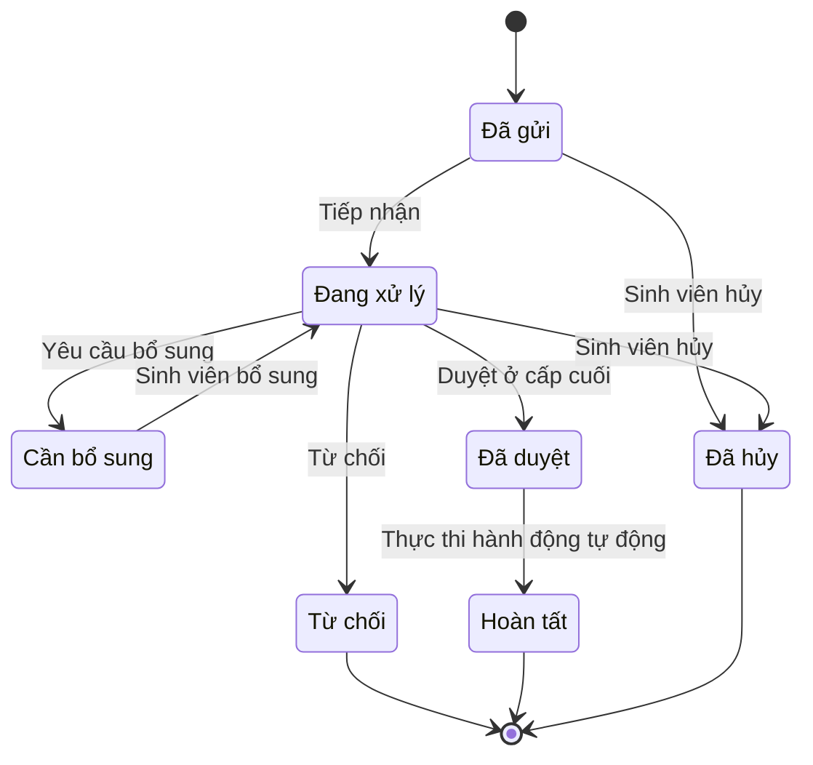
```mermaid
stateDiagram-v2
    state "Đã gửi" as DaGui
    state "Đang xử lý" as DangXuLy
    state "Cần bổ sung" as CanBoSung
    state "Đã duyệt" as DaDuyet
    state "Từ chối" as TuChoi
    state "Hoàn tất" as HoanTat
    state "Đã hủy" as DaHuy
    [*] --> DaGui
    DaGui --> DangXuLy : Tiếp nhận
    DangXuLy --> CanBoSung : Yêu cầu bổ sung
    CanBoSung --> DangXuLy : Sinh viên bổ sung
    DangXuLy --> DaDuyet : Duyệt ở cấp cuối
    DangXuLy --> TuChoi : Từ chối
    DaDuyet --> HoanTat : Thực thi hành động tự động
    DaGui --> DaHuy : Sinh viên hủy
    DangXuLy --> DaHuy : Sinh viên hủy
    TuChoi --> [*]
    HoanTat --> [*]
    DaHuy --> [*]
```

**Tiêu chí nghiệm thu (mức nghiệp vụ)**

- **Cho** sinh viên chưa học đủ một học kỳ, **khi** xin bảo lưu, **thì** bị từ chối ngay kèm lý do về điều kiện.
- **Cho** đơn xin giấy xác nhận chỉ cần một cấp duyệt (`CTSV`), **khi** được duyệt, **thì** hệ thống tự sinh PDF và sinh viên nhận thông báo "đã sẵn sàng".
- **Cho** đơn vượt SLA 5 ngày làm việc, **khi** quá hạn, **thì** người duyệt và cấp trên nhận nhắc hoặc được leo thang.
- **Cho** cán bộ đồng thời là người gửi đơn, **khi** tự duyệt đơn của mình, **thì** bị chặn.
- **Cho** đơn xin bảo lưu được duyệt hoàn toàn, **khi** hoàn tất, **thì** trạng thái sinh viên chuyển sang Bảo lưu theo quyết định và các đăng ký chưa chốt bị hủy.

### 6.22 SCH — Scholarship, Rewards, Discipline & Conduct *(đề xuất bổ sung — nhóm C)*

| Thuộc tính | Nội dung |
|---|---|
| Tên tiếng Việt | Học bổng, khen thưởng, kỷ luật và rèn luyện |
| Mục tiêu | Hỗ trợ công tác sinh viên: đánh giá điểm rèn luyện, xét học bổng, ghi nhận khen thưởng và kỷ luật; cung cấp dữ liệu cho miễn giảm học phí và xét tốt nghiệp |
| Tác nhân | `CTSV` (chính); `ADV`, `DEAN` (duyệt cấp lớp, khoa); `STU`; `FIN` |
| Ưu tiên · Giai đoạn · Công sức | Could · P4 · M |
| Phụ thuộc | `STU`, `GRD`; cung cấp cho `FEE`, `GRA` |

**Luồng nghiệp vụ chính:** cuối kỳ sinh viên tự đánh giá rèn luyện → lớp, khoa, trường duyệt → `CTSV` xét học bổng từ GPA và rèn luyện → công bố và cấp phát; khen thưởng và kỷ luật được ghi nhận theo quyết định trong năm.

**Yêu cầu chức năng**

| ID | Chức năng | Mô tả và ràng buộc | Tác nhân | Ưu tiên |
|---|---|---|---|---|
| FR-SCH-001 | Loại học bổng và tiêu chí | Định nghĩa học bổng (khuyến khích học tập, tài trợ, chính sách): tiêu chí (GPA, rèn luyện), số suất hoặc quỹ, thời gian | `CTSV` | S |
| FR-SCH-002 | Xét và cấp học bổng | Sinh danh sách đề xuất từ GPA và rèn luyện; duyệt; công bố; cấp phát (khấu trừ vào `FEE` hoặc chi trả) | `CTSV`, `DEAN` | S |
| FR-SCH-003 | Điểm rèn luyện | Sinh viên tự đánh giá theo tiêu chí → lớp → khoa → trường duyệt; xếp loại theo kỳ | `STU`, `ADV`, `DEAN`, `CTSV` | S |
| FR-SCH-004 | Khen thưởng | Ghi nhận hình thức, số quyết định, ngày, đơn vị khen | `CTSV` | C |
| FR-SCH-005 | Kỷ luật | Ghi nhận mức (khiển trách, cảnh cáo, đình chỉ học tập, buộc thôi học), thời hạn hiệu lực, quyết định; tác động tới học bổng và xét tốt nghiệp | `CTSV` | S |
| FR-SCH-006 | Hoạt động ngoại khóa | Ghi nhận tham gia câu lạc bộ, tình nguyện, sự kiện kèm điểm hoạt động | `CTSV`, `STU` | C |
| FR-SCH-007 | Báo cáo công tác sinh viên | Báo cáo học bổng, khen thưởng, kỷ luật, rèn luyện theo kỳ, khoa, lớp | `CTSV`, `DEAN` | C |

**Quy tắc nghiệp vụ**

| ID | Quy tắc |
|---|---|
| BR-SCH-01 | Điểm rèn luyện thang 0–100; xếp loại mặc định (tham chiếu Thông tư 16/2015/TT-BGDĐT, cần kiểm tra văn bản thay thế): Xuất sắc 90–100; Tốt 80 đến dưới 90; Khá 65 đến dưới 80; Trung bình 50 đến dưới 65; Yếu 35 đến dưới 50; Kém dưới 35 |
| BR-SCH-02 | Học bổng khuyến khích học tập yêu cầu GPA và điểm rèn luyện đạt ngưỡng, không đang chịu kỷ luật từ mức cấu hình; một sinh viên nhận tối đa một học bổng khuyến khích trong một kỳ |
| BR-SCH-03 | Kỷ luật lưu hồ sơ theo thời hạn hiệu lực; mức đình chỉ học tập chặn đăng ký học phần trong thời gian hiệu lực; kỷ luật từ cảnh cáo trở lên ảnh hưởng xếp hạng tốt nghiệp (`BR-GRA-05`) |
| BR-SCH-04 | Điểm rèn luyện được công bố sau khi cấp trường duyệt; sinh viên có quyền phản hồi trong thời hạn |
| BR-SCH-05 | Quy tắc xử lý khi xếp loại rèn luyện yếu hoặc kém liên tiếp (tạm ngừng học, buộc thôi học) cấu hình theo quy chế của trường |

**Dữ liệu chính**

- **Scholarship** (loại, tiêu chí, quỹ), **ScholarshipAward** (sinh viên, kỳ, số tiền, trạng thái), **ConductEvaluation** (sinh viên, kỳ, điểm tự chấm, điểm các cấp duyệt, điểm cuối, xếp loại).
- **Reward**, **DisciplineRecord** (mức, số quyết định, hiệu lực từ – đến), **ActivityRecord**.

**Tiêu chí nghiệm thu (mức nghiệp vụ)**

- **Cho** sinh viên GPA 3,4, rèn luyện Tốt, không kỷ luật, **khi** xét học bổng khuyến khích (ngưỡng GPA 3,2 và rèn luyện từ Khá), **thì** sinh viên nằm trong danh sách đề xuất.
- **Cho** sinh viên có kỷ luật cảnh cáo còn hiệu lực, **khi** xét học bổng, **thì** bị loại kèm lý do.
- **Cho** sinh viên tự chấm 92, cấp lớp duyệt 85, cấp khoa duyệt 85, cấp trường duyệt 83, **khi** hoàn tất, **thì** điểm cuối là 83 (xếp loại Tốt) và điểm ở mỗi cấp đều được lưu.

### 6.23 EVA — Course & Lecturer Evaluation *(đề xuất bổ sung — nhóm C)*

| Thuộc tính | Nội dung |
|---|---|
| Tên tiếng Việt | Khảo sát chất lượng giảng dạy |
| Mục tiêu | Thu thập đánh giá ẩn danh của sinh viên về học phần và giảng viên theo từng lớp học phần, tổng hợp để cải tiến chất lượng và phục vụ kiểm định |
| Tác nhân | `ACAD` (cấu hình); `STU` (thực hiện); `LEC`, `DEAN` (xem kết quả) |
| Ưu tiên · Giai đoạn · Công sức | Could · P4 · S |
| Phụ thuộc | `ENR`, `CLS`, `TCH`; cung cấp cho `RPT`, `TCH` |

**Luồng nghiệp vụ chính:** `ACAD` tạo mẫu khảo sát → mở đợt khảo sát cho các lớp học phần của kỳ → sinh viên làm khảo sát ẩn danh → hệ thống tổng hợp → giảng viên và khoa xem kết quả tổng hợp.

**Yêu cầu chức năng**

| ID | Chức năng | Mô tả và ràng buộc | Tác nhân | Ưu tiên |
|---|---|---|---|---|
| FR-EVA-001 | Bộ câu hỏi khảo sát | Tạo mẫu khảo sát (câu hỏi thang điểm, trắc nghiệm, ý kiến tự do) theo nhóm tiêu chí; có phiên bản | `ACAD` | S |
| FR-EVA-002 | Mở đợt khảo sát | Gắn mẫu với học kỳ hoặc lớp học phần; thời gian mở – đóng; đối tượng | `ACAD` | S |
| FR-EVA-003 | Làm khảo sát | Sinh viên làm khảo sát ẩn danh cho từng lớp học phần; nhắc hoàn thành | `STU` | S |
| FR-EVA-004 | Tổng hợp kết quả | Điểm trung bình theo tiêu chí, phân bố, so sánh theo kỳ và khoa; ý kiến tự do được kiểm duyệt | `ACAD`, `DEAN` | S |
| FR-EVA-005 | Báo cáo cho giảng viên | Giảng viên xem kết quả của chính mình dưới dạng tổng hợp ẩn danh | `LEC` | S |
| FR-EVA-006 | Điều kiện bắt buộc | Tùy chọn yêu cầu hoàn thành khảo sát trước khi xem điểm học phần | `ACAD` | C |

**Quy tắc nghiệp vụ**

| ID | Quy tắc |
|---|---|
| BR-EVA-01 | Ẩn danh tuyệt đối với giảng viên và khoa: hệ thống chỉ lưu việc "sinh viên đã làm khảo sát" để chống làm trùng, tách rời khỏi nội dung trả lời |
| BR-EVA-02 | Mỗi sinh viên chỉ làm một lần cho một lớp học phần trong một đợt; chỉ sinh viên có đăng ký hợp lệ mới được làm |
| BR-EVA-03 | Chỉ hiển thị kết quả tổng hợp khi có ít nhất N phản hồi (mặc định 5) để tránh suy ra danh tính |
| BR-EVA-04 | Ý kiến tự do được kiểm duyệt trước khi giảng viên xem; `ACAD` có thể ẩn ý kiến vi phạm |
| BR-EVA-05 | Kết quả khảo sát dùng để cải tiến chất lượng; không tự động quyết định việc đánh giá hay xử lý giảng viên |

**Dữ liệu chính**

- **SurveyTemplate** (câu hỏi, phiên bản), **SurveyRound** (kỳ, thời gian, đối tượng), **SurveyParticipation** (sinh viên, lớp học phần — không có câu trả lời), **SurveyResponse** (lớp học phần, câu trả lời — không có mã sinh viên), **SurveyResultSummary**.

**Tiêu chí nghiệm thu (mức nghiệp vụ)**

- **Cho** sinh viên đã làm khảo sát lớp L, **khi** làm lại, **thì** bị chặn.
- **Cho** lớp L chỉ có 3 phản hồi với ngưỡng tối thiểu 5, **khi** giảng viên xem kết quả, **thì** thấy thông báo "chưa đủ số phản hồi tối thiểu" thay vì số liệu.
- **Cho** cơ sở dữ liệu của khảo sát, **khi** truy vấn các câu trả lời, **thì** không có cách nào liên kết một câu trả lời với một sinh viên cụ thể.

## 7. Mô hình dữ liệu khái niệm

Mức khái niệm: chỉ thể hiện thực thể chính và quan hệ; thuộc tính chi tiết của từng thực thể nằm ở mục "Dữ liệu chính" của từng module. Thiết kế vật lý (kiểu dữ liệu, chỉ mục…) thuộc giai đoạn thiết kế.

### 7.1 ERD học vụ

Một thực thể xuất hiện ở nhiều sơ đồ (ví dụ `STUDENT`, `TERM`, `COURSE_SECTION`) vẫn là **cùng một bảng**; mỗi sơ đồ chỉ vẽ phần quan hệ liên quan để dễ đọc.

**A. Cơ cấu tổ chức và học phần**

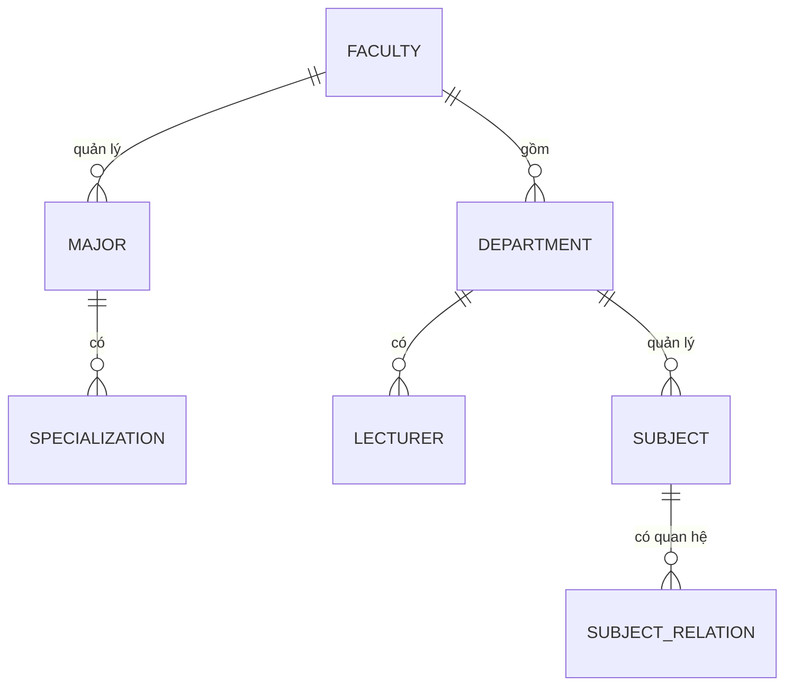
```mermaid
erDiagram
    FACULTY ||--o{ DEPARTMENT : "gồm"
    FACULTY ||--o{ MAJOR : "quản lý"
    MAJOR ||--o{ SPECIALIZATION : "có"
    DEPARTMENT ||--o{ LECTURER : "có"
    DEPARTMENT ||--o{ SUBJECT : "quản lý"
    SUBJECT ||--o{ SUBJECT_RELATION : "có quan hệ"
```

**B. Chương trình đào tạo, lớp hành chính và sinh viên**

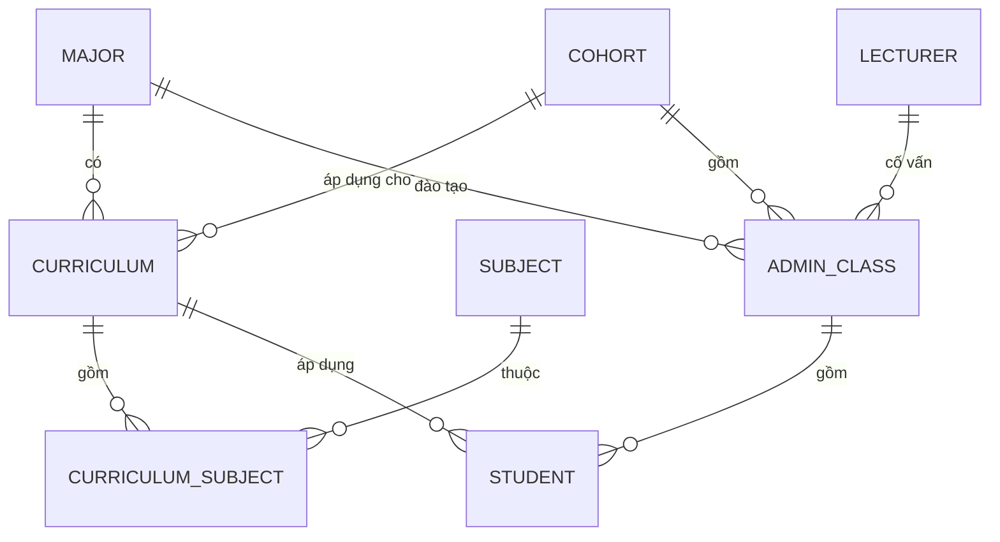
```mermaid
erDiagram
    MAJOR ||--o{ CURRICULUM : "có"
    COHORT ||--o{ CURRICULUM : "áp dụng cho"
    CURRICULUM ||--o{ CURRICULUM_SUBJECT : "gồm"
    SUBJECT ||--o{ CURRICULUM_SUBJECT : "thuộc"
    COHORT ||--o{ ADMIN_CLASS : "gồm"
    MAJOR ||--o{ ADMIN_CLASS : "đào tạo"
    LECTURER ||--o{ ADMIN_CLASS : "cố vấn"
    ADMIN_CLASS ||--o{ STUDENT : "gồm"
    CURRICULUM ||--o{ STUDENT : "áp dụng"
```

**C. Tổ chức giảng dạy: lớp học phần, lịch, đăng ký, điểm danh**

```mermaid
erDiagram
    ACADEMIC_YEAR ||--o{ TERM : "gồm"
    TERM ||--o{ COURSE_SECTION : "mở"
    SUBJECT ||--o{ COURSE_SECTION : "được mở thành"
    COURSE_SECTION ||--o{ SECTION_INSTRUCTOR : "do"
    LECTURER ||--o{ SECTION_INSTRUCTOR : "giảng dạy"
    COURSE_SECTION ||--o{ SCHEDULE_RULE : "có lịch"
    BUILDING ||--o{ ROOM : "gồm"
    ROOM ||--o{ SCHEDULE_RULE : "được xếp"
    SCHEDULE_RULE ||--o{ CLASS_SESSION : "sinh ra"
    STUDENT ||--o{ ENROLLMENT : "đăng ký"
    COURSE_SECTION ||--o{ ENROLLMENT : "nhận"
    CLASS_SESSION ||--o{ ATTENDANCE_RECORD : "có"
    ENROLLMENT ||--o{ ATTENDANCE_RECORD : "được ghi"
```

**D. Điểm và GPA**

```mermaid
erDiagram
    COURSE_SECTION ||--o{ SECTION_GRADE_COMPONENT : "có cơ cấu điểm"
    ENROLLMENT ||--o{ GRADE_ENTRY : "có điểm thành phần"
    SECTION_GRADE_COMPONENT ||--o{ GRADE_ENTRY : "của"
    ENROLLMENT ||--o| COURSE_RESULT : "có kết quả"
    STUDENT ||--o{ TERM_GPA : "có"
    TERM ||--o{ TERM_GPA : "của kỳ"
```

**E. Kỳ thi**

```mermaid
erDiagram
    TERM ||--o{ EXAM_SESSION : "gồm"
    COURSE_SECTION ||--o{ EXAM_SESSION : "thi"
    EXAM_SESSION ||--o{ EXAM_ROOM_ASSIGNMENT : "chia phòng"
    ROOM ||--o{ EXAM_ROOM_ASSIGNMENT : "phòng thi"
    EXAM_ROOM_ASSIGNMENT ||--o{ EXAM_CANDIDATE : "xếp"
    STUDENT ||--o{ EXAM_CANDIDATE : "dự thi"
```

### 7.2 ERD tài chính, dịch vụ và hệ thống

**F. Học phí và thanh toán**

```mermaid
erDiagram
    direction LR
    STUDENT ||--o{ INVOICE : "có hóa đơn"
    TERM ||--o{ INVOICE : "thuộc kỳ"
    INVOICE ||--o{ INVOICE_LINE : "gồm"
    FEE_TYPE ||--o{ INVOICE_LINE : "loại khoản thu"
    FEE_TYPE ||--o{ FEE_SCHEDULE : "có đơn giá"
    STUDENT ||--o{ PAYMENT : "thanh toán"
    PAYMENT ||--o{ PAYMENT_ALLOCATION : "phân bổ"
    INVOICE ||--o{ PAYMENT_ALLOCATION : "được thu"
    STUDENT ||--o{ STUDENT_WAIVER : "được miễn giảm"
    WAIVER_POLICY ||--o{ STUDENT_WAIVER : "áp dụng"
    INVOICE ||--o{ REFUND : "hoàn tiền"
```

**G. Hồ sơ, giấy tờ, đơn từ và thông báo**

```mermaid
erDiagram
    direction LR
    STUDENT ||--o{ STUDENT_DOCUMENT : "nộp hồ sơ"
    DOCUMENT_TYPE ||--o{ STUDENT_DOCUMENT : "thuộc loại"
    DOCUMENT_TEMPLATE ||--o{ ISSUED_DOCUMENT : "sinh ra"
    STUDENT ||--o{ ISSUED_DOCUMENT : "được cấp"
    REQUEST_TYPE ||--o{ REQUEST : "loại đơn"
    STUDENT ||--o{ REQUEST : "gửi"
    REQUEST ||--o{ REQUEST_STEP : "qua các bước"
    USER ||--o{ REQUEST_STEP : "xử lý"
    NOTIFICATION_TEMPLATE ||--o{ NOTIFICATION : "dựng từ"
    NOTIFICATION ||--o{ NOTIFICATION_RECIPIENT : "gửi tới"
    USER ||--o{ NOTIFICATION_RECIPIENT : "nhận"
```

**H. Tài khoản, phân quyền và nhật ký**

```mermaid
erDiagram
    direction LR
    USER ||--o{ USER_ROLE : "có vai trò"
    ROLE ||--o{ USER_ROLE : "gán cho"
    ROLE ||--o{ ROLE_PERMISSION : "có quyền"
    PERMISSION ||--o{ ROLE_PERMISSION : "thuộc"
    USER ||--o{ AUDIT_LOG : "thực hiện"
    USER ||--o| STUDENT : "tài khoản của"
    USER ||--o| LECTURER : "tài khoản của"
```

**I. Học vụ, tốt nghiệp, công tác sinh viên và khảo sát**

```mermaid
erDiagram
    direction LR
    GRADUATION_BATCH ||--o{ GRADUATION_RECORD : "gồm"
    STUDENT ||--o{ GRADUATION_RECORD : "xét tốt nghiệp"
    STUDENT ||--o{ ACADEMIC_WARNING : "bị cảnh báo"
    SCHOLARSHIP ||--o{ SCHOLARSHIP_AWARD : "cấp"
    STUDENT ||--o{ SCHOLARSHIP_AWARD : "nhận"
    STUDENT ||--o{ CONDUCT_EVALUATION : "được đánh giá"
    STUDENT ||--o{ DISCIPLINE_RECORD : "bị kỷ luật"
    COURSE_SECTION ||--o{ SURVEY_PARTICIPATION : "khảo sát"
    STUDENT ||--o{ SURVEY_PARTICIPATION : "tham gia"
```

### 7.3 Quy ước dữ liệu chung

| # | Quy ước |
|---|---|
| 1 | Mỗi bảng có khóa chính nội bộ không mang ý nghĩa nghiệp vụ; mã nghiệp vụ (MSSV, mã học phần, mã lớp…) là khóa duy nhất riêng và có ràng buộc ở cơ sở dữ liệu |
| 2 | Trường chuẩn của mọi bản ghi theo `GC-11`; dữ liệu nghiệp vụ dùng xóa mềm (`GC-02`) |
| 3 | Dữ liệu lịch sử **bất biến**: nhật ký kiểm toán, giao dịch tài chính, phiên bản điểm, lịch sử trạng thái sinh viên — chỉ ghi thêm |
| 4 | Dữ liệu có hiệu lực theo thời gian dùng cặp ngày hiệu lực từ – đến (nhiệm kỳ, khung giá, bộ quy chế, gán cố vấn, gán CTĐT) |
| 5 | Dữ liệu có phiên bản: học phần, CTĐT, bộ quy chế, mẫu văn bản, mẫu thông báo |
| 6 | Kết quả tổng hợp quan trọng (GPA từng kỳ, số liệu báo cáo chốt kỳ) được lưu thành snapshot, không tính lại tùy ý |
| 7 | Dữ liệu cá nhân nhạy cảm (CCCD, địa chỉ, tài liệu, mật khẩu, khóa bí mật) được mã hóa hoặc băm tùy loại, che một phần khi hiển thị và ghi nhật ký khi xem đầy đủ |
| 8 | Thời gian lưu theo UTC, hiển thị theo UTC+7; tiền tệ lưu số nguyên đồng (VND) |
| 9 | Bộ ký tự UTF-8 cho tiếng Việt có dấu; tìm kiếm và sắp xếp hỗ trợ không phân biệt dấu |
| 10 | Giá trị trạng thái lưu bằng mã ổn định không dấu (ví dụ `DANG_HOC`), hiển thị tiếng Việt hoặc tiếng Anh qua cơ chế đa ngôn ngữ |
| 11 | Ràng buộc toàn vẹn (khóa ngoại, duy nhất, kiểm tra miền giá trị) đặt ở cơ sở dữ liệu, không chỉ ở ứng dụng |

### 7.4 Danh mục trạng thái

| Đối tượng | Các trạng thái (theo vòng đời) | Module |
|---|---|---|
| Tài khoản | Hoạt động · Khóa tạm · Bị khóa · Vô hiệu hóa · Chỉ đọc | `AUTH` |
| Sinh viên | Chờ nhập học → Đang học ⇄ Bảo lưu → Thôi học / Buộc thôi học / Chuyển trường / Đã tốt nghiệp | `STU` |
| Lớp hành chính | Hoạt động → Đã đóng | `CLS` |
| Lớp học phần | Dự kiến → Mở đăng ký → Đóng đăng ký → Đang học → Kết thúc → Đã khóa; Hủy | `CLS` |
| Học kỳ | Dự kiến → Đăng ký → Đang diễn ra → Thi và nhập điểm → Kết thúc → Đã khóa | `ACY` |
| Đăng ký học phần | Danh sách chờ; Đã đăng ký → Đã chốt → Hoàn thành; Đã hủy; Đã rút | `ENR` |
| Thời khóa biểu | Nháp → Đã công bố → Đã khóa | `TTB` |
| Buổi học | Dự kiến → Đã dạy; Nghỉ; Dạy bù; Hủy | `TTB`, `ATT` |
| Điểm của lớp học phần | Nháp → Đã nộp → Đã xác nhận → Đã công bố → Đã khóa | `GRD` |
| Ca thi | Dự thảo → Đã công bố → Đã thi → Đã chuyển điểm; Hủy | `EXM` |
| Hóa đơn | Nháp → Đã phát hành → Thanh toán một phần → Đã thanh toán; Đã hủy; (cờ Quá hạn) | `FEE` |
| Hồ sơ sinh viên nộp | Chờ xác minh → Hợp lệ / Không hợp lệ / Cần bổ sung | `DOC` |
| Văn bản cấp | Đã cấp → Đã thu hồi | `DOC` |
| Thông báo (từng kênh) | Chờ gửi → Đã gửi → Đã đọc; Lỗi; Bị trả lại | `NOT` |
| Đơn từ | Đã gửi → Đang xử lý ⇄ Cần bổ sung → Đã duyệt → Hoàn tất; Từ chối; Đã hủy | `REQ` |
| Hồ sơ xét tốt nghiệp | Dự kiến → Thiếu điều kiện / Đủ điều kiện → Đã duyệt → Đã tốt nghiệp | `GRA` |
| Cảnh báo học vụ | Chờ duyệt → Đã duyệt → Đã thông báo; Hủy | `GRA` |
| Đợt khảo sát | Nháp → Đang mở → Đã đóng | `EVA` |

## 8. Yêu cầu giao diện và trải nghiệm người dùng

Mục này mô tả giao diện ở mức tổng quan (phân hệ, danh sách màn hình, nguyên tắc). Thiết kế chi tiết (wireframe, mockup) thực hiện ở giai đoạn thiết kế giao diện.

### 8.1 Các phân hệ giao diện

| Phân hệ | Đối tượng | Mục đích | Ghi chú |
|---|---|---|---|
| Cổng Sinh viên | `STU` (và `GUA` nếu có) | Tự phục vụ: đăng ký học phần, xem thời khóa biểu, điểm, học phí, gửi đơn | Ưu tiên trải nghiệm trên điện thoại |
| Cổng Giảng viên | `LEC`, `ADV` | Lịch dạy, điểm danh, nhập điểm, cố vấn học tập, thông báo cho lớp | Thao tác nhanh trên cả máy tính và điện thoại |
| Cổng Quản trị / Văn phòng | `ADMIN`, `ACAD`, `EXAM`, `CTSV`, `FIN`, `DEAN` | Quản lý danh mục, nghiệp vụ, báo cáo, cấu hình | Giao diện dày dữ liệu, tối ưu cho máy tính |
| Trang công khai | Khách | Đăng nhập, quên mật khẩu, xác thực văn bản bằng mã QR | Không yêu cầu đăng nhập |

### 8.2 Danh sách màn hình chính

**Cổng Sinh viên**

| Màn hình | Module |
|---|---|
| Trang chủ (dashboard cá nhân) | `RPT` |
| Hồ sơ cá nhân và yêu cầu chỉnh sửa | `STU` |
| Đăng ký học phần (chọn lớp, thời khóa biểu tạm, cảnh báo trùng lịch, tổng tín chỉ) | `ENR` |
| Kết quả đăng ký và phiếu đăng ký | `ENR` |
| Thời khóa biểu (tuần, học kỳ) | `TTB` |
| Lịch thi | `EXM` |
| Kết quả học tập (điểm, GPA, bảng điểm) | `GRD` |
| Chuyên cần | `ATT` |
| Học phí và thanh toán | `FEE` |
| Hồ sơ và giấy tờ (tải lên, yêu cầu cấp giấy) | `DOC` |
| Đơn từ (gửi, theo dõi tiến độ) | `REQ` |
| Chương trình đào tạo và tiến độ học tập | `CUR` |
| Học bổng và điểm rèn luyện | `SCH` |
| Khảo sát chất lượng | `EVA` |
| Thông báo | `NOT` |
| Cài đặt tài khoản (mật khẩu, phiên đăng nhập, tùy chọn thông báo) | `AUTH`, `NOT` |

**Cổng Giảng viên**

| Màn hình | Module |
|---|---|
| Trang chủ (lịch hôm nay, việc cần làm) | `TCH`, `RPT` |
| Lịch dạy và lịch coi thi | `TTB`, `EXM` |
| Lớp học phần đang dạy và danh sách sinh viên | `CLS`, `TCH` |
| Điểm danh | `ATT` |
| Nhập điểm và nộp điểm | `GRD` |
| Lớp cố vấn học tập (nếu có) | `TCH`, `GRA` |
| Gửi thông báo cho lớp | `NOT` |
| Đề cương học phần | `SUB` |
| Duyệt đơn (nếu được giao) | `REQ` |
| Hồ sơ cá nhân và lịch bận | `TCH` |
| Kết quả khảo sát | `EVA` |

**Cổng Quản trị / Văn phòng**

| Nhóm màn hình | Module |
|---|---|
| Dashboard theo vai trò; báo cáo | `RPT` |
| Danh mục: khoa – bộ môn – ngành; năm học – học kỳ; phòng học; học phần; chương trình đào tạo | `FAC`, `ACY`, `ROM`, `SUB`, `CUR` |
| Sinh viên (danh sách, hồ sơ, import, trạng thái); giảng viên | `STU`, `TCH` |
| Khóa, lớp hành chính; mở lớp học phần | `CLS` |
| Xếp thời khóa biểu; quản lý đăng ký học phần (đợt, ngoại lệ, chốt) | `TTB`, `ENR` |
| Điểm danh và chuyên cần; kỳ thi (lịch, phòng, giám thị); quản lý điểm | `ATT`, `EXM`, `GRD` |
| Học phí (khoản thu, hóa đơn, thanh toán, công nợ) | `FEE` |
| Hồ sơ và giấy tờ; đơn từ (hộp thư duyệt) | `DOC`, `REQ` |
| Học vụ và tốt nghiệp; học bổng – rèn luyện – kỷ luật; khảo sát | `GRA`, `SCH`, `EVA` |
| Thông báo (soạn, mẫu, lịch sử) | `NOT` |
| Quản trị hệ thống (người dùng, vai trò – quyền, cấu hình, quy chế, nhật ký, sao lưu, import) | `AUTH`, `SYS` |

**Trang công khai:** đăng nhập · quên / đặt lại mật khẩu · xác thực văn bản bằng mã QR · bảng tin công khai (mức Could).

### 8.3 Nguyên tắc trải nghiệm người dùng

| ID | Nguyên tắc |
|---|---|
| UX-01 | Dùng tiếng Việt rõ ràng, nhất quán với bảng thuật ngữ ([mục 1.4](#14-thuật-ngữ-và-viết-tắt)) |
| UX-02 | Tác vụ thường dùng tối đa 3 lần nhấp từ trang chủ |
| UX-03 | Responsive từ chiều rộng 360 px; Cổng Sinh viên ưu tiên điện thoại |
| UX-04 | Danh sách có tìm kiếm, lọc, sắp xếp, phân trang và nhớ bộ lọc gần nhất |
| UX-05 | Biểu mẫu kiểm tra tại chỗ, chỉ rõ trường lỗi và giữ nguyên dữ liệu đã nhập khi có lỗi |
| UX-06 | Thao tác nguy hiểm (xóa, hủy, chốt, khóa) cần xác nhận nêu rõ hệ quả; thao tác hàng loạt có bước xem trước |
| UX-07 | Trạng thái hiển thị bằng nhãn chữ **và** màu (không chỉ dựa vào màu); tương phản đạt WCAG AA |
| UX-08 | Có trạng thái đang tải, danh sách rỗng và lỗi rõ ràng; tác vụ dài hiển thị tiến trình |
| UX-09 | Lý do từ chối phải cụ thể và chỉ cách khắc phục (ví dụ "Thiếu học phần tiên quyết: Giải tích 1") |
| UX-10 | Điều hướng nhất quán: menu theo vai trò, breadcrumb, nút quay lại |
| UX-11 | Đăng ký học phần hiển thị trực quan thời khóa biểu tạm thời, cảnh báo trùng lịch ngay khi chọn, tổng tín chỉ hiện tại và giới hạn |
| UX-12 | In và xuất file đúng biểu mẫu; phông chữ hiển thị đúng tiếng Việt có dấu |
| UX-13 | Hỗ trợ bàn phím và trình đọc màn hình cho các thao tác chính (mục tiêu WCAG 2.1 AA) |
| UX-14 | Chế độ giao diện sáng / tối (mức Could) |

## 9. Yêu cầu phi chức năng

Các chỉ tiêu là mục tiêu đề xuất, đo ở giai đoạn nghiệm thu; chỉ tiêu quy mô lấy theo `NFR-SCA-01`.

### 9.1 Hiệu năng (PERF)

| ID | Yêu cầu | Chỉ tiêu và cách kiểm tra | Ưu tiên |
|---|---|---|---|
| NFR-PERF-01 | Trang thông thường (danh sách, chi tiết) | Phản hồi không quá 2 giây ở phân vị 95 với 200 người dùng đồng thời trên dữ liệu 10.000 sinh viên | M |
| NFR-PERF-02 | Đăng ký học phần giờ cao điểm | Không quá 3 giây ở phân vị 95 khi 500 người cùng đăng ký (đồ án: tối thiểu 100). Kiểm thử 100 yêu cầu đồng thời vào 1 chỗ cuối: đúng 1 yêu cầu thành công, sĩ số không vượt tối đa | M |
| NFR-PERF-03 | Báo cáo và xuất file | Báo cáo chuẩn không quá 10 giây với tối đa 10.000 dòng; xuất Excel tối đa 10.000 dòng không quá 15 giây; trên 50.000 dòng chạy nền | M |
| NFR-PERF-04 | Import dữ liệu | Import 5.000 dòng sinh viên hoàn tất không quá 60 giây và hiển thị tiến trình | S |
| NFR-PERF-05 | Tính lại GPA cuối kỳ | Tính lại GPA cho 10.000 sinh viên trong tác vụ nền không quá 10 phút | S |

### 9.2 Bảo mật (SEC)

| ID | Yêu cầu | Chỉ tiêu và cách kiểm tra | Ưu tiên |
|---|---|---|---|
| NFR-SEC-01 | Truyền tải an toàn | Bắt buộc HTTPS ở môi trường triển khai; cookie phiên có Secure, HttpOnly, SameSite | M |
| NFR-SEC-02 | Phòng chống lỗ hổng phổ biến | Chống các lỗi trong OWASP Top 10: SQL injection (truy vấn tham số hóa), XSS (mã hóa đầu ra, chính sách nội dung), CSRF (mã chống giả mạo), cấu hình sai, thành phần lỗi thời | M |
| NFR-SEC-03 | Bảo vệ mật khẩu và đăng nhập | Băm mật khẩu bằng bcrypt hoặc Argon2; giới hạn tần suất đăng nhập; không tiết lộ tên đăng nhập có tồn tại | M |
| NFR-SEC-04 | Chống truy cập trái quyền theo đối tượng (IDOR) | Mọi truy cập theo mã đối tượng đều kiểm tra phạm vi dữ liệu; có ca kiểm thử riêng cho từng vai trò | M |
| NFR-SEC-05 | Kiểm quyền phía máy chủ | Mọi điểm truy cập kiểm tra vai trò – hành động – phạm vi; mặc định từ chối (xem `BR-AUTH-04`) | M |
| NFR-SEC-06 | Mã hóa dữ liệu nhạy cảm | Mã hóa khi lưu (CCCD, tệp hồ sơ, bí mật cấu hình) và khi truyền | S |
| NFR-SEC-07 | Tải tệp lên an toàn | Kiểm tra loại tệp thực, kích thước; đổi tên; lưu ngoài thư mục web; không thực thi tệp tải lên | M |
| NFR-SEC-08 | Nhật ký và cảnh báo bảo mật | Ghi đăng nhập, phân quyền, truy cập dữ liệu nhạy cảm, thao tác ngoại lệ; cảnh báo hành vi bất thường | S |
| NFR-SEC-09 | Quản lý phụ thuộc | Cập nhật thư viện có lỗ hổng đã biết; quét phụ thuộc định kỳ | S |
| NFR-SEC-10 | Kiểm thử bảo mật trước nghiệm thu | Hoàn thành checklist OWASP ASVS mức 1; không còn lỗ hổng mức cao | M |

### 9.3 Độ tin cậy (REL)

| ID | Yêu cầu | Chỉ tiêu và cách kiểm tra | Ưu tiên |
|---|---|---|---|
| NFR-REL-01 | Tính sẵn sàng | Từ 99% trong giờ hành chính; từ 99,5% trong thời gian đăng ký học phần (mục tiêu khi triển khai thực tế) | S |
| NFR-REL-02 | Sao lưu và khôi phục | Sao lưu hằng ngày; RPO không quá 24 giờ, RTO không quá 4 giờ; thử khôi phục mỗi học kỳ (`BR-SYS-04`) | M |
| NFR-REL-03 | Toàn vẹn giao dịch | Thao tác nhiều bước (đăng ký, điểm, thanh toán) thực hiện trong giao dịch nguyên tử; callback thanh toán có tính idempotent | M |
| NFR-REL-04 | Xử lý lỗi | Lỗi hệ thống không làm mất dữ liệu đã xác nhận; thông báo lỗi thân thiện kèm mã tham chiếu | M |
| NFR-REL-05 | Tác vụ nền | Có thử lại tự động và cảnh báo khi thất bại liên tiếp | S |

### 9.4 Khả dụng và trải nghiệm (USA)

| ID | Yêu cầu | Chỉ tiêu và cách kiểm tra | Ưu tiên |
|---|---|---|---|
| NFR-USA-01 | Ngôn ngữ | Giao diện tiếng Việt mặc định, hỗ trợ tiếng Anh | M |
| NFR-USA-02 | Đa thiết bị | Responsive từ 360 px; Cổng Sinh viên dùng tốt trên điện thoại | M |
| NFR-USA-03 | Khả năng tiếp cận | Đạt mức WCAG 2.1 AA ở các luồng chính (tương phản, bàn phím, nhãn) | S |
| NFR-USA-04 | Dễ học | Người dùng mới hoàn thành lần đăng ký học phần đầu tiên chỉ với trợ giúp trong ứng dụng (kiểm tra với 5 người dùng thử) | S |
| NFR-USA-05 | Thông báo lỗi | Nêu nguyên nhân và cách khắc phục (xem `UX-09`) | M |

### 9.5 Tương thích (CMP)

| ID | Yêu cầu | Chỉ tiêu và cách kiểm tra | Ưu tiên |
|---|---|---|---|
| NFR-CMP-01 | Trình duyệt | Hai phiên bản mới nhất của Chrome, Edge, Firefox, Safari | M |
| NFR-CMP-02 | Định dạng tệp | Xuất .xlsx, PDF, CSV mở được trên Microsoft Office, LibreOffice, Google Sheets; PDF nhúng phông chữ hỗ trợ tiếng Việt | M |

### 9.6 Bảo trì (MNT)

| ID | Yêu cầu | Chỉ tiêu và cách kiểm tra | Ưu tiên |
|---|---|---|---|
| NFR-MNT-01 | Kiến trúc mô-đun | Tổ chức mã theo module ở [mục 5](#5-kiến-trúc-nghiệp-vụ-và-danh-mục-module); phụ thuộc một chiều, dễ mở rộng | M |
| NFR-MNT-02 | Tách và kiểm thử quy tắc lõi | Kiểm tra đăng ký, tính điểm và GPA, học phí, điều kiện tốt nghiệp nằm ở lớp riêng, có kiểm thử đơn vị với độ phủ từ 80% dòng của lớp này | M |
| NFR-MNT-03 | Cấu hình thay vì viết cứng | Mọi ngưỡng quy chế nằm trong cấu hình (`SYS`), không viết cứng trong mã | M |
| NFR-MNT-04 | Tài liệu vận hành | Có tài liệu cài đặt, cấu hình, vận hành, sao lưu và khôi phục | S |
| NFR-MNT-05 | Chất lượng mã | Theo chuẩn mã hóa thống nhất và xem xét mã (code review) trước khi gộp | S |

### 9.7 Dữ liệu và tuân thủ (DAT)

| ID | Yêu cầu | Chỉ tiêu và cách kiểm tra | Ưu tiên |
|---|---|---|---|
| NFR-DAT-01 | Bảo vệ dữ liệu cá nhân | Tuân thủ Luật Bảo vệ dữ liệu cá nhân 91/2025/QH15: xác định dữ liệu cá nhân và dữ liệu nhạy cảm, thông báo mục đích, bảo đảm quyền của chủ thể, có quy trình xử lý khi xảy ra vi phạm | M |
| NFR-DAT-02 | Dữ liệu dùng cho đồ án | Chỉ dùng dữ liệu giả; nếu dùng dữ liệu thật phải ẩn danh hóa hoặc có chấp thuận | M |
| NFR-DAT-03 | Toàn vẹn dữ liệu | Ràng buộc đặt ở cơ sở dữ liệu; không có bản ghi mồ côi; kiểm tra bằng truy vấn đối chiếu định kỳ | M |
| NFR-DAT-04 | Thời gian lưu trữ | Nhật ký kiểm toán từ 5 năm; dữ liệu điểm và bảng điểm lưu lâu dài theo quy định của trường; hồ sơ nộp lên theo chính sách (`FR-SYS-018`) | M |
| NFR-DAT-05 | Nhập dữ liệu ban đầu | Hỗ trợ nhập từ Excel và có báo cáo đối chiếu số lượng sau khi nhập | S |

### 9.8 Bản địa hóa, quy mô và giám sát (LOC · SCA · OBS)

| ID | Yêu cầu | Chỉ tiêu và cách kiểm tra | Ưu tiên |
|---|---|---|---|
| NFR-LOC-01 | Định dạng | Ngày dd/MM/yyyy; số theo quy ước Việt Nam; tiền tệ VND; múi giờ UTC+7 | M |
| NFR-LOC-02 | Sắp xếp và tìm kiếm | Theo thứ tự chữ cái tiếng Việt; hỗ trợ tìm không dấu | M |
| NFR-LOC-03 | Văn bản in song ngữ | Bảng điểm và giấy xác nhận hỗ trợ song ngữ Việt – Anh | S |
| NFR-SCA-01 | Quy mô thiết kế | 10.000 sinh viên đang học, 500 giảng viên, 1.000 lớp học phần mỗi kỳ, 200 người dùng đồng thời (đỉnh 500 khi đăng ký) | M |
| NFR-SCA-02 | Tăng trưởng dữ liệu | Sau 5 năm (khoảng 50.000 sinh viên tích lũy, hàng triệu bản ghi điểm danh) hiệu năng vẫn trong chỉ tiêu nhờ chỉ mục và chính sách lưu trữ | S |
| NFR-OBS-01 | Nhật ký ứng dụng | Nhật ký có cấu trúc kèm mã tương quan cho mỗi yêu cầu; có điểm kiểm tra tình trạng hệ thống | S |
| NFR-OBS-02 | Số liệu vận hành | Thời gian phản hồi, tỷ lệ lỗi, độ dài hàng đợi xem được trên trang quản trị | C |

## 10. Ma trận truy vết

### 10.1 Mục tiêu nghiệp vụ → module → yêu cầu → kiểm chứng

| Mục tiêu | Module chính | Yêu cầu tiêu biểu | Kiểm chứng |
|---|---|---|---|
| O-01 Tập trung hóa dữ liệu | `STU`, `FAC`, `CLS`, `SUB`, `SYS` | `FR-STU-001`, `FR-STU-007`, `FR-FAC-001`, `FR-SYS-007` | UAT-03, UAT-04 |
| O-02 Tự động hóa quy tắc học vụ | `ENR`, `GRD`, `FEE`, `GRA` | `FR-ENR-004`, `FR-ENR-008`, `FR-GRD-003`, `FR-GRD-008`, `FR-FEE-003`, `FR-GRA-006` | UAT-06, UAT-07, UAT-11, UAT-14 |
| O-03 Tổ chức giảng dạy không xung đột | `TTB`, `ROM`, `EXM`, `CLS` | `FR-TTB-003`, `FR-ROM-004`, `FR-EXM-004`, `FR-CLS-013` | UAT-05, UAT-10 |
| O-04 Minh bạch và tự phục vụ | `NOT`, `RPT`, `DOC` | `FR-NOT-004`, `FR-RPT-009`, `FR-RPT-010`, `FR-DOC-009` | UAT-12, UAT-13, UAT-16 |
| O-05 Kiểm soát tài chính chính xác | `FEE` | `FR-FEE-003`, `FR-FEE-006`, `FR-FEE-007`, `FR-FEE-018` | UAT-11 |
| O-06 Bảo mật và tuân thủ | `AUTH`, `SYS`, `DOC` | `FR-AUTH-006`, `FR-AUTH-013`, `FR-SYS-004`, `FR-DOC-006` | UAT-01, UAT-02, UAT-17 |
| O-07 Báo cáo thời gian thực | `RPT` | `FR-RPT-001`, `FR-RPT-004`, `FR-RPT-006`, `FR-RPT-011` | UAT-16 |
| O-08 Rút ngắn xử lý đơn từ và giấy tờ | `REQ`, `DOC` | `FR-REQ-003`, `FR-REQ-007`, `FR-DOC-008`, `FR-DOC-010` | UAT-12, UAT-15 |
| O-09 Hoàn thành đồ án đúng hạn | Toàn bộ P1 | Mọi yêu cầu mức M của P1 | UAT-01 → UAT-08 |

### 10.2 Thống kê yêu cầu theo module và độ phủ yêu cầu ban đầu

Bảng được lập từ chính nội dung mục 6 (số liệu tự động đối chiếu khi biên soạn). Cột **Nguồn** cho biết module nằm trong yêu cầu ban đầu hay là đề xuất bổ sung.

| Mục | Module | Nguồn | FR | M | S | C | W | BR |
|---|---|---|---|---|---|---|---|---|
| 6.1 | `AUTH` | Yêu cầu | 18 | 11 | 3 | 4 | 0 | 10 |
| 6.2 | `STU` | Yêu cầu | 18 | 10 | 6 | 2 | 0 | 11 |
| 6.3 | `CLS` | Yêu cầu | 18 | 12 | 3 | 3 | 0 | 9 |
| 6.4 | `FAC` | Yêu cầu | 10 | 4 | 5 | 1 | 0 | 7 |
| 6.5 | `SUB` | Yêu cầu | 13 | 5 | 6 | 2 | 0 | 8 |
| 6.6 | `ENR` | Yêu cầu | 17 | 11 | 4 | 2 | 0 | 11 |
| 6.7 | `TTB` | Yêu cầu | 14 | 7 | 5 | 2 | 0 | 8 |
| 6.8 | `ATT` | Yêu cầu | 14 | 7 | 5 | 2 | 0 | 9 |
| 6.9 | `GRD` | Yêu cầu | 18 | 12 | 4 | 2 | 0 | 12 |
| 6.10 | `FEE` | Yêu cầu | 20 | 11 | 4 | 4 | 1 | 12 |
| 6.11 | `DOC` | Yêu cầu | 16 | 8 | 4 | 2 | 2 | 8 |
| 6.12 | `NOT` | Yêu cầu | 15 | 6 | 5 | 4 | 0 | 9 |
| 6.13 | `EXM` | Yêu cầu | 16 | 7 | 6 | 2 | 1 | 10 |
| 6.14 | `TCH` | Yêu cầu | 16 | 5 | 8 | 2 | 1 | 9 |
| 6.15 | `RPT` | Yêu cầu | 16 | 8 | 4 | 3 | 1 | 7 |
| 6.16 | `SYS` | Yêu cầu | 18 | 7 | 8 | 3 | 0 | 10 |
| 6.17 | `ACY` | Đề xuất | 8 | 6 | 2 | 0 | 0 | 6 |
| 6.18 | `CUR` | Đề xuất | 11 | 6 | 5 | 0 | 0 | 7 |
| 6.19 | `ROM` | Đề xuất | 6 | 1 | 3 | 2 | 0 | 5 |
| 6.20 | `GRA` | Đề xuất | 12 | 5 | 7 | 0 | 0 | 8 |
| 6.21 | `REQ` | Đề xuất | 10 | 5 | 3 | 2 | 0 | 7 |
| 6.22 | `SCH` | Đề xuất | 7 | 0 | 4 | 3 | 0 | 5 |
| 6.23 | `EVA` | Đề xuất | 6 | 0 | 5 | 1 | 0 | 5 |
| | **Tổng** | | **317** | **154** | **109** | **48** | **6** | **193** |

## 11. Kế hoạch triển khai, kiểm thử và nghiệm thu

### 11.1 Từ tài liệu BA đến nghiệm thu

| Bước | Công việc | Sản phẩm bàn giao | Ghi chú |
|---|---|---|---|
| 1 | Phân tích nghiệp vụ | Tài liệu BA này (v1.0) | Chốt các câu hỏi mở ở [mục 12](#12-vấn-đề-mở-và-câu-hỏi-cần-xác-nhận) |
| 2 | Đặc tả use case chi tiết (SRS) | Use case, activity diagram, sequence diagram cho các luồng P1 | Dựa trên mục 3.3 và mục 6; theo yêu cầu mẫu của giảng viên hướng dẫn (`Q-20`) |
| 3 | Thiết kế cơ sở dữ liệu | ERD vật lý, từ điển dữ liệu, script khởi tạo | Dựa trên mục 7 |
| 4 | Thiết kế giao diện | Wireframe, mockup, bộ thành phần giao diện | Dựa trên mục 8 |
| 5 | Thiết kế kiến trúc và chọn công nghệ | Tài liệu kiến trúc, cấu trúc dự án | Tham khảo [Phụ lục D](#phụ-lục-d--gợi-ý-công-nghệ-không-ràng-buộc) |
| 6 | Lập trình theo giai đoạn P1 → P4 | Mã nguồn, kiểm thử tự động | Mỗi giai đoạn chia thành các sprint |
| 7 | Kiểm thử và nghiệm thu (UAT) | Báo cáo kiểm thử, danh sách lỗi và kết quả xử lý | Theo [mục 11.2](#112-chiến-lược-kiểm-thử-và-nghiệm-thu) |
| 8 | Triển khai demo và bàn giao | Hướng dẫn sử dụng, hướng dẫn cài đặt, báo cáo đồ án | Dữ liệu mẫu và kịch bản trình diễn |

**Gợi ý chia sprint cho P1** (điều chỉnh theo thời gian thực tế của học kỳ):

| Sprint | Nội dung |
|---|---|
| 1 | `SYS` cơ bản, `AUTH`, `FAC`, `ACY`, `ROM` |
| 2 | `SUB`, `CUR`, `TCH` |
| 3 | `CLS` (khóa, lớp hành chính), `STU` |
| 4 | `CLS` (lớp học phần), `TTB` cơ bản, `ENR` |
| 5 | `GRD`, `NOT` trong ứng dụng, `RPT` dashboard cơ bản; kiểm thử tổng hợp và sửa lỗi |

### 11.2 Chiến lược kiểm thử và nghiệm thu

**Các cấp kiểm thử**

| Cấp | Đối tượng | Cách thực hiện |
|---|---|---|
| Đơn vị | Quy tắc lõi: kiểm tra đăng ký, tính điểm và GPA, học phí, điều kiện tốt nghiệp, cảnh báo học vụ | Kiểm thử tự động với bộ ca có số liệu cụ thể (các ví dụ trong mục 6) — `NFR-MNT-02` |
| Tích hợp | Luồng giữa module: đăng ký → công nợ; điểm danh → điều kiện thi; điểm → GPA → cảnh báo | Kiểm thử tự động trên cơ sở dữ liệu thử nghiệm |
| Hệ thống | Luồng đầu – cuối của từng vai trò | Kịch bản thao tác trên giao diện |
| Chấp nhận (UAT) | Các kịch bản UAT-01 → UAT-19 bên dưới | Người dùng đại diện (giảng viên hướng dẫn, thành viên nhóm đóng vai) thực hiện và ký xác nhận |
| Phi chức năng | Hiệu năng, bảo mật, khả năng tiếp cận | Theo chỉ tiêu ở [mục 9](#9-yêu-cầu-phi-chức-năng) |
| Hồi quy | Toàn bộ kiểm thử tự động | Chạy trước mỗi lần gộp mã và trước mỗi lần phát hành |

**Bộ dữ liệu mẫu (seed) đề xuất**

| Thành phần | Bộ nhỏ (phát triển và demo) | Bộ lớn (kiểm thử hiệu năng) |
|---|---|---|
| Khoa / ngành | 3 khoa, 6 ngành | 8 khoa, 20 ngành |
| Học phần / CTĐT | 60 học phần, mỗi ngành 1 CTĐT | 400 học phần |
| Giảng viên | 20 | 500 |
| Sinh viên | 300 (nhiều trạng thái khác nhau) | 10.000 |
| Học kỳ | 2 học kỳ đã khóa và 1 học kỳ đang diễn ra | 8 học kỳ |
| Lớp học phần / phòng | 40 lớp, 20 phòng | 1.000 lớp mỗi kỳ, 150 phòng |
| Tình huống đặc biệt | Có sinh viên học lại, bị cảnh báo, nợ học phí, bảo lưu, vắng quá ngưỡng | Phân bố ngẫu nhiên theo tỷ lệ |

**Kịch bản nghiệm thu (UAT)**

| ID | Kịch bản | Module | Giai đoạn | Kết quả mong đợi (tóm tắt) |
|---|---|---|---|---|
| UAT-01 | Đăng nhập, khóa tạm sau nhiều lần sai, đặt lại mật khẩu | `AUTH` | P1 | Khóa sau 5 lần sai; liên kết đặt lại chỉ dùng một lần và hết hạn sau 30 phút |
| UAT-02 | Phân quyền và phạm vi dữ liệu | `AUTH` | P1 | Giảng viên chỉ thấy lớp mình; sinh viên không xem được dữ liệu sinh viên khác; truy cập trái quyền bị từ chối và ghi nhật ký |
| UAT-03 | Dựng danh mục: năm học – học kỳ, khoa – ngành, học phần, CTĐT | `FAC`, `ACY`, `SUB`, `CUR`, `ROM` | P1 | Chặn vòng lặp tiên quyết; trọng số điểm phải bằng 100%; CTĐT thiếu tín chỉ không ban hành được |
| UAT-04 | Tạo hồ sơ sinh viên, cấp MSSV, import có lỗi, chuyển trạng thái | `STU` | P1 | MSSV đúng quy tắc; lỗi báo theo dòng – cột; Bảo lưu hủy các đăng ký chưa chốt |
| UAT-05 | Mở lớp học phần, phân công giảng viên, xếp lịch không xung đột | `CLS`, `TCH`, `TTB`, `ROM` | P1 | Chặn lớp thiếu giảng viên chính; phát hiện trùng phòng, giảng viên, sức chứa |
| UAT-06 | Đăng ký học phần | `ENR` | P1 | Chặn thiếu tiên quyết, trùng lịch, vượt tín chỉ, hết chỗ; 100 yêu cầu đồng thời vào 1 chỗ cuối chỉ có 1 yêu cầu thành công |
| UAT-07 | Nhập điểm, tính điểm tổng kết và GPA, công bố | `GRD` | P1 | Khớp bộ ca chuẩn (ví dụ 6,9 → C; GPA kỳ 2,50); sinh viên chỉ thấy điểm đã công bố |
| UAT-08 | Điều chỉnh điểm sau công bố | `GRD` | P1 | Không sửa trực tiếp; có yêu cầu, duyệt, phiên bản và lịch sử |
| UAT-09 | Điểm danh, cảnh báo vắng, cấm thi | `ATT`, `EXM` | P2 | Cảnh báo ở ngưỡng 10%; vượt 20% bị loại khỏi danh sách thi |
| UAT-10 | Lập lịch thi không xung đột; xét điều kiện dự thi; nhập điểm thi | `EXM` | P2 | Không trùng ca, phòng, giám thị; điểm thi chuyển đúng sang `GRD` |
| UAT-11 | Học phí: tính, miễn giảm, thanh toán một phần, hoàn tiền, đối soát | `FEE` | P2 | Số tiền đúng ví dụ ở mục 6.10; giao dịch bất biến; người lập khác người duyệt hoàn tiền; sao kê khớp mã tham chiếu |
| UAT-12 | Yêu cầu cấp giấy xác nhận, PDF kèm QR, xác thực công khai | `DOC`, `REQ` | P2 | Số văn bản duy nhất; QR hợp lệ; văn bản thu hồi hiển thị "Đã thu hồi" |
| UAT-13 | Thông báo theo sự kiện, email, thử lại khi lỗi | `NOT` | P2 | Mỗi sinh viên một thông báo; nội dung không chứa điểm; thử lại tối đa 3 lần |
| UAT-14 | Cảnh báo học vụ và xét tốt nghiệp | `GRA` | P3 | Danh sách cảnh báo đúng ngưỡng; lý do thiếu điều kiện cụ thể; giảm hạng khi học lại vượt 10% |
| UAT-15 | Đơn từ: gửi, duyệt nhiều cấp, hành động tự động | `REQ` | P3 | Chặn đơn không đủ điều kiện; SLA và leo thang; đơn bảo lưu đổi trạng thái sinh viên |
| UAT-16 | Dashboard và báo cáo theo vai trò, xuất file | `RPT` | P3 | Đúng phạm vi dữ liệu; snapshot không đổi; báo cáo lớn chạy nền |
| UAT-17 | Sao lưu, khôi phục, khóa sổ học kỳ, nhật ký kiểm toán | `SYS` | P3 | Khôi phục khớp số liệu; khóa sổ bị chặn khi còn lớp chưa công bố; nhật ký đầy đủ |
| UAT-18 | Học bổng và điểm rèn luyện | `SCH` | P4 | Lọc đúng ngưỡng; sinh viên bị kỷ luật bị loại khỏi học bổng |
| UAT-19 | Khảo sát ẩn danh | `EVA` | P4 | Không làm lại; áp ngưỡng phản hồi tối thiểu; không liên kết được câu trả lời với sinh viên |

### 11.3 Định nghĩa hoàn thành (Definition of Done)

Một yêu cầu (hoặc một nhóm yêu cầu) được coi là hoàn thành khi:

1. Đã cài đặt đúng mô tả và các quy tắc nghiệp vụ liên quan (`BR`), kể cả trường hợp từ chối và thông báo lỗi.
2. Quy tắc lõi có kiểm thử đơn vị đạt; luồng liên quan có kiểm thử tích hợp (`NFR-MNT-02`).
3. Kịch bản UAT tương ứng ở [mục 11.2](#112-chiến-lược-kiểm-thử-và-nghiệm-thu) đạt.
4. Đã kiểm tra quyền và phạm vi dữ liệu cho từng vai trò liên quan (`NFR-SEC-04`, `NFR-SEC-05`).
5. Thao tác ghi quan trọng có nhật ký kiểm toán; sự kiện nghiệp vụ phát thông báo theo [Phụ lục A](#phụ-lục-a--danh-mục-sự-kiện-thông-báo).
6. Không còn lỗi mức nghiêm trọng hoặc cao; mã đã được xem xét và gộp vào nhánh chính.
7. Tài liệu BA được cập nhật nếu yêu cầu có thay đổi (tăng phiên bản, ghi vào lịch sử).

### 11.4 Quản lý thay đổi yêu cầu

1. Ghi đề xuất thay đổi: mã yêu cầu bị ảnh hưởng, lý do, tác động tới phạm vi, thời gian, kiểm thử.
2. Nhóm (và giảng viên hướng dẫn nếu cần) đánh giá và quyết định: chấp nhận, hoãn sang giai đoạn sau hoặc từ chối.
3. Nếu chấp nhận: cập nhật tài liệu BA (giữ nguyên mã cũ, thêm mã mới khi cần), tăng phiên bản, ghi lịch sử phiên bản.
4. Cập nhật thiết kế, mã nguồn và kịch bản kiểm thử tương ứng.

## 12. Vấn đề mở và câu hỏi cần xác nhận

Mỗi câu hỏi đã có **phương án mặc định** đang được áp dụng trong tài liệu để không chặn tiến độ. Các câu in đậm nên được chốt sớm nhất vì ảnh hưởng tới nhiều module.

| ID | Câu hỏi | Phương án mặc định đang áp dụng | Ảnh hưởng nếu khác | Người quyết định |
|---|---|---|---|---|
| **Q-01** | Trường áp dụng học chế tín chỉ hay niên chế? | Tín chỉ (`A-02`) | Phải đổi logic `ENR`, `GRD`, `FEE`, `GRA` | Giảng viên hướng dẫn, Phòng Đào tạo |
| Q-02 | Quy mô thực tế: số sinh viên, giảng viên, lớp học phần mỗi kỳ? | 10.000 sinh viên, 500 giảng viên, 1.000 lớp học phần (`NFR-SCA-01`) | Yêu cầu hiệu năng, hạ tầng | Giảng viên hướng dẫn |
| **Q-03** | Thang điểm và công thức điểm tổng kết của trường: 5 mức A–F hay thang mở rộng có B+, C+, D+? | 5 mức theo Thông tư 56/2026/TT-BGDĐT; thang mở rộng là cấu hình tùy chọn ([Phụ lục C](#phụ-lục-c--bảng-quy-đổi-điểm-và-xếp-loại-mặc-định)) | `GRD`, `GRA`, báo cáo | Phòng Đào tạo |
| Q-04 | Có học kỳ hè không? | Có, tùy chọn | `ACY`, `ENR`, `FEE` | Phòng Đào tạo |
| Q-05 | Chỉ đại học chính quy hay có liên thông, vừa học vừa làm, sau đại học? | Chỉ đại học chính quy | `FAC`, `CUR`, `ENR` | Giảng viên hướng dẫn |
| Q-06 | Có tích hợp thanh toán trực tuyến không? | Không ở P1–P3: ghi nhận thủ công và import sao kê; cổng thanh toán là P4 | `FEE` | Nhóm, giảng viên hướng dẫn |
| Q-07 | Điểm danh có cần mã QR hoặc sinh trắc học không? | Điểm danh thủ công trên web; QR là mức Could | `ATT` | Giảng viên hướng dẫn |
| Q-08 | Xếp thời khóa biểu và lịch thi tự động hay chỉ kiểm tra xung đột? | Chỉ kiểm tra xung đột; tự động là mức Could | `TTB`, `EXM` | Nhóm |
| Q-09 | Có thi trực tuyến và ngân hàng đề không? | Không (Won't) | `EXM` | Giảng viên hướng dẫn |
| Q-10 | Chính sách chặn khi nợ học phí (đăng ký, dự thi, xem điểm, nhận bằng)? | Tắt mặc định, bật được theo từng loại | `ENR`, `EXM`, `FEE`, `GRA` | Phòng Tài chính |
| Q-11 | Có tài khoản cho phụ huynh không? | Không (mức Could) | `AUTH`, `NOT`, `RPT` | Giảng viên hướng dẫn |
| Q-12 | Học lại: tính điểm cao nhất hay lần học gần nhất vào GPA tích lũy? | Điểm cao nhất | `GRD` | Phòng Đào tạo |
| Q-13 | Có song ngành và chuyển ngành không? | Có chuyển ngành, không song ngành | `STU`, `CUR` | Phòng Đào tạo |
| Q-14 | Danh mục hồ sơ nhập học bắt buộc gồm những gì? | Danh mục mẫu ở module `DOC` | `DOC` | Phòng CTSV |
| Q-15 | Có công nhận hoặc chuyển đổi tín chỉ cho sinh viên chuyển trường? | Có, nhập thủ công | `GRD`, `CUR` | Phòng Đào tạo |
| Q-16 | Có cần chữ ký số trên văn bản? | Không; dùng mã QR xác thực | `DOC` | Giảng viên hướng dẫn |
| Q-17 | Quy tắc đặt mã: MSSV, mã lớp, mã học phần, số văn bản? | Ví dụ cấu hình: MSSV = 2 số cuối năm nhập học + mã ngành + 4 số thứ tự | `STU`, `CLS`, `SUB`, `DOC` | Phòng Đào tạo |
| Q-18 | Ngôn ngữ giao diện và bảng điểm song ngữ? | Tiếng Việt là chính, tiếng Anh phụ; bảng điểm song ngữ ở mức Should | `SYS`, `GRD` | Giảng viên hướng dẫn |
| **Q-19** | Công nghệ và hạ tầng triển khai? | Laravel 13 (PHP 8.3) + MySQL trên Laragon (`A-10`), xem [Phụ lục D](#phụ-lục-d--gợi-ý-công-nghệ-không-ràng-buộc) | Toàn bộ thiết kế kỹ thuật | Nhóm |
| **Q-20** | Giảng viên hướng dẫn yêu cầu mẫu báo cáo và các sơ đồ UML nào (use case, activity, class, sequence…)? | Dùng cấu trúc tài liệu này; bổ sung UML ở bước SRS | Hình thức nộp đồ án | Giảng viên hướng dẫn |
| Q-21 | Quy chế mới khuyến khích học tập linh hoạt (ghi nhận kết quả theo từng phần). Có triển khai tích lũy theo mô-đun hay vi chứng chỉ không? | Không ở phiên bản này | `CUR`, `GRD` | Phòng Đào tạo |
| **Q-22** | Các khóa tuyển sinh trước 2026 chuyển tiếp sang Thông tư 56/2026/TT-BGDĐT như thế nào? | Khóa trước 2026 giữ bộ quy chế theo Thông tư 08/2021; khóa từ 2026 dùng bộ theo Thông tư 56/2026 (cấu hình theo khóa — `FR-SYS-003`) | `SYS`, `GRD`, `GRA`, `ENR` | Phòng Đào tạo |

## Phụ lục A — Danh mục sự kiện thông báo

Kênh mặc định: **TA** = thông báo trong ứng dụng, **EM** = email. Cột "Bắt buộc" cho biết người nhận có tắt được hay không (`BR-NOT-02`). Mọi nội dung thông báo tuân thủ `BR-NOT-03` (không gửi dữ liệu nhạy cảm qua email hoặc SMS).

| Mã | Sự kiện | Module nguồn | Người nhận | Kênh | Bắt buộc |
|---|---|---|---|---|---|
| EV-AUTH-01 | Yêu cầu đặt lại mật khẩu | `AUTH` | Chủ tài khoản | EM | Có |
| EV-AUTH-02 | Tài khoản bị khóa tạm hoặc có đăng nhập bất thường | `AUTH` | Chủ tài khoản, `ADMIN` | TA, EM | Có |
| EV-AUTH-03 | Thay đổi vai trò hoặc quyền | `AUTH` | Người bị ảnh hưởng | TA | Có |
| EV-STU-01 | Xác nhận nhập học, cấp MSSV và tài khoản | `STU` | `STU` | EM | Có |
| EV-STU-02 | Thay đổi trạng thái sinh viên (bảo lưu, thôi học…) | `STU` | `STU`, `ADV` | TA, EM | Có |
| EV-STU-03 | Kết quả duyệt yêu cầu chỉnh sửa hồ sơ | `STU` | `STU` | TA | Không |
| EV-ENR-01 | Mở hoặc đóng đợt đăng ký học phần | `ENR` | `STU` thuộc đối tượng | TA, EM | Không |
| EV-ENR-02 | Xác nhận đăng ký, hủy hoặc rút học phần | `ENR` | `STU` | TA | Không |
| EV-ENR-03 | Lớp học phần bị hủy hoặc thay đổi quan trọng | `CLS`, `ENR` | `STU` đã đăng ký, `LEC` | TA, EM | Có |
| EV-ENR-04 | Có chỗ trống (danh sách chờ) | `ENR` | `STU` trong danh sách chờ | TA, EM | Không |
| EV-TTB-01 | Công bố thời khóa biểu | `TTB` | `STU`, `LEC` | TA | Không |
| EV-TTB-02 | Thay đổi lịch học, phòng, nghỉ, dạy bù | `TTB` | `STU`, `LEC` của lớp | TA, EM | Có |
| EV-TTB-03 | Nhắc lịch học ngày mai | `TTB` | `STU`, `LEC` | TA | Không |
| EV-ATT-01 | Vắng chạm ngưỡng cảnh báo | `ATT` | `STU`, `ADV` | TA, EM | Có |
| EV-ATT-02 | Vắng vượt ngưỡng cấm thi | `ATT` | `STU`, `ADV`, `ACAD` | TA, EM | Có |
| EV-GRD-01 | Điểm được công bố (không kèm điểm trong nội dung) | `GRD` | `STU` | TA, EM | Không |
| EV-GRD-02 | Điểm được điều chỉnh sau công bố | `GRD` | `STU`, `LEC` | TA, EM | Có |
| EV-GRD-03 | Nhắc hạn nhập hoặc nộp điểm | `GRD` | `LEC` | TA, EM | Không |
| EV-GRD-04 | Kết quả phúc khảo | `GRD` | `STU` | TA, EM | Có |
| EV-FEE-01 | Phát hành thông báo học phí | `FEE` | `STU` | TA, EM | Có |
| EV-FEE-02 | Xác nhận thanh toán và biên lai | `FEE` | `STU` | TA, EM | Không |
| EV-FEE-03 | Nhắc hạn nộp hoặc quá hạn | `FEE` | `STU` | TA, EM | Có |
| EV-FEE-04 | Hoàn tiền hoặc điều chỉnh công nợ | `FEE` | `STU` | TA | Có |
| EV-EXM-01 | Công bố lịch thi và danh sách phòng thi | `EXM` | `STU`, giám thị | TA, EM | Có |
| EV-EXM-02 | Không đủ điều kiện dự thi | `EXM` | `STU`, `ADV` | TA, EM | Có |
| EV-EXM-03 | Nhắc lịch thi hoặc lịch coi thi | `EXM` | `STU`, giám thị | TA | Không |
| EV-EXM-04 | Thay đổi lịch thi | `EXM` | `STU`, giám thị | TA, EM | Có |
| EV-DOC-01 | Hồ sơ thiếu, không hợp lệ hoặc cần bổ sung | `DOC` | `STU` | TA, EM | Có |
| EV-DOC-02 | Giấy tờ đã sẵn sàng | `DOC` | `STU` | TA | Không |
| EV-REQ-01 | Đơn đã được tiếp nhận | `REQ` | `STU` | TA | Không |
| EV-REQ-02 | Có đơn chờ duyệt hoặc sắp quá SLA | `REQ` | Người duyệt | TA, EM | Không |
| EV-REQ-03 | Kết quả xử lý đơn | `REQ` | `STU` | TA, EM | Có |
| EV-GRA-01 | Cảnh báo học vụ | `GRA` | `STU`, `ADV`, `DEAN` | TA, EM | Có |
| EV-GRA-02 | Kết quả xét tốt nghiệp | `GRA` | `STU` | TA, EM | Có |
| EV-ACY-01 | Mốc học vụ sắp đến | `ACY` | Cán bộ liên quan | TA | Không |
| EV-SYS-01 | Lỗi nghiêm trọng hoặc sao lưu thất bại | `SYS` | `ADMIN` | TA, EM | Có |
| EV-SCH-01 | Kết quả xét học bổng, điểm rèn luyện | `SCH` | `STU` | TA | Không |
| EV-EVA-01 | Mở đợt khảo sát hoặc nhắc hoàn thành | `EVA` | `STU` | TA | Không |

## Phụ lục B — Danh mục báo cáo

Mọi báo cáo xuất được Excel / PDF (`FR-RPT-006`) và chịu phạm vi dữ liệu của người dùng (`FR-RPT-008`). Cột "Ưu tiên" theo MoSCoW.

| Mã | Tên báo cáo | Người dùng chính | Bộ lọc chính | Ưu tiên |
|---|---|---|---|---|
| RP-STU-01 | Danh sách sinh viên | `ACAD`, `CTSV`, `DEAN` | Khoa, ngành, khóa, lớp, trạng thái | M |
| RP-STU-02 | Biến động sinh viên (nhập học, bảo lưu, thôi học, tốt nghiệp) | `ACAD`, `CTSV` | Học kỳ, năm học, khoa | S |
| RP-STU-03 | Thống kê nhân khẩu (giới tính, dân tộc, địa bàn, đối tượng chính sách) | `CTSV`, `ACAD` | Khóa, ngành | C |
| RP-DOC-01 | Sinh viên thiếu hồ sơ | `CTSV` | Khóa, ngành | S |
| RP-CLS-01 | Danh sách lớp hành chính và sĩ số | `ACAD`, `DEAN` | Khóa, ngành | M |
| RP-CLS-02 | Lớp học phần mở trong kỳ (sĩ số, giảng viên, phòng) | `ACAD`, `DEAN` | Học kỳ, khoa | M |
| RP-CLS-03 | Lớp thiếu hoặc đầy sĩ số | `ACAD` | Học kỳ | S |
| RP-ENR-01 | Kết quả đăng ký theo sinh viên và theo lớp | `ACAD` | Học kỳ, lớp | M |
| RP-ENR-02 | Sinh viên chưa đăng ký hoặc thiếu tín chỉ | `ACAD`, `ADV` | Học kỳ, lớp hành chính | M |
| RP-ENR-03 | Thống kê nhu cầu đăng ký học phần | `ACAD`, `DEAN` | Học kỳ, học phần | S |
| RP-TTB-01 | Thời khóa biểu (theo lớp, giảng viên, phòng, sinh viên) | Mọi người dùng | Học kỳ, tuần | M |
| RP-ROM-01 | Mức sử dụng phòng học | `ACAD` | Học kỳ, tòa nhà | S |
| RP-ATT-01 | Bảng chuyên cần của lớp học phần | `LEC`, `ACAD` | Lớp học phần | M |
| RP-ATT-02 | Sinh viên vượt ngưỡng vắng | `ACAD`, `ADV`, `DEAN` | Học kỳ, ngưỡng | M |
| RP-ATT-03 | Tổng hợp chuyên cần theo khoa | `DEAN`, `ACAD` | Học kỳ, khoa | S |
| RP-GRD-01 | Sổ điểm lớp học phần | `LEC`, `ACAD` | Lớp học phần | M |
| RP-GRD-02 | Bảng điểm cá nhân (transcript) | `STU`, `ACAD` | Sinh viên, học kỳ | M |
| RP-GRD-03 | Phổ điểm và tỷ lệ đạt theo học phần hoặc giảng viên | `DEAN`, `ACAD` | Học kỳ, học phần | S |
| RP-GRD-04 | GPA và xếp loại học lực theo kỳ | `ACAD`, `DEAN` | Học kỳ, khoa, khóa | M |
| RP-GRD-05 | Lớp chưa nhập hoặc chưa nộp điểm | `ACAD` | Học kỳ, khoa | M |
| RP-GRD-06 | Lịch sử điều chỉnh điểm | `ACAD` | Học kỳ, lớp | S |
| RP-EXM-01 | Lịch thi | Mọi người dùng | Kỳ thi | M |
| RP-EXM-02 | Danh sách phòng thi và biên bản coi thi | `EXAM`, `LEC` | Ca thi, phòng | M |
| RP-EXM-03 | Thống kê vi phạm quy chế thi | `EXAM` | Kỳ thi | C |
| RP-EXM-04 | Phân công và thống kê coi thi | `EXAM`, `DEAN` | Kỳ thi, khoa | S |
| RP-FEE-01 | Bảng kê thu học phí | `FIN` | Học kỳ, khoản thu, phương thức | M |
| RP-FEE-02 | Công nợ và tuổi nợ | `FIN`, `DEAN` | Học kỳ, khoa, lớp | M |
| RP-FEE-03 | Miễn giảm học phí | `FIN`, `CTSV` | Học kỳ, diện miễn giảm | S |
| RP-FEE-04 | Doanh thu theo khoản thu và phương thức | `FIN` | Học kỳ, khoản thu | S |
| RP-FEE-05 | Đối soát thanh toán | `FIN` | Kỳ thu, ngân hàng | S |
| RP-TCH-01 | Khối lượng giảng dạy | `ACAD`, `DEAN` | Học kỳ, khoa, giảng viên | S |
| RP-TCH-02 | Danh sách giảng viên theo khoa và chức danh | `ACAD` | Khoa, chức danh | M |
| RP-EVA-01 | Kết quả khảo sát chất lượng giảng dạy | `DEAN`, `LEC` | Học kỳ, khoa | C |
| RP-GRA-01 | Danh sách cảnh báo học vụ | `ACAD`, `DEAN`, `ADV` | Học kỳ, khoa | M |
| RP-GRA-02 | Sinh viên đủ hoặc thiếu điều kiện tốt nghiệp | `ACAD` | Đợt xét | M |
| RP-GRA-03 | Thống kê xếp hạng tốt nghiệp | `ACAD`, `DEAN` | Đợt xét, ngành | S |
| RP-GRA-04 | Sổ cấp bằng | `ACAD` | Năm | S |
| RP-REQ-01 | Thống kê đơn từ (số lượng, thời gian xử lý, tồn đọng) | `ACAD`, `DEAN` | Loại đơn, khoảng ngày | S |
| RP-SCH-01 | Học bổng, khen thưởng, kỷ luật | `CTSV` | Học kỳ, khoa | C |
| RP-SYS-01 | Nhật ký truy cập và thao tác | `ADMIN` | Người dùng, đối tượng, khoảng ngày | M |
| RP-SYS-02 | Thống kê sử dụng hệ thống | `ADMIN` | Khoảng ngày | C |

## Phụ lục C — Bảng quy đổi điểm và xếp loại mặc định

> Các bảng dưới đây là **giá trị mặc định** tham chiếu Thông tư 56/2026/TT-BGDĐT theo các bản tổng hợp đã tra cứu ([Phụ lục E](#phụ-lục-e--nguồn-tra-cứu-và-mức-độ-xác-minh)); toàn bộ là **tham số cấu hình theo khóa** (`FR-SYS-003`). Cần đối chiếu văn bản gốc và quy chế của trường trước khi chốt.

### C.1 Quy đổi điểm học phần

**Thang mặc định (5 mức)** — dùng cho khóa áp dụng Thông tư 56/2026/TT-BGDĐT:

| Điểm thang 10 | Điểm chữ | Thang 4 | Kết quả |
|---|---|---|---|
| Từ 8,50 đến 10,00 | A | 4,0 | Đạt |
| Từ 7,00 đến 8,49 | B | 3,0 | Đạt |
| Từ 5,50 đến 6,99 | C | 2,0 | Đạt |
| Từ 4,00 đến 5,49 | D | 1,0 | Đạt |
| Dưới 4,00 | F | 0,0 | Không đạt |

Ngưỡng dưới của mỗi mức là điều kiện phân loại (điểm lớn hơn hoặc bằng ngưỡng), áp dụng cho điểm đã làm tròn theo `BR-GRD-02`.

**Thang mở rộng (8 mức) — tùy chọn theo cấu hình.** Một số trường chia nhỏ thêm các mức B+, C+, D+; cách chia này không thuộc chuẩn chung của Bộ nên chỉ dùng khi quy chế của trường quy định:

| Điểm thang 10 | Điểm chữ | Thang 4 |
|---|---|---|
| Từ 8,5 đến 10,0 | A | 4,0 |
| Từ 8,0 đến 8,4 | B+ | 3,5 |
| Từ 7,0 đến 7,9 | B | 3,0 |
| Từ 6,5 đến 6,9 | C+ | 2,5 |
| Từ 5,5 đến 6,4 | C | 2,0 |
| Từ 5,0 đến 5,4 | D+ | 1,5 |
| Từ 4,0 đến 4,9 | D | 1,0 |
| Dưới 4,0 | F | 0,0 |

### C.2 Xếp loại học lực và xếp hạng tốt nghiệp

Xếp loại theo GPA học kỳ, GPA năm học hoặc GPA tích lũy (thang 4):

| GPA | Xếp loại | Dùng cho xếp hạng tốt nghiệp |
|---|---|---|
| Từ 3,60 đến 4,00 | Xuất sắc | Có |
| Từ 3,20 đến 3,59 | Giỏi | Có |
| Từ 2,50 đến 3,19 | Khá | Có |
| Từ 2,00 đến 2,49 | Trung bình | Có |
| Từ 1,00 đến 1,99 | Yếu | Không (không đủ điều kiện tốt nghiệp) |
| Dưới 1,00 | Kém | Không (không đủ điều kiện tốt nghiệp) |

### C.3 Tham số học vụ mặc định

| Tham số | Giá trị mặc định | Ghi chú |
|---|---|---|
| Số điểm thành phần tối thiểu của một học phần | 3 | Theo nguồn tổng hợp về Thông tư 56/2026 |
| Trọng số tối thiểu của điểm thi cuối kỳ | 50% | Như trên |
| Trọng số tối đa của đánh giá từ xa | 50% | Theo một bản tổng hợp; cần đối chiếu |
| Điểm đạt học phần | Từ 4,0 (mức D) | `BR-GRD-03` |
| Khối lượng đăng ký mỗi học kỳ | Từ 2/3 đến 3/2 khối lượng trung bình một học kỳ của CTĐT | Theo một bản tổng hợp; có khung riêng cho sinh viên cảnh báo, học kỳ cuối, học lực khá trở lên |
| Thời gian học tối đa | 2,0 lần thời gian đào tạo chuẩn | `BR-STU-08` |
| Cảnh báo: tín chỉ không đạt trong kỳ | Vượt 50% số tín chỉ đã đăng ký | `BR-GRA-02` |
| Cảnh báo: GPA học kỳ | Dưới 0,80 (kỳ đầu của khóa); dưới 1,00 (các kỳ sau) | Thông tư giao trường quy định chi tiết |
| Cảnh báo: tổng tín chỉ nợ | Theo quy chế trường (ví dụ tham khảo: 24 tín chỉ) | Chỉ là ví dụ, không phải chuẩn chung |
| Số lần cảnh báo liên tiếp tối đa | 3 | Cấu hình; vượt thì xét buộc thôi học |
| Điều kiện tốt nghiệp về điểm | CGPA từ 2,00 | `BR-GRA-04` |
| Giảm hạng tốt nghiệp do học lại | Khối lượng học lại vượt 10% khối lượng chuẩn | `BR-GRA-05` |
| Ngưỡng cảnh báo vắng | 10% số buổi | Đề xuất của tài liệu này (`BR-ATT-03`) |
| Ngưỡng cấm thi do vắng | Vượt 20% số buổi | Quy định phổ biến ở các trường, không phải của Thông tư |
| Thời hạn phúc khảo | 7 ngày kể từ ngày công bố | Đề xuất (`BR-GRD-09`) |

### C.4 Xếp loại điểm rèn luyện (module `SCH`)

Theo Thông tư 16/2015/TT-BGDĐT (cần kiểm tra văn bản thay thế): Xuất sắc 90–100 · Tốt 80 đến dưới 90 · Khá 65 đến dưới 80 · Trung bình 50 đến dưới 65 · Yếu 35 đến dưới 50 · Kém dưới 35.

## Phụ lục D — Gợi ý công nghệ (không ràng buộc)

Phụ lục này **không thuộc phạm vi BA** và chỉ mang tính gợi ý để nối tiếp sang giai đoạn thiết kế. Cả bốn lab hiện có trong thư mục làm việc (`Buoi7/Lab7`, `Lab6`, `Lab08`, `OnTapKiemTra/QuanLySach`) đều là dự án **Laravel 13 (PHP 8.3, PHPUnit)** chạy trên Laragon; ba trong số đó dùng SQLite mặc định, riêng `Lab08` dùng MySQL. Vì vậy stack dưới đây ưu tiên sự quen thuộc để giảm rủi ro `R-01` và ràng buộc `C-02`. Nếu nhóm chọn stack khác, các yêu cầu nghiệp vụ và phi chức năng của tài liệu này vẫn giữ nguyên.

| Mối quan tâm | Gợi ý | Liên quan |
|---|---|---|
| Ngôn ngữ và framework | PHP 8.3+ với Laravel (phiên bản nhóm đang dùng trong các lab) | Toàn bộ |
| Cơ sở dữ liệu | MySQL 8 hoặc MariaDB trên Laragon, **không dùng SQLite** cho dự án này: đăng ký học phần cần khóa dòng và ghi đồng thời mà SQLite xử lý kém (`BR-ENR-05`, `NFR-PERF-02`). Dùng bộ ký tự utf8mb4 và collation hỗ trợ tiếng Việt; khóa ngoại và ràng buộc duy nhất đặt ở CSDL | `NFR-DAT-03`, `NFR-LOC-02` |
| Giao diện | Blade kết hợp Livewire, hoặc Inertia với Vue / React; Bootstrap hoặc Tailwind CSS | Mục 8 |
| Xác thực và phân quyền | Cơ chế xác thực của Laravel; gói RBAC (ví dụ `spatie/laravel-permission`); Policy / Gate cho phạm vi dữ liệu | `AUTH` |
| Hàng đợi, tác vụ nền, lịch chạy | Laravel Queue (driver database) và Scheduler | `NOT`, `SYS`, `RPT` |
| Import / export Excel | Laravel Excel (`maatwebsite/excel`) | `STU`, `SYS`, `RPT` |
| Sinh PDF | `barryvdh/laravel-dompdf` hoặc công cụ chuyển HTML sang PDF khác; nhúng phông Unicode | `DOC`, `GRD`, `FEE` |
| Nhật ký kiểm toán | `spatie/laravel-activitylog` hoặc bảng ghi thêm tự xây | `SYS` |
| Sao lưu | `spatie/laravel-backup` hoặc `mysqldump` theo lịch | `SYS` |
| Email khi phát triển | Hộp thư thử nghiệm (ví dụ Mailpit hoặc Mailtrap) | `NOT` |
| Kiểm thử | PHPUnit (nhóm đã có); Pest hoặc Laravel Dusk hoặc Playwright cho kiểm thử giao diện | Mục 11 |
| Dữ liệu mẫu | Seeder và Factory (Faker với locale vi_VN) | `FR-SYS-016` |
| Chuẩn mã | Laravel Pint | `NFR-MNT-05` |
| Sơ đồ trong tài liệu | Mermaid trong Markdown (GitHub hiển thị trực tiếp) | Tài liệu |

> Các tên gói trên chỉ là ví dụ; cần kiểm tra tương thích với phiên bản Laravel và PHP đang dùng trước khi chọn.

**Gợi ý tổ chức mã theo module:** đặt mỗi module trong một namespace riêng (ví dụ `App\Modules\Enrollment`), phụ thuộc một chiều theo [mục 5.5](#55-ma-trận-phụ-thuộc). Tách quy tắc lõi thành các lớp dịch vụ độc lập, dễ kiểm thử đơn vị (`NFR-MNT-02`): kiểm tra điều kiện đăng ký, tính điểm và GPA, tính học phí, kiểm tra điều kiện tốt nghiệp, xác định cảnh báo học vụ.

## Phụ lục E — Nguồn tra cứu và mức độ xác minh

Các nguồn dưới đây được tra cứu ngày 04/10/2026 khi lập tài liệu. Do không đọc được toàn văn bản gốc của Thông tư 56/2026/TT-BGDĐT (tệp PDF vượt giới hạn của công cụ tra cứu), các chi tiết của thông tư lấy từ **bản tổng hợp thứ cấp**; vì vậy cột "Mức xác minh" ghi rõ để nhóm đối chiếu lại.

| Nội dung | Nguồn | Mức xác minh |
|---|---|---|
| Thông tư 56/2026/TT-BGDĐT được ban hành ngày 07/07/2026, thay thế Thông tư 08/2021/TT-BGDĐT | [Trang văn bản của Bộ GD&ĐT](https://moet.gov.vn/van-ban/van-ban-quy-pham-phap-luat/thong-tu-ban-hanh-quy-che-dao-tao-trinh-do-dai-hoc.html) | Đã xác nhận trên trang chính thức (số hiệu, ngày ban hành); nội dung chi tiết nằm trong tệp PDF chưa đọc được |
| Thang điểm A–F và quy đổi thang 4; xếp loại học lực; điều kiện tốt nghiệp; giảm hạng khi học lại vượt 10%; thời gian học tối đa 2 lần | [Bản tổng hợp của LuatVietnam](https://luatvietnam.vn/giao-duc/thong-tu-56-2026-tt-bgddt-quy-che-dao-tao-trinh-do-dai-hoc-moi-nhat-tu-bo-giao-duc-442198-d1.html); [Tóm tắt của Đại học Kinh tế Quốc dân](https://vanbanmoi.neu.edu.vn/tom-tat-nhung-noi-dung-trong-tam-cua-thong-tu-so-56-2026-tt-bgddt-va-dinh-huong-trien-khai-tai-dai-hoc-kinh-te-quoc-dan/) | Hai bản tổng hợp thống nhất về thang điểm và ngưỡng giảm hạng 10%; các mục còn lại chủ yếu từ một nguồn |
| Khối lượng đăng ký mỗi học kỳ (2/3 – 3/2 khối lượng trung bình); ngưỡng cảnh báo học vụ | Cùng hai bản tổng hợp trên | Các bản tổng hợp mô tả không hoàn toàn giống nhau; thông tư giao trường quy định chi tiết — **cần đối chiếu** |
| Luật Bảo vệ dữ liệu cá nhân số 91/2025/QH15, hiệu lực 01/01/2026, thay thế Nghị định 13/2023/NĐ-CP | [Báo Chính phủ](https://baochinhphu.vn/luat-bao-ve-du-lieu-ca-nhan-chinh-thuc-co-hieu-luc-tu-ngay-mai-1-1-2026-102251231155609721.htm) | Nguồn báo chí chính thống; nên đọc thêm văn bản luật |
| Chính quyền địa phương hai cấp từ 01/07/2025, 34 đơn vị cấp tỉnh | [VietnamPlus](https://www.vietnamplus.vn/34-tinh-thanh-moi-cua-viet-nam-chinh-thuc-di-vao-hoat-dong-post1047390.vnp) | Nhiều nguồn báo chí thống nhất |
| Thông tư 16/2015/TT-BGDĐT — xếp loại điểm rèn luyện | [Thư viện pháp luật](https://thuvienphapluat.vn/van-ban/Giao-duc/Thong-tu-16-2015-TT-BGDDT-danh-gia-ket-qua-ren-luyen-nguoi-duoc-dao-tao-trinh-do-dai-hoc-chinh-quy-287375.aspx) | Kết quả tìm kiếm; **chưa kiểm tra** văn bản thay thế sau 2015 |
